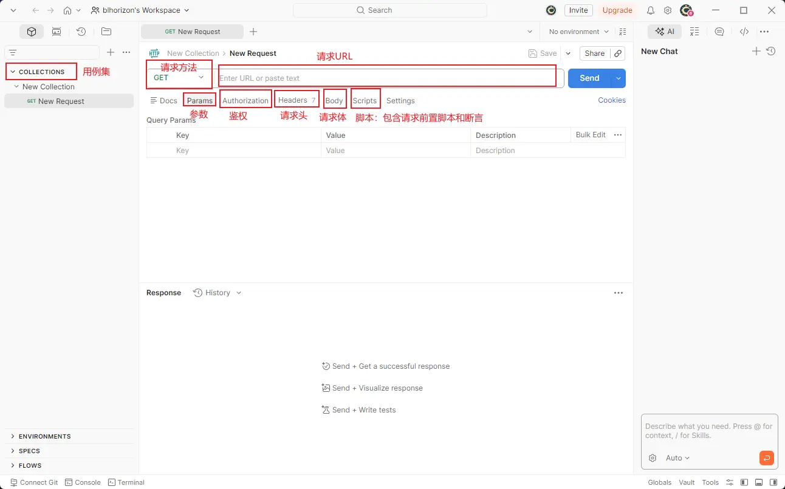
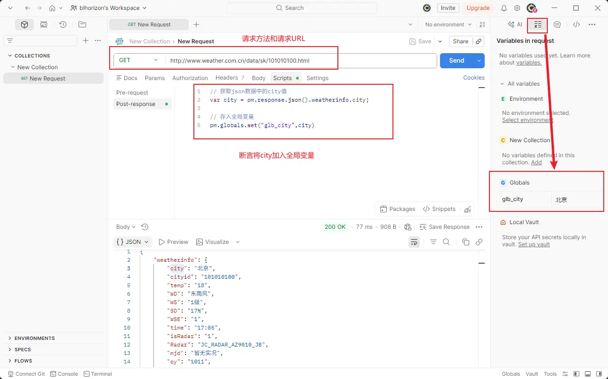
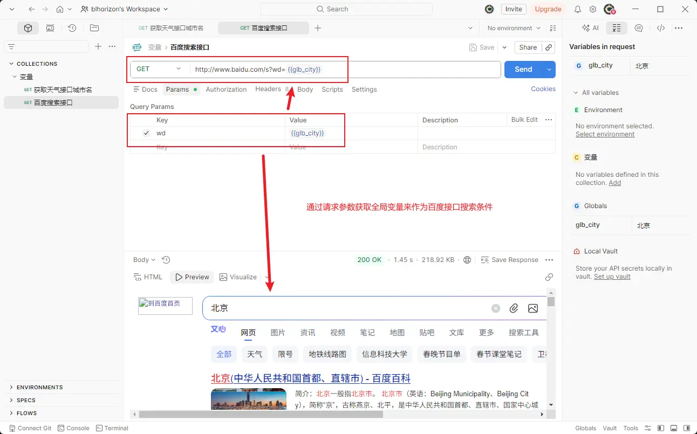
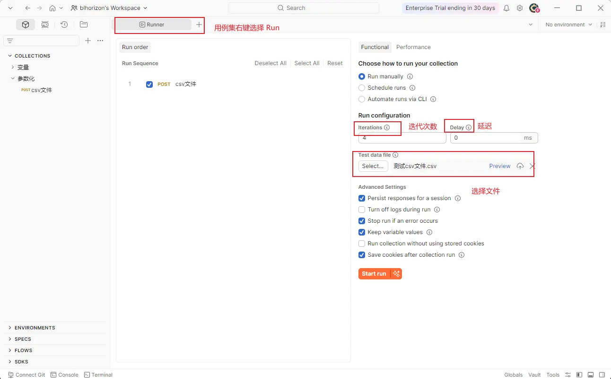
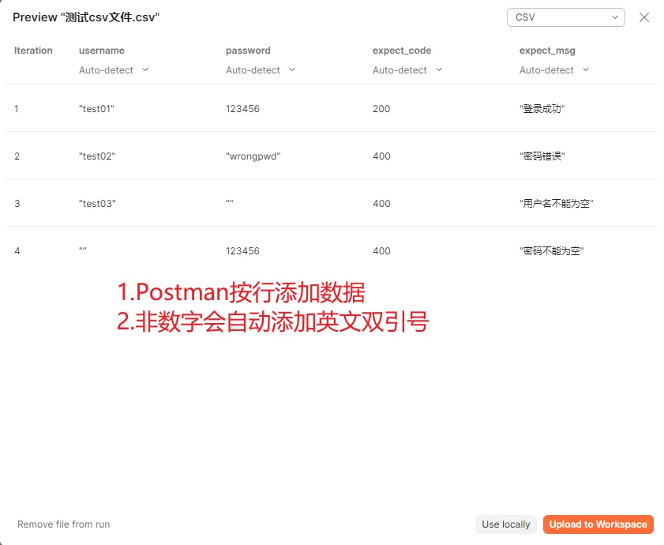
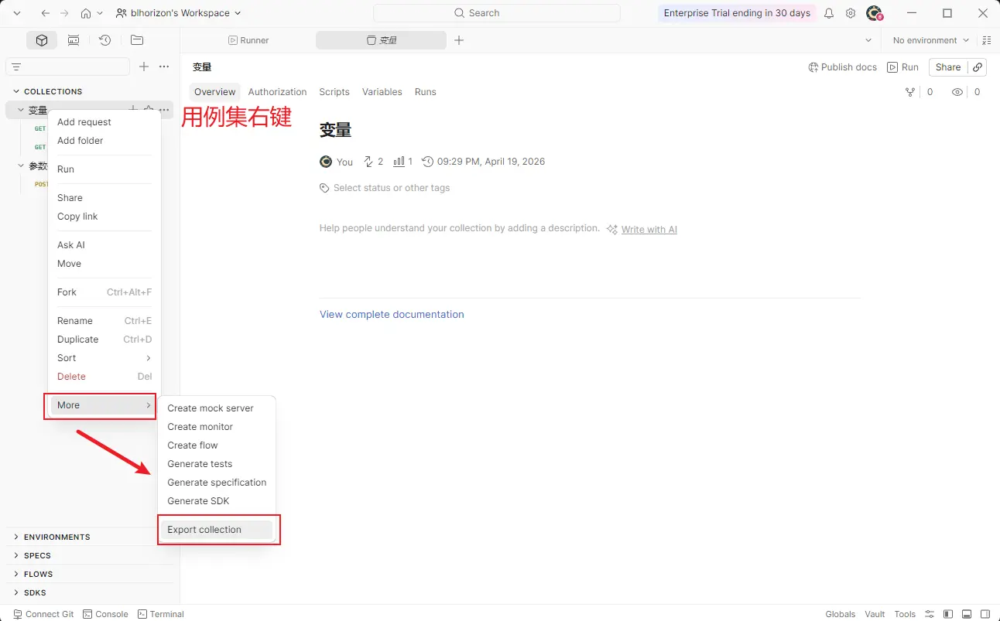
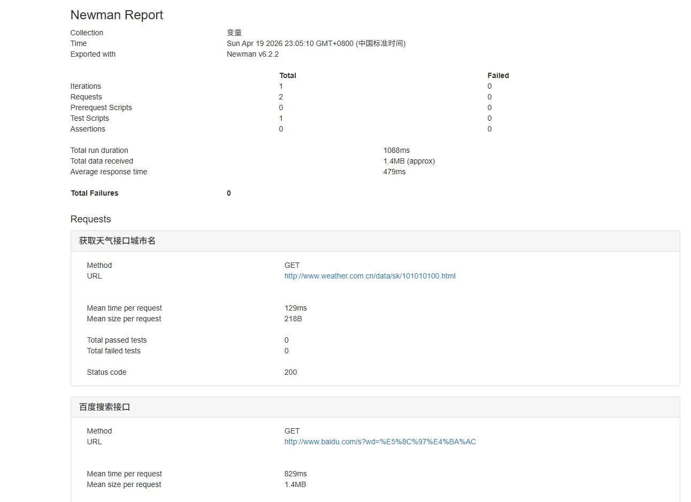

## Postman 安装

Postman 的安装很简单，在 [官网](https://www.postman.com/downloads/) 下载。由于`默认自动安装到 C 盘`，但可以直接将整个文件夹给剪切到你想要存放的文件夹中。



在安装 Xmind 时也出现了这种情况，不过可以`在应用程序所在文件夹启动命令行`，输入如下命令：

```bash
# "安装包名称" /D="D:\Xmind"
"Xmind-25.04.03033-202505120645.exe" /D="D:\Xmind"
```

---

## Postman 断言

在 `Scripts -> Post-response` 中可以进行断言，即在请求后执行 `Postman 自带的 JavaScript 脚本`。

1. 断言响应状态码：选择 `Status code：Code is 200` 即可出现如下代码

```js
// pm：代表 Postman 的一个实例
// test()：实例方法，有两个参数
//    参数一：断言成功后，给出的文字提示
//    参数二：匿名函数，表示 Postman 响应结果中应该包含该状态码
pm.test("Status code is 200", function () {
    pm.response.to.have.status(200);
});
```

2. 断言响应体是否包含某个字符串：选择 `Response body：Contains string` 即可出现如下代码

```js
// string_you_want_to_search：可修改，修改为需要查找的字符串
pm.test("Body matches string", function () {
    pm.expect(pm.response.text()).to.include("string_you_want_to_search");
});
```

3. 断言响应体是否等于某个字符串：选择 `Response body：Is equal to a string` 即可出现如下代码

```js
// response_body_string：可修改，修改为响应体中该有的字符串
pm.test("Body is correct", function () {
    pm.response.to.have.body("response_body_string");
});
```

4. 断言 JSON 数据：选择 `Response body：JSON value check` 即可出现如下代码

```js
// jsonData.value 中的 value 对应响应体的键，100 则对应其所等于的值
pm.test("Your test name", function () {
    var jsonData = pm.response.json();
    pm.expect(jsonData.value).to.eql(100);
});
```

5. 断言响应头：选择 `Response headers：Content-Type header check` 即可出现如下代码

```js
// Content-Type：响应头包含的键
pm.test("Content-Type is present", function () {
    pm.response.to.have.header("Content-Type");
});

// 也可以键值对
pm.test("Content-Type is present", function () {
    pm.response.to.have.header("Content-Type","application/json;charset=UTF-8");
});
```

## Postman 环境配置

1. 全局变量：在 Postman 全局生效的唯一变量

```js
// 变量设置
pm.globals.set("variable_key", "variable_value");

// 变量获取
pm.globals.get("variable_key");

// 请求参数获取
{{variable_key}}
```

2. 环境变量：在特定环境（`开发环境、测试环境、生产环境`）下生效的唯一变量

```js
// 变量设置
pm.environment.set("variable_key", "variable_value");

// 变量获取
pm.environment.get("variable_key");

// 请求参数获取
{{variable_key}}
```

通过获取`变量`，可以`关联`不同请求接口，例如如下例子：`获取天气接口中的城市，以此作为百度搜索接口使用`

1. 通过天气接口：`http://www.weather.com.cn/data/sk/101010100.html` 获取城市名



2. 将全局变量作为百度搜索接口使用



## Postman 参数化

Postman 批量自动化的核心能力，`通过外部数据文件批量传入多组测试用例`，实现一个接口跑几十 / 几百组测试数据，无需重复创建请求。

### 方法一：CSV 文件参数化

- 第一行是变量名（和请求中引用的变量名完全一致），后续每行是一组测试用例
- 编码必须为 `UTF-8`，分隔符用英文逗号，避免中文乱码
- 示例：`login_test_data.csv`

```csv
username,password,expect_code,expect_msg
test01,123456,200,登录成功
test02,wrongpwd,400,密码错误
test03,,400,用户名不能为空
,123456,400,密码不能为空
```

- 请求体 JSON：

```json
{
  "username": "{{username}}",
  "password": "{{password}}"
}
```

- Tests 断言脚本（批量验证结果）：

```js
// 验证响应状态码
pm.test(`响应状态码为{{expect_code}}`, function () {
  pm.response.to.have.status({{expect_code}});
});
// 验证响应消息
pm.test(`响应消息为{{expect_msg}}`, function () {
  pm.expect(pm.response.json().msg).to.eql("{{expect_msg}}");
});
```

- 在用例集中右键选择 `Run`



- 点击 `Preview`，可以看到其数据格式。适用于`简单纯文本数据`



### 方法二：JSON 文件参数化

- JSON 数据文件：外层为数组，每个元素是一组测试用例的键值对，支持嵌套结构，示例：`login_test_data.json`

```json
[
  {"username": "test01","password": "123456","expect": {"code": 200,"msg": "登录成功"}},
  {"username": "test02","password": "wrongpwd","expect": {"code": 400,"msg": "密码错误"}}
]
```

- 引用`基础字段：{{username}}`，`嵌套字段：{{expect.code}}、{{expect.msg}}`

- 后续操作与 csv 文件一样，其中非数字也会以字符串表示，布尔值也适合（`csv不适用布尔值`）

## 生成测试报告

- 需要`先安装好 Node.js，才会有 npm`。安装 `newman` 依赖

```shell
npm install -g newman
```

- 再安装 `newman-reporter-html` ，用来生成测试报告

```shell
npm install -g newman-reporter-html
```

- 指定数据文件执行生成 html 测试报告

```shell
newman run 接口集合.json -e 环境变量.json -d 测试数据.csv/json -r html --reporter-html-export 测试报告.html
```

- 导出用例集 `变量.postman_collection.json`



- 执行如下命令会生成 `测试报告.html`

```shell
newman run 变量.postman_collection.json -r html --reporter-html-export 测试报告.html
```



## 项目实战

由于黑马已经把接口给关闭了（`不在内网中`），故做不了接口测试，可以观看 [iHRM 人力资源管理系统接口测试](https://blog.csdn.net/2301_81080769/article/details/149140478)