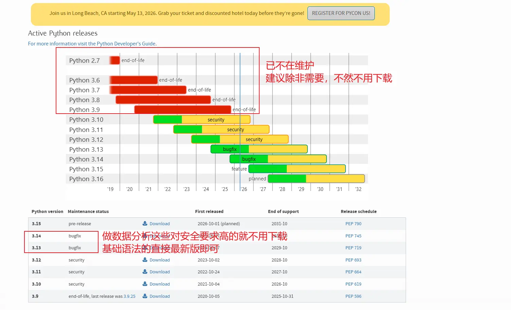

## Python 简介


编译型编程语言会先通过编译器将代码一次性编译为`中间文件`（如 Java 会生成 `.class` 字节码文件），再由运行时环境执行；而解释型语言是由解释器 “`边解释边执行`”。从执行效率看，解释型语言通常略逊一筹，但在现代计算机性能加持下，这种差距在大多数场景下已可忽略不计。

Python 则是一门`解释型`编程语言，其代码执行`依赖于 Python 解释器`，会逐行将代码转换为计算机可识别的机器码（二进制指令）。

## 环境安装

Python 安装门槛极低，只需前往 [Python 官方网站](https://www.python.org/) 下载 3.6 及以上版本的安装包即可。安装过程中，你可自定义安装路径，还可勾选自动配置环境变量，这样无论在哪个目录下打开终端，都能直接调用 Python 解释器。



[PyCharm](https://www.jetbrains.com/zh-cn/pycharm/) 是一款专业的 Python 集成开发环境（IDE），也是目前除 VSCode 外最主流的 Python 开发工具。它已统一为单一安装包，内置 30 天专业版全功能免费试用，到期后自动切换为社区版。

在 PyCharm 中，代码下方的不同颜色波浪线代表不同含义：

- **红色波浪线**：表示代码存在语法或逻辑错误，执行时会直接报错；

- **灰色波浪线**：提示代码未遵循 PEP 8 编码规范，可使用快捷键 Ctrl+Alt+L 一键格式化代码；

- **绿色波浪线**：表明单词拼写可能有误。

## Print 函数

在实际工作中极少直接使用，核心原因是已被更规范、`可持久化的日志模块`全面替代；不过在学习阶段，它仍是在控制台快速打印数据、验证代码逻辑是否符合预期的常用工具。

1. print 函数的旧式字符串格式化，需在字符串中通过占位符明确指定数据类型：

    - 整型占位符：`%0nd`（表示输出的证整数显示位数为 `n`，不足用 `0` 补全）

    - 浮点型占位符：`%.nf`（`n` 为保留的小数位数；省略`.n`则默认保留 `6` 位小数）

    - 通用字符串占位符：`%s`（可自动将任意数据类型转换为字符串输出）

2. Python 3.6 及以上版本推出了更简洁直观的 `f-string（格式化字符串字面值）`，只需在字符串前加前缀 `f或F（大小写不敏感）`，占位处直接用 `{变量/表达式}` 即可。

```python
print(f'年龄是{age}')
```

3. 第三种字符串格式化方式：`str.format ()` 方法，以 `{}` 为占位符，占位符数量与 format () 入参数量对应，全 Python 版本兼容。

Python 的单行注释使用 `#` 号标识；多行注释通常用于`文件头部或函数的文档字符串`（函数），以`三个连续的单引号或双引号`作为起始和结束标记。

## input 函数

`input('请输入：')` 是 Python 内置的键盘输入交互函数，以用户按下`回车键`作为输入结束的标识，函数括号内可填写自定义提示文本，引导用户输入对应内容。

该函数有一个关键特性：所有通过 input 接收的输入内容，无论原始输入格式如何，都会被`默认转换为字符串（str）类型`。

这个函数多用于入门学习阶段的简单代码交互场景，在实际项目工作中极少使用。

## Python 变量

在 Python 中，变量需`先定义赋值`才能调用，核心作用是存储数据。

变量名需遵循以下规则：

1. 仅由 **英文字母（区分大小写）、阿拉伯数字和下划线（_）** 组成，`禁止使用中文、空格或其他特殊符号`

2. 必须以英文字母或下划线开头，**绝对不能以数字开头**

3. 不能与 Python 内置的 **关键字（保留字）** 重名

4. 严格区分大小写，例如 `Name` 和 `name` 是两个完全不同的变量

---

Python 官方 `PEP 8 编码规范`推荐使用`下划线连接法`（snake_case），即每个单词用小写字母，中间用下划线分隔；此外还有两种常见命名风格：

- 大驼峰命名法（PascalCase）：每个单词首字母大写，多用于类名定义

- 小驼峰命名法（camelCase）：第一个单词首字母小写，后续单词首字母大写，在部分非官方 Python 项目或跨语言场景中使用

## Python 数据类型

Python 的数据类型可分为`数字类型`与`非数字类型`两大类别：

1. 数字类型：包含整型、浮点型、布尔型、复数型。其中复数型日常开发使用较少，格式示例：`3+4i`。

2. 非数字类型：包含字符串、列表、元组、字典。
    - 列表（`list`）：结构类似数组，语法格式：`[1,2,3,4]`
    - 元组（`tuple`）：语法格式：`(1,2,3,4)`
    - 字典（`dict`）：以键值对形式存储数据，语法格式：`{'name':'小明','age':22}`

使用 `type(变量)` 函数可以查看对应变量的数据类型，该方法仅返回类型结果，不会直接在控制台打印输出。

下面是3 个最常用的基础类型转换函数的用法与规则：

- **int(变量)**：将符合规则的对象转换为整型。仅支持纯整数字符串、数字类类型（浮点型、布尔型）转换，`不支持带小数点、含非数字内容的字符串转换`。

- **float(变量)**：将符合规则的对象转换为浮点型。支持纯数字格式的字符串（含整数、小数格式）、整型、布尔型等数字类数据转换。

- **str(变量)**：通用类型转换函数，可将任意数据类型的对象转换为字符串类型，无转换报错风险。

## Python 运算符

算术运算符如下：

| **运算符** | **运算符名称** | **核心功能**           | **关键备注**                     |
|-----|-------|----------------|--------------------------|
| `()`  | 小括号   | 提升运算优先级        | 优先级最高，可嵌套使用，优先执行括号内的运算   |
| `**`  | 幂运算符  | 计算数值的幂次方       | 优先级仅次于小括号，可实现平方、立方等运算    |
| `*`   | 乘法运算符 | 计算两个数值的乘积      | 属于乘除商余运算组，同级别从左到右执行      |
| `/`  | 除法运算符 | 计算两个数值的商       | 核心特性：无论是否整除，运算结果始终为浮点型   |
| `//`  | 整除运算符 | 计算商的整数部分（向下取整） | 仅保留整数位，舍弃小数部分，负数遵循向下取整规则 |
| `%`   | 取余运算符 | 计算两数相除后的余数     | 常用于判断奇偶性、循环周期等场景         |
| `+`   | 加法运算符 | 计算两个数值的和       | 优先级最低的运算组，也可用于字符串拼接      |
| `-`   | 减法运算符 | 计算两个数值的差       | 优先级最低的运算组，也可用于表示负数       |

---

比较运算符如下：

| **运算符** | **运算符名称** | **核心功能**          | **结果说明**                                        |
|---------|-----------|-------------------|-------------------------------------------------|
| **==**      | 等于运算符     | 判断左右两边的值是否完全相等    | 所有比较运算符的运算结果仅为布尔值 True/False |
| **!=**      | 不等于运算符    | 判断左右两边的值是否不相等     | 条件成立返回 True，不成立返回 False                         |
| **>**       | 大于运算符     | 判断左边的值是否大于右边的值    | 条件成立返回 True，不成立返回 False                         |
| **<**       | 小于运算符     | 判断左边的值是否小于右边的值    | 条件成立返回 True，不成立返回 False                         |
| **>=**      | 大于等于运算符   | 判断左边的值是否大于或等于右边的值 | 满足大于 / 等于任一条件，即返回 True                          |
| **<=**      | 小于等于运算符   | 判断左边的值是否小于或等于右边的值 | 满足小于 / 等于任一条件，即返回 True                          |

---

逻辑运算符如下：

| **运算符** | **名称 / 功能描述**                                         | **结果** |
|---------|-------------------------------------------------------|--------|
| and     | 逻辑 “与”：仅当两侧表达式均为 True时，结果才为 True；否则返回 False           | False  |
| or      | 逻辑 “或”：只要两侧表达式有一个为 True，结果就为 True；若全为 False 则返回 False | True   |
| not     | 逻辑 “非”：对单个表达式结果取反，True 变 False，False 变 True           | False  |

逻辑运算符优先级：`not > and > or`，可通过括号 `()` 改变执行顺序。

---

赋值运算符如下：

| **运算符** | **名称 / 功能描述**            | **示例（等价于）**        |
|---------|--------------------------|--------------------|
| =       | 基本赋值：将右侧表达式的值直接赋给左侧变量    | a = 10             |
| +=      | 加后赋值：左侧变量与右侧值相加，结果赋给左侧变量 | a += 3 → a = a + 3 |
| -=      | 减后赋值：左侧变量减去右侧值，结果赋给左侧变量  | a -= 2 → a = a - 2 |
| *=      | 乘后赋值：左侧变量与右侧值相乘，结果赋给左侧变量 | a *= 2 → a = a * 2 |
| /=      | 除后赋值：左侧变量除以右侧值，结果赋给左侧变量  | a /= 2 → a = a / 2 |

赋值运算符均为 “`右结合`”，即从右向左计算（如 a = b = 10 等价于 b = 10; a = b）。