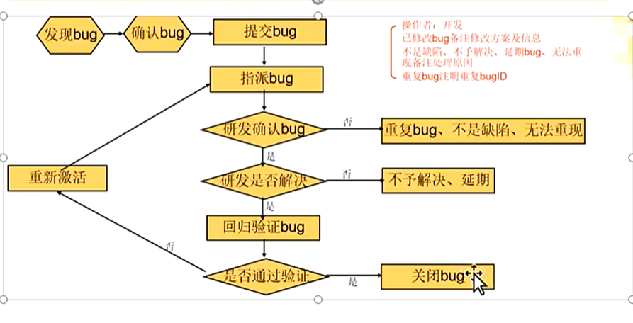
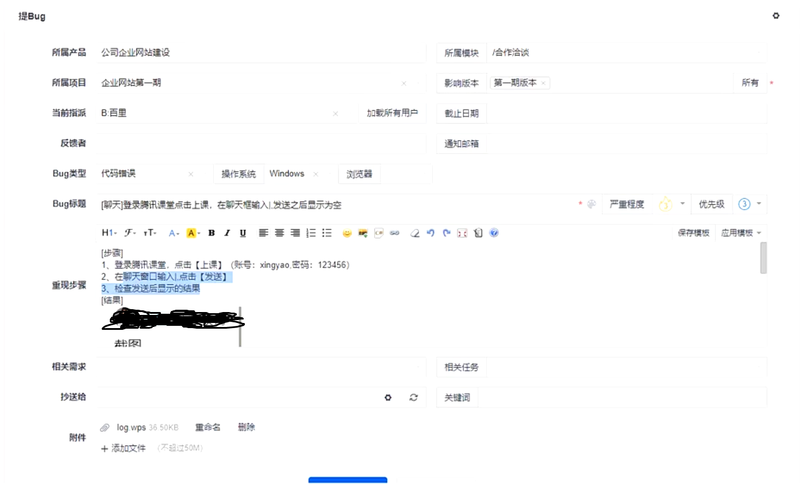

## 用例评审

测试用例评审是软件研发流程中核心的`质量前置管控环节`，由测试、产品、开发等多角色共同参与，对测试用例的需求覆盖度、逻辑严谨性、可执行性、风险防控能力进行系统性审核与校准，提前发现用例缺陷，对齐团队需求认知，最终保障测试活动有效性，大幅降低线上故障风险。

由测试组发起评审，对编写的用例进行考核，如果评审未通过，则进行修改，反之则发起项目组评审，当通过这两次评审后，将用例归档，作为后续执行阶段的用例

### 笔试面试题

1. 用例需要评审吗？紧急情况用例也要评审吗？

    答：需要评审。紧急情况将用例通过邮件的方式发送给负责人即可。

2. 如果项目很紧急，来不急写用例，怎么办？

    答：可以先用 checklist 检查列表，即 Xmind 来把测试点给覆盖。事后有时间可以补充完善用例，用以回归测试。

3. 遇到隐性需求该如何写用例？（`需求不明确`）

    答：先熟悉功能，并类比同类成熟产品，站在用户角度上去挖掘需求，也要询问产品负责人相关细节。

4. 用例有没有优先级？如果一定有优先级，依据什么来确定？

    答：用例是有优先级之分的，根据该功能是否为主业务逻辑以及高频使用场景。

5. 如何编写用例？（根据测试思维来判断什么时候用那种测试设计方法）

6. 编写测试用例会用到什么方法？接着会问，你觉得你在写用例时会遇到吗？（结合项目来答）

## 关于 Bug

软件 Bug（缺陷），是软件在研发、测试、运行全流程中，`不符合需求规格说明书`、`不满足用户合理预期`、`影响软件正常使用的各类问题`，涵盖功能错误、逻辑异常、性能不达标、兼容性故障、安全漏洞、UI/UX 体验问题、数据异常等全维度。

上诉定义可获取到 Bug 的判定标准：
- **不符合需求规格**：与产品需求文档（PRD）、设计文档、接口文档明确约定的功能、规则、逻辑不一致，是最核心的判定依据。（`不符合需求`）
- **不符合用户合理预期**：即使需求未明确标注，但不符合行业通用规范、用户正常使用习惯，比如必填项无校验提示、按钮点击无反馈。（`改进建议`）
- **影响正常使用与安全**：导致程序崩溃、数据丢失 / 泄露、核心业务阻断、高危安全风险、性能严重劣化等问题。（`功能缺陷`）

以禅道为准，常见的 Bug 由代码（功能）错误、界面优化、设计缺陷

### Bug 的生命周期

Bug 从发现到闭环的全链路：
1. **新建（New）**：测试人员发现问题，校验复现后提交 Bug 单，初始状态为新建。
2. **分配（Assigned）**：测试负责人 / 项目经理审核 Bug 有效性后，分配给对应开发模块负责人。
3. **处理中（In Progress）**：开发确认 Bug 属实，接受分配，启动代码修复工作。
4. **已修复（Fixed/Resolved）**：开发完成代码修复，合入对应测试版本，标记为已修复。
5. **回归测试（Retest）**：测试人员在新版本中，严格按照复现步骤对 Bug 进行验证。
6. **关闭（Closed）**：回归验证通过，Bug 彻底解决，无衍生问题，关闭该 Bug 单。
7. **重开（Reopened）**：回归不通过，Bug 复现 / 修复不彻底 / 衍生新问题，状态打回重开，重新进入分配修复流程。
8. **延期 / 拒绝（Deferred/Rejected）**：特殊场景需项目组评审确认，比如非核心问题当前版本不修复、需求理解偏差、无法复现且无有效日志、属于需求变更而非 Bug 等，必须标注明确原因。 

### Bug 的等级

根据 Bug 的严重等级来确定修复的优先度，一些公司会以提多少 Bug 来作为你的绩效。

| 严重等级                    | 核心定义                                      | 典型场景                                        |
|-------------------------|-------------------------------------------|---------------------------------------------|
| 致命（Blocker/Critical）    | 阻断核心业务流程，导致系统瘫痪、数据不可逆丢失 / 泄露，影响全量 / 大面积用户 | 程序崩溃闪退、主功能完全不可用、数据库损坏、支付资金异常、高危远程代码执行漏洞     |
| 严重（Major）               | 核心功能严重错误，主业务流程受阻，无替代解决方案                  | 核心功能逻辑计算错误、关键数据展示异常、接口大面积报错、性能不达标导致业务无法正常执行 |
| 一般（Normal/Minor，`最多`）        | 次要功能异常、非核心流程问题，有替代方案，不影响主业务运行             | 非必填项校验异常、次要页面 UI 错位、提示文案错误、非核心接口偶发报错        |
| 轻微（Trivial/Enhancement） | 不影响功能使用，仅为体验优化、细节规范问题                     | 界面字体 / 颜色不统一、冗余提示文案、操作体验优化建议、不影响理解的拼写错误     |

优先级 ≠ 严重等级：严重等级代表问题的危害程度，优先级代表修复的紧急程度。比如致命 Bug 默认最高优先级，而部分 UI 体验问题虽等级轻微，但涉及品牌宣传，可设为高优先级。

### Bug 必填要素

一份规范的 Bug 单，能让开发快速复现、定位、修复问题，避免无效沟通，核心必填项如下：
1. 精准标题：一句话概括核心问题，推荐格式：【所属模块】+ 操作场景 + 异常结果。示例：【登录模块】手机号输入 12 位数字，点击登录无报错提示且无法提交。
2. 前置条件：复现 Bug 所需的环境、版本、账号、前置操作等基础信息。
3. 复现步骤：按 1/2/3 序号清晰罗列操作步骤，无遗漏、无歧义，确保开发按步骤可稳定复现。
4. 实际结果：执行操作步骤后，软件实际出现的异常现象，客观描述，不添加主观判断。
5. 预期结果：按照需求文档 / 行业规范，软件应该呈现的正确结果。
6. 辅助附件：问题截图、录屏、服务端 / 客户端日志、抓包数据、测试账号密码、环境信息（APP 版本号、设备型号、系统版本、浏览器版本、接口地址等）。
7. 基础属性：严重等级、优先级、所属模块、提交人、提交时间、关联需求 ID / 测试用例 ID。

### 主流 Bug 管理工具

- 企业级商用：Jira、TAPD（腾讯）、阿里云效、飞书项目、ONES
- 开源 / 免费：禅道（`常用`）、Mantis、Bugzilla
- 轻量协作：Notion、飞书多维表格、Trello

不管是开源还是商业的缺陷管理工具，它们`本质都是一样`的，用来管理bug的生命周期。掌握其中一款工具，自然就会用其他的，稍微有一点点区别的，别人加以指点，就可以明白了。

### Bug 跟踪

发现bug后，接下来你提交到bug管理平台，提交一个bug包含哪些内容？
- bug标题——标题要`清晰简洁`，写明bug描述；如果没有选择功能模块，最好在标题中标注功能模块。让查看bug的人员清楚知道你所表达的意思。bug的功能模块 + `bug的操作 + bug的结果`。
- 重现步骤——`详细`写下发现bug的测试过程。能指导开发重现这个bug。附上测试数据。
- 实际结果：出现bug的结果，粘贴bug截图、日志截图
- 预期结果 — 记得写清楚`预期`
- bug类型和严重程度 —— 便于后续测试结果分析，bug的统计
- bug测试环境——例如：什么系统，哪个版本等。兼容性问题、难以重现问题
- 附件—日志文件，文件测试数据。图片、崩溃日志文件等

截止日期一般由开发人员填写，测试人员没必要去选择日期。

### 注意点

1. 一个 Bug 单只记录一个问题，禁止多个问题合并提交，避免修复遗漏、无法跟踪闭环。
2. 客观描述事实，拒绝主观判断。比如不能写 “这个页面好丑”，应写 “【个人中心】头像边框与设计稿不符，设计稿圆角 8px，实际为 0px”。
3. 严禁无复现步骤提交 Bug，必须确保步骤完整，开发可复现；偶现 Bug 需标注复现概率、出现场景、留存日志，不可直接忽略。
4. 提交前先核对需求文档，确认需求理解无误，避免把需求变更、产品设计逻辑当成 Bug 提交。
6. 回归测试不局限于 Bug 本身，需同步校验关联功能，避免修复一个 Bug 衍生出新的问题。