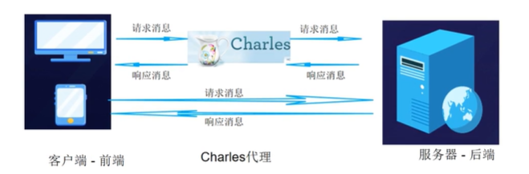

## 抓包的目的（了解）

软件测试中抓包，核心是`捕获客户端与服务端之间的网络传输数据包`，破解`黑盒测试的信息盲区`，实现问题精准定位、业务逻辑校验、安全风险排查、性能瓶颈分析，同时支撑测试场景构造与责任边界划分，是功能、接口、安全、性能测试的核心必备技能。

以下是抓包在软件测试中的核心价值与具体应用场景：

### 精准定位前后端问题，划分责任边界（最高频核心用途）

黑盒测试`只能看到页面最终表现，无法判断故障根因在前端还是后端`，抓包可直接拆解交互全链路，快速定责，避免团队推诿。

1. **功能异常根因定位**：针对登录失败、数据不展示、提交不生效等问题，通过抓包可直接`核对`：前端是否发送了请求、请求参数 / 格式 / 协议是否符合接口文档、服务端返回的状态码 / 响应体是否正确。比如页面提示 “提交失败”，若抓包发现前端传参格式错误，即为前端问题；若参数正确但后端返回 500 / 业务错误码，即为后端问题。

2. **全链路问题排查**：针对页面加载慢、请求超时、白屏等问题，抓包可`定位`是 DNS 解析异常、TCP 握手失败、网络丢包重传，还是接口服务处理耗时过长，精准锁定性能 / 网络瓶颈。

3. **第三方交互问题定位**：涉及支付、地图、推送等第三方 SDK / 接口时，抓包可快速`验证`是我方系统传参错误，还是第三方接口返回异常，缩小排查范围。

### 校验接口业务逻辑，覆盖黑盒测试盲区

页面端的测试只能覆盖表层操作，`无法验证后端接口的底层逻辑校验`，抓包可以突破前端限制，验证业务规则的完整性和严谨性。

1. **后端参数校验验证**：前端页面通常会做输入限制（比如金额≤100、手机号格式校验），但恶意用户可通过抓包篡改请求参数，绕过前端限制。测试`通过抓包改参，可验证后端是否做了二次校验`，避免出现 “0 元下单”“越权修改他人信息” 等致命业务漏洞。

2. **接口文档一致性校验**：抓包可核对请求入参、响应出参、状态码、字段含义`是否与接口文档一致`，避免出现文档与实际实现脱节、多余敏感字段返回等问题。

3. **权限与越权漏洞验证**：通过抓包获取高权限接口的请求信息，用普通用户的身份重放请求，可验证是否存在水平`越权`（操作同级别其他用户数据）、垂直越权（普通用户操作管理员功能）等高危问题，这些是页面操作完全无法覆盖的测试点。

### 开展安全测试，挖掘数据与传输安全风险

抓包是 Web/APP `安全测试`的基础手段，核心用于验证数据传输安全、挖掘潜在安全漏洞，满足合规要求。

1. **敏感数据泄露排查**：抓包可查看账号密码、身份证号、银行卡信息、支付密钥等敏感数据是否明文传输，是否做了合规加密处理，是否符合《个人信息保护法》、等保 2.0 等合规要求，`避免敏感数据被窃听泄露`。

2. **常见安全漏洞挖掘**：通过抓包篡改请求参数、重放数据包，可测试 SQL 注入、XSS 跨站脚本、CSRF 跨站请求伪造、重放攻击（比如重复支付、重复领券）等常见安全漏洞，`验证服务端的防护策略是否生效`。

3. **加密与签名校验验证**：抓包可验证请求是否做了签名防篡改、加密算法是否安全，`避免数据包被中间人篡改`，保障传输链路的完整性。

### 支撑性能与弱网测试，验证系统稳定性

1. **性能瓶颈定位**：抓包可统计接口的响应时长、吞吐量、并发下的丢包率、TCP 重传情况，定位是网络链路问题，还是服务端处理性能不足；同时可验证长连接、连接复用等优化策略是否生效，为性能优化提供数据支撑。

2. **弱网与异常网络场景测试**：通过 Charles、Fiddler 等抓包工具，可模拟弱网、高延迟、丢包、网络抖动、断网重连等极端场景，测试 APP / 网页在异常网络下的表现：是否会出现数据重复提交、订单重复创建、页面崩溃、数据错乱等问题，验证系统的容错能力和稳定性。

### Mock 数据与场景构造，提升测试效率与覆盖度

抓包工具自带的 Mock 功能，可解决测试环境依赖、极端场景难构造的痛点。

1. **无依赖前置测试**：后端接口尚未开发完成时，测试可通过抓包工具 Mock 接口的返回数据（正常 / 异常 / 边界值），提前对前端页面进行测试，不用等待后端联调完成，大幅缩短测试周期。

2. **极端场景快速构造**：无需修改数据库、无需后端配合，即可通过 Mock 模拟接口超时、500 错误、空数据、超大列表、异常状态码等极端场景，测试前端的容错处理、异常提示是否符合预期，提升测试覆盖度。

## Charles 安装（了解）

Charles 全称 Charles Proxy，俗称 “花瓶”，是一款跨平台的 HTTP/HTTPS/HTTP2/WebSocket 协议`抓包代理工具`，也是软件测试、移动端 / 前端开发领域最主流的抓包工具之一。

基于 “中间人代理” 原理，`捕获客户端与服务端之间的全量网络流量`，支持请求篡改、响应 Mock、弱网模拟、接口重放等一站式能力，完美匹配软件测试全流程的抓包需求。

由 Java 编写的软件，故安装运行 Charles 的时候要安装好 [Java](https://www.oracle.com/cn/java/technologies/downloads/#jdk21-windows) 环境。安装完成后的 [Charles](https://www.charlesproxy.com/) 需要付费授权，不过提供了 30 天免费试用，试用版单次启动最长使用 30 分钟，到期重启即可继续使用。

## HTTP

HTTP：全称 HyperText Transfer Protocol（超文本传输协议），是互联网应用层最基础的通信协议，基于 TCP/IP 协议栈，负责客户端（浏览器 / APP）与服务端之间的超文本数据传输，`默认端口 80，全程明文传输`。

### 核心特性

1. **简单通用**：基于请求 - 响应模型，语法简洁，跨平台、跨终端兼容，是 Web 通信的基石；
2. **无状态**：协议本身不记录客户端的身份和请求历史，需通过 Cookie/Session/Token 维持用户会话；
3. **灵活可扩展**：支持自定义请求方法、头部字段，适配图片、视频、JSON 等各类数据格式传输。

### 致命短板

1. **明文传输，无保密性**：所有数据在网络中完全裸奔，中间节点（公共 WiFi、路由器、运营商、网关）均可无门槛窃听、截取完整数据，包括账号密码、身份证号、支付信息等敏感内容；
2. **无身份校验，易伪造**：无法验证通信双方的真实身份，极易遭遇中间人攻击、钓鱼网站伪装，用户无法确认自己访问的是目标网站还是恶意站点；
3. **无完整性校验，易篡改**：传输过程中数据被篡改（如运营商插入广告、恶意代码、修改业务参数），通信双方完全无法察觉。

## HTTPS

HTTPS：全称 HyperText Transfer Protocol Secure（超文本传输安全协议），是 HTTP 的安全增强版，核心是在 HTTP 与 TCP 传输层之间新增了 `SSL/TLS 加密隧道，默认端口 443`，解决了 HTTP 明文传输的三大致命安全隐患，是当前互联网的主流标准协议。

HTTPS 通过`混合加密体系`、`数字证书身份认证`、`哈希摘要完整性校验`三大核心机制，完整解决 HTTP 的原生安全问题，同时兼顾传输性能。
> 核心一句话总结：`HTTPS = HTTP + SSL/TLS`，本质是给 HTTP 通信加了加密、身份认证、完整性校验三重安全防护。

### 混合加密体系（解决明文窃听问题）

HTTPS 结合了`非对称加密`和`对称加密`的优势，规避两者的短板：
- **对称加密**：加解密使用同一个密钥，速度极快，适合加密大量业务数据；但密钥传输过程中容易泄露。常用算法：AES、ChaCha20。
- **非对称加密**：分为公钥（公开分发）和私钥（仅服务端持有），公钥加密的内容只有私钥能解密，反之亦然；安全性极高，但加解密速度慢，不适合大量数据传输。常用算法：RSA、ECC。

**加密流程核心逻辑**：通信前，通过非对称加密安全协商出一个`仅客户端和服务端知晓的会话对称密钥`；后续所有 HTTP 业务数据，全程用这个会话对称密钥加密传输，兼顾安全与性能。

### 数字证书与 CA 机构（解决身份伪造问题）

为了防止公钥被中间人伪造替换，HTTPS 引入了 `CA（证书颁发机构）` 体系：
- 服务端提前向权威 CA 机构申请数字证书，证书包含服务端域名、公钥、有效期、CA 数字签名等信息；
- TLS 握手时，服务端将证书发送给客户端，客户端通过系统预置的 CA 根证书，校验证书的合法性、域名匹配度、有效期，确认服务端是真实可信的，而非中间人伪造；
- 证书校验不通过，客户端会直接中断通信，弹出 “不安全连接” 警告。

### 哈希摘要与数字签名（解决数据篡改问题）

传输数据时，通过 SHA256 等哈希算法生成数据的唯一摘要，再用私钥对摘要进行数字签名；接收方收到数据后，用公钥验签，重新计算数据摘要并比对，一旦数据被篡改，摘要会完全不一致，立即识别异常，拒绝处理。

（简单理解）主流 TLS 1.2 握手 4 步完成，TLS 1.3 已优化至 1-RTT，大幅降低握手延迟：
1. 客户端 Hello：发送支持的 TLS 版本、加密套件、随机数 1；
2. 服务端 Hello：返回确认的 TLS 版本、加密套件、随机数 2、服务端数字证书；
3. 客户端校验证书合法后，生成预主密钥，用服务端公钥加密发送给服务端；
4. 双方通过预主密钥 + 两个随机数，生成相同的会话对称密钥，后续所有 HTTP 数据均用该密钥加密传输。

## HTTP 和 HTTP 差异

| **对比维度**   | **HTTP**                          | **HTTPS**                                                 |
|------------|-----------------------------------|-----------------------------------------------------------|
| **默认端口**   | 80                                | 443                                                       |
| **传输特性**   | 明文传输，无加密                          | 全程 TLS 加密传输，密文传输                                          |
| **安全性**    | 无保密性、无身份校验、无完整性保护，极易被窃听 / 篡改 / 伪造 | 三重安全防护，防窃听、防篡改、防伪造，安全性极高                                  |
| **证书要求**   | 无需证书                              | 必须向权威 CA 机构申请数字证书（自签名证书仅可用于测试环境）                          |
| **性能开销**   | 无加密解密开销，TCP 三次握手后直接传输数据           | 额外的 TLS 握手开销，加解密有轻微性能损耗；TLS 1.3 + 会话复用优化后，损耗可忽略           |
| **抓包难度**   | 无门槛，直接抓取即可看到完整明文请求 / 响应           | 必须安装并信任中间人根证书、开启 SSL 代理，否则只能看到乱码密文；开启 SSL Pinning 后无法常规抓包 |
| **SEO 权重** | 浏览器标记 “不安全”，搜索引擎降权                | 浏览器标记安全锁，搜索引擎优先收录，权重更高                                    |
| **合规性**    | 传输敏感个人信息违反《个人信息保护法》《网络安全法》等保要求    | 满足数据传输加密的合规要求，是线上业务的强制标准                                  |
| **适用场景**   | 仅内部测试环境、无敏感信息的静态资源站点              | 所有线上 Web 站点、APP 接口、支付、金融、政务等涉及用户数据的业务场景                   |

### 软测相关

1. 为什么 HTTPS 抓包必须安装证书、开启 SSL 代理？
- Charles 抓包的本质是合法的中间人攻击。HTTPS 的设计初衷就是防止中间人窃听，正常通信中，只有客户端和真实服务端能拿到会话对称密钥，中间人只能拿到无法解密的密文。
- 要实现 HTTPS 抓包解密，必须满足两个核心条件：
    - 让客户端信任 Charles 的根证书，把 Charles 当成合法的服务端，完成 TLS 握手并协商出客户端 - Charles 的会话密钥；
    - Charles 同时作为客户端，和真实服务端完成 TLS 握手，协商出 Charles - 服务端的会话密钥；
    - Charles 用两套密钥分别解密、加密双向流量，实现明文查看和篡改，这也是 Charles 中 SSL Proxying 配置、证书信任的核心原理。

2. 为什么高版本系统 / APP 抓不到 HTTPS 包？
- **系统级证书限制**：Android 7.0 及以上系统，默认不信任用户手动安装的根证书，仅信任系统预置的权威 CA 根证书；iOS 10.3 + 安装证书后，必须手动在「证书信任设置」中开启完全信任，否则证书不生效。
- **SSL Pinning（证书固定）**：正规线上 APP 会在代码中固定服务端证书的公钥 / 哈希值，即使客户端信任了 Charles 证书，APP 发现证书与固定值不一致，会直接中断通信，拒绝传输数据，这也是第三方 APP 无法常规抓包的核心原因。
    > 合规提示：仅可对企业自有、授权测试的 APP 关闭 SSL Pinning，禁止未经授权破解第三方 APP。

3. 软件测试中 HTTP/HTTPS 的核心测试关注点
- HTTP 测试：核心关注合规风险，线上业务禁止用 HTTP 传输账号密码、身份证、支付信息等敏感数据，否则违反《个人信息保护法》等合规要求；仅可用于内部测试环境，需确认是否有强制跳转 HTTPS 的配置。
- HTTPS 测试：
    - 证书有效性：校验证书有效期、域名匹配度、CA 机构合法性，避免证书过期、域名不匹配导致线上故障；
    - 安全配置：禁用 TLS 1.0/1.1 等不安全版本、弱加密套件，开启 HSTS，防止 SSL 剥离攻击；
    - 传输安全：校验敏感数据是否在 HTTPS 基础上做了二次加密，是否有明文泄露敏感字段；
    - 防护有效性：验证 SSL Pinning 是否生效，是否能抵御中间人抓包篡改。

### 常见误区

**HTTPS 不是绝对安全**：HTTPS 只解决传输层的安全问题，无法防护应用层漏洞。SQL 注入、XSS 跨站脚本、越权操作、业务逻辑漏洞等，依然需要通过接口测试、安全测试来防护；如果设备被 ROOT / 越狱、用户手动信任了恶意证书，HTTPS 通信依然可能被窃听。

**HTTPS 一定比 HTTP 慢很多**：早期 TLS 协议握手开销较大，现在 TLS 1.3 优化了握手流程，配合会话复用、OCSP 装订、CDN 加速等技术，HTTPS 的性能损耗已经极小，远低于其带来的安全收益，已无性能层面的接入障碍。

**用了 HTTPS 就不用再做数据加密**：核心敏感数据（如支付密码、银行卡号），建议在应用层做二次加密。双重防护可以避免即使传输层被解密，核心数据依然无法被窃取，进一步提升安全水位。