## 为什么需要使用数据库

文件系统检索在数据量过大时速度慢的要死，也不能高效的备份数据去防止磁盘损坏时导致数据丢失，还有多线程高并发处理某条数据，很难想象该条数据会变成什么样子。
> [为什么需要数据库？](https://www.zhihu.com/question/24088008) 中 `DataWonder` 的解释

数据库是`信息化系统的核心数据底座`，本质是对结构化数据进行统一、高效、安全、可靠的集中存储与管理，彻底解决零散文件 / 表格存储的核心痛点，支撑从个人小程序到国家级平台的全场景业务运行与数据价值挖掘。

### 核心基础：持久化结构化存储，降低数据冗余

解决零散文件 / Excel `易丢失`、格式混乱、`重复存储`的痛点。
- 核心能力：将海量有规则的业务数据（用户信息、订单、商品、财务数据等）按固定表结构持久化存储，程序关闭、设备宕机不会丢失数据；通过表关联设计，避免同一份数据在多系统重复存储，极大降低数据冗余，节省存储成本。
- 通俗案例：电商平台千万级用户、亿级订单数据，统一存储在数据库中，而非分散在无数个 Excel / 文本文件里。

### 核心能力：极致高效的数据检索与批量处理

解决海量数据下，`快速筛选、查询、统计数据`的刚需。
- 核心能力：通过索引、查询优化引擎、分布式计算等能力，支持亿级数据的毫秒级检索、多表关联查询、批量增删改操作，彻底突破 Excel 等工具几万行数据就卡顿的性能瓶颈。
- 通俗案例：外卖平台用户筛选 “30 分钟送达、评分 4.8 分以上、人均 20 元以内” 的商家，百万级商户数据中秒级返回结果。

### 业务保障：强一致性与并发控制，杜绝数据错乱

解决多用户同时操作、关键业务流程中`数据出错`的致命风险。
- 核心能力：通过 `ACID 事务特性`，保证关键业务操作的原子性（要么全成功要么全失败）、一致性、隔离性、持久性；通过锁机制、并发控制，解决多用户同时读写同一份数据的冲突问题，从根源上杜绝业务异常。
- 通俗案例：银行转账、支付下单场景，不会出现 “用户扣款成功但商家未收到钱”“最后一件商品被多人同时下单” 的错误。

### 安全兜底：精细化权限管控与全生命周期安全防护

解决`数据泄露、误删、恶意篡改、无权限访问`的安全风险。
- 核心能力：支持精细化的权限分配（如财务仅可查看账单、管理员才可修改核心配置），提供数据加密、自动备份与灾备恢复、操作审计日志、防注入攻击等全链路安全能力，保障数据全生命周期的安全合规。
- 通俗案例：企业员工误删核心订单数据，可通过数据库备份快速回滚恢复；用户身份证、银行卡等敏感信息可加密存储，避免泄露。

### 业务支撑：高可用、高并发与弹性扩容，支撑业务增长

解决`高流量、大规模`业务场景下，系统稳定运行的核心需求。
- 核心能力：支持主从复制、读写分离、分库分表、集群部署等能力，可扛住每秒数十万次的读写请求（如双十一、春运抢票峰值），同时可随业务规模弹性扩容，保障系统 7×24 小时不间断稳定运行。

### 价值挖掘：数据共享与分析，赋能业务决策

解决`数据孤岛、数据无法转化`为商业价值的痛点。
- 核心能力：作为企业统一的数据中枢，实现多业务系统（ERP、CRM、OA 等）的数据共享与互通；为数据分析、商业智能（BI）、机器学习模型提供完整的数据源，支撑企业做经营报表、用户画像、销量预测、风险管控等决策，将数据转化为核心商业价值。

---

## 为什么选择 MySQL

MySQL 是全球装机量最高、应用最广的`开源关系型数据库`，是个人开发者、中小企业、互联网大厂信息化系统的`首选数据底座`。它的普及绝非单一优势，而是`成本、生态、性能、易用性、兼容性、可靠性`的综合均衡优势，完美覆盖从个人 Demo 到`千亿级流量业务`的全生命周期需求。

### 开源免费，极致的成本优势（核心选型动因）

这是 MySQL 区别于 Oracle、SQL Server 等商业数据库最核心的竞争力，也是绝大多数用户的`选型起点`。
- **零门槛免费使用**：遵循 GPL 开源协议，个人、中小企业乃至大型企业，`均可免费下载、使用、修改源码，无需支付任何授权费用`。对比 Oracle 动辄几十万 / 年、按 CPU 核数阶梯计费的商业授权模式，MySQL 能直接砍掉 90% 以上的数据库采购成本，对预算有限的创业公司、中小项目极其友好。
- **灵活的商业兜底**：同时提供付费企业版与官方技术支持，满足金融、政务等对合规和售后有强要求的场景，可`免费起步、按需升级，进退自如`。

### 生态极度成熟，学习与落地门槛趋近于零

`经过 30 年的迭代`，MySQL 已形成业界最完善的数据库生态，是关系型数据库的 “行业通用标准”，彻底解决了 “没人会用、没工具支撑、踩坑没人解” 的落地难题。
- **学习成本极低，人才储备充足**：全网`有海量免费的教程、文档、开源项目`，是计算机专业、开发入门的标配数据库；国内招聘市场上，掌握 MySQL 的开发、运维、DBA 人才数量远超其他数据库，企业招人、团队协作的人力成本极低。
- **全链路工具链开箱即用**：从可视化管理（Navicat、DBeaver、phpMyAdmin）、监控告警（Prometheus+Grafana、Zabbix）、备份迁移（mysqldump、XtraBackup），到读写分离、分库分表中间件（Sharding-JDBC、MyCat），有`大量成熟免费的工具`，无需重复造轮子。
- **全栈框架原生兼容**：`几乎所有主流 Web 开发框架`（Java SpringBoot、Python Django/Flask、PHP Laravel、Node.js Express），都将 MySQL 作为默认首选数据库，提供原生适配，一行配置即可完成对接，开发效率拉满。

### 性能够硬，完美适配绝大多数核心业务场景

很多人对开源数据库有 “性能差” 的误解，实际上 MySQL（尤其 8.0 + 版本）在`联机事务处理 OLTP`（信息化系统、电商交易、用户管理等核心场景）的表现，完全对标商业数据库，足以支`撑绝大多数企业的业务需求`。
- **企业级事务与并发能力**：默认的 InnoDB 存储引擎，完整支持 ACID 事务特性、行级锁、MVCC 多版本并发控制，完美解决多用户并发读写冲突，杜绝超卖、转账异常等业务问题，可`支撑每秒数十万次的读写请求（QPS）。`
- **极致的查询性能**：支持 B + 树索引、哈希索引、联合索引、覆盖索引等丰富的索引优化能力，配合查询优化引擎，可实现`亿级数据量下的毫秒级检索`，完全满足信息化系统、电商平台的高频查询需求。
- **规模化生产验证**：`阿里、腾讯、字节跳动、美团、拼多多等国内互联网巨头`，均在核心业务中大规模使用 MySQL（基于官方版本定制的分支），支撑双十一、春节红包等万亿级流量峰值，稳定性和性能经过了最严苛的生产环境检验。

### 轻量化易用，部署运维门槛极低

对比 Oracle、DB2 等重型商业数据库，MySQL 的`轻量化和易用性`，是它能快速普及的关键。
- **跨平台兼容，部署极速**：安装包体积小，完美兼容 Windows、Linux、macOS 全平台，无论是本地开发机、云服务器，还是嵌入式设备，都`能在几分钟内完成安装部署，开箱即用`。
- **运维成本极低**：`配置逻辑简单`，日常的启停、备份、扩容、故障排查，都有标准化的流程和工具，小型项目甚至无需专职 DBA，后端开发人员就能完成基础运维；而商业数据库往往需要专职 DBA 团队才能保障稳定运行，人力成本极高。

### 稳定可靠，企业级安全与高可用能力

MySQL 早已不是 “玩具级” 开源数据库，而是具备完整的企业级高可用、安全合规能力，足以`支撑核心业务 7×24 小时不间断运行`。
- **数据不丢的兜底能力**：InnoDB 引擎的崩溃恢复机制、redo log/undo log 双日志体系，就算服务器突发宕机、断电，重启后也能自动恢复数据，保证`数据一致性，不会出现数据损坏或丢失`。
- **完善的高可用架构**：原生支持主从复制、读写分离、组复制（MGR），可快速搭建主备集群、多活集群，实现故障自动切换，RPO（数据丢失量）趋近于 0，RTO（故障恢复时间）缩短至秒级，满足核心业务的高可用要求。
- **全链路安全合规**：支持精细化的用户权限管控（库、表、行级权限）、数据传输加密、存储加密、操作审计日志、防 SQL 注入等安全能力，完全满足等保 2.0、金融行业合规要求，可有效防范数据泄露、恶意篡改、越权访问等风险。

### 弹性扩展，适配业务全生命周期

MySQL 最大的优势之一，是能陪伴业务从 0 到 1 再到规模化增长，`全程无需更换数据库`，避免了巨大的业务迁移成本。
- **无缝弹性扩容**：初期个人项目、小型业务，单节点 MySQL 就能完美支撑；随着业务增长，可无缝升级为 “主从架构 → 读写分离 → 分库分表 → 分布式集群”，弹性支撑业务从日活几百到日活上亿的全阶段。
- **多场景灵活适配**：提供多存储引擎支持，可根据业务场景灵活选择：
    - InnoDB（默认）：支持事务、行级锁，适合交易、订单等核心业务场景；
    - MyISAM：读多写少场景，适合静态数据、统计报表；
    - Memory：内存级存储，适合高频访问的热点数据（如验证码、会话信息）。
- **云原生深度适配**：所有主流云厂商（阿里云、腾讯云、华为云、AWS），都提供开箱即用的托管式 MySQL 服务（RDS），自动搞定备份、灾备、扩容、安全防护，无需关注底层运维，是云上信息化系统的首选。

### MySQL 的适用边界

MySQL 是`通用型关系型数据库的最优解`，但并非万能，它的核心优势与适配场景有明确边界：
- ✅ 首选场景：Web 应用、企业信息化系统（OA/ERP/CRM）、电商交易系统、用户管理系统、中小规模数据中台等 OLTP 场景。
- ❌ 非最优场景：超大规模离线数据分析（OLAP）、PB 级非结构化数据存储、时序数据（物联网设备监控）等场景，更适合搭配 ClickHouse、MongoDB、InfluxDB 等专用数据库，而非`单独使用` MySQL。

归根结底，大家选择 MySQL，不是因为它在某一个维度做到了世界第一，而是它在`成本、易用性、性能、生态、可靠性`的综合表现上，做到了极致的均衡。它能`让新手快速上手`，让中小企业低成本落地，让大厂规模化定制，完美匹配绝大多数信息化系统对数据库的核心需求，这也是它能稳居数据库行业头部数十年的核心原因。

## 安装 MySQL

以 `8.0.45` 版本为例（其他版本的安装过程是类似的），下载 [MySQL 安装包（.msi）](https://dev.mysql.com/downloads/installer/)，双击开始安装。
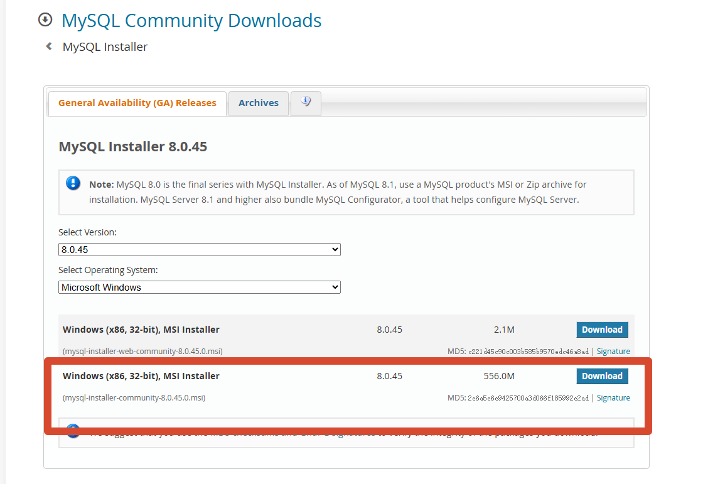

勾选自定义 `custom`，然后点击 Next：
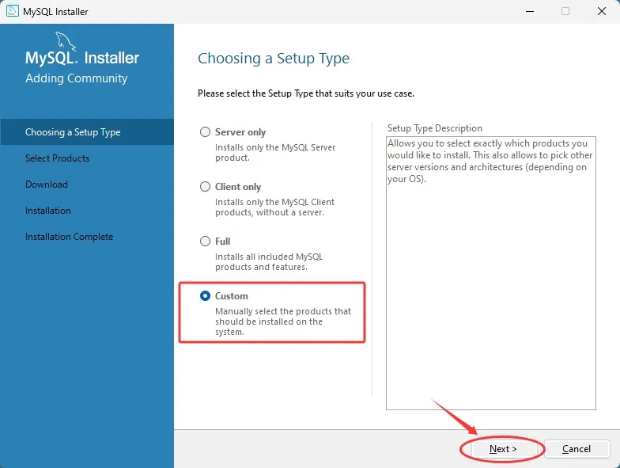

在组件列表里逐层展开，勾选 `MySQL Server 8.0.45 - X64`，点击中的箭头，将他添加到右侧的窗口里：
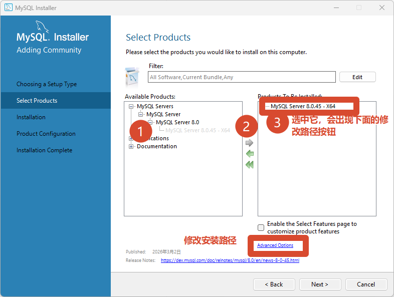

鼠标选中 `MySQL Server 8.0.41=5 - x64`，点击 `Advanced Options` ，将 MySQL 的安装路径改为其他盘（非系统盘）：
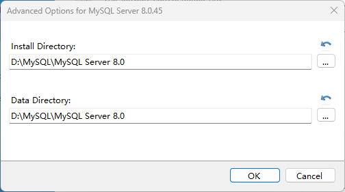

最简单的路径修改方法，可以直接`将 C 改成 D`，然后点击 OK，在点击上图里的 Next。

点击 `Execute` 按钮，系统开始安装 `MySQL 8.0.45`，安装过程中会显示进度条，耐心等待安装完成：
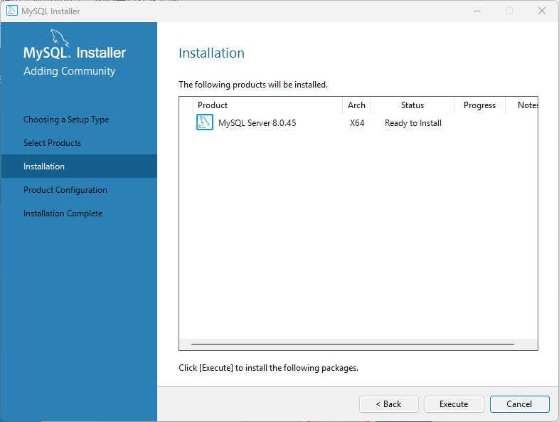

安装完成后(✅)，连续点击`两次` Next，进入到下面的界面(`默认即可`)，不要动它，点击 Next：
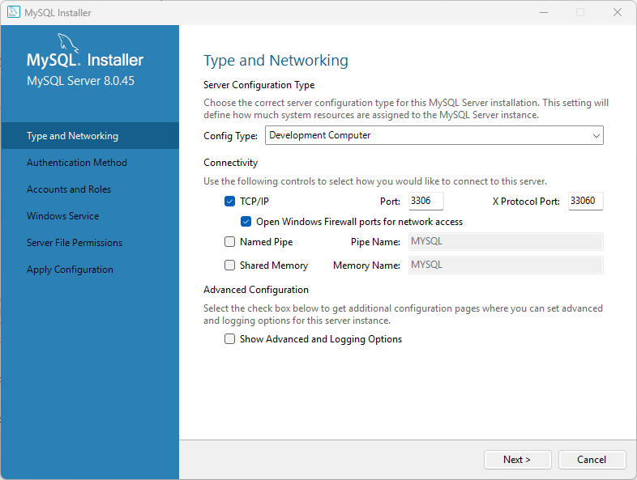

官方推荐第一种，我们就用第一种，直接点击 Next：

注意，如果后面用到数据库图形化工具的话，例如 `navicat`，如果 navicat 版本太老，会产生数据库连接错误，这里建议选择第二个密码选项。
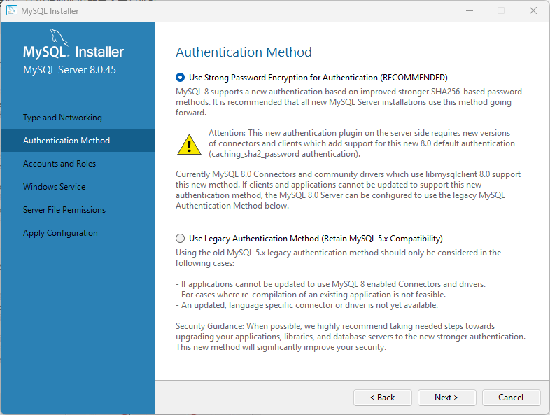

在 `Password` 和 `Repeat Password` 输入框中，输入自定义的数据库密码，密码需为`字母、数字和特殊字符`，长度不少于 8 位，输入完成后，点击 Next：
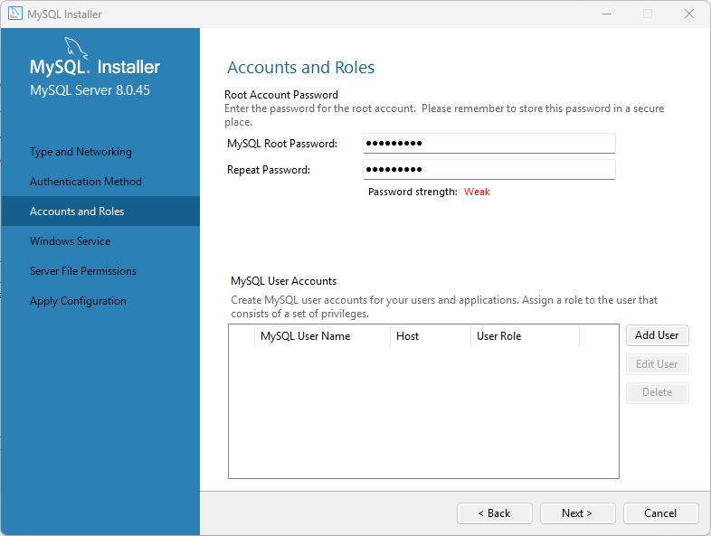

之后一直点击 `Next` 或 `Execute` 即可，都是默认安装配置，当看到该界面时，证明已安装完毕：
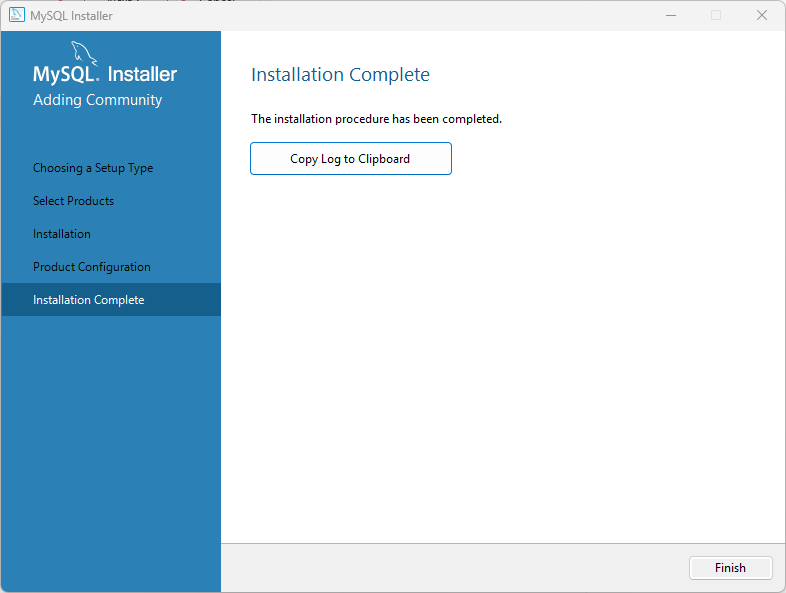

## 配置 MySQL 的环境变量

右键点击`此电脑`，选择`属性`：
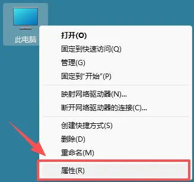

在弹出的窗口中点击`高级系统设置`：

在系统属性窗口中，点击`环境变量`按钮：

在`系统变量`列表中，找到 `Path` 变量，点击`编辑`：
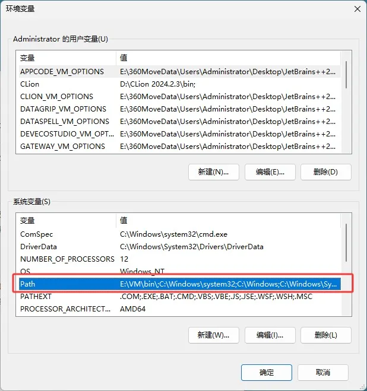

点击`新建`，将 MySQL 的安装路径下的 `bin` 目录（例如：`D:\MySQL\MySQL Server 8.0\bin`）粘贴进去，点击`确定`保存设置：
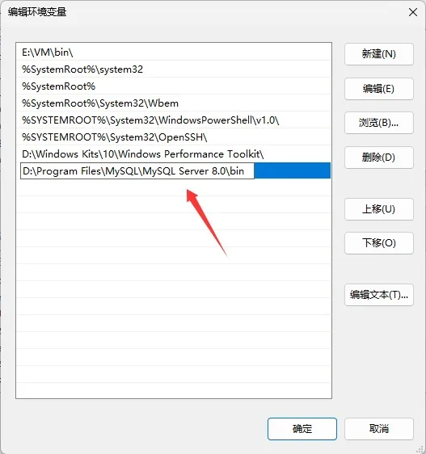

依次点击确定，`环境变量`就配置好了。

最后验证一下 MySQL 是否安装成功。按下键盘上的 `Win+R` 组合键（Windows 系统）或打开终端（Linux 系统），输入 `mysql -u root -p` 并回车。此时会提示`输入密码`，输入之前设置的数据库密码，然后回车：
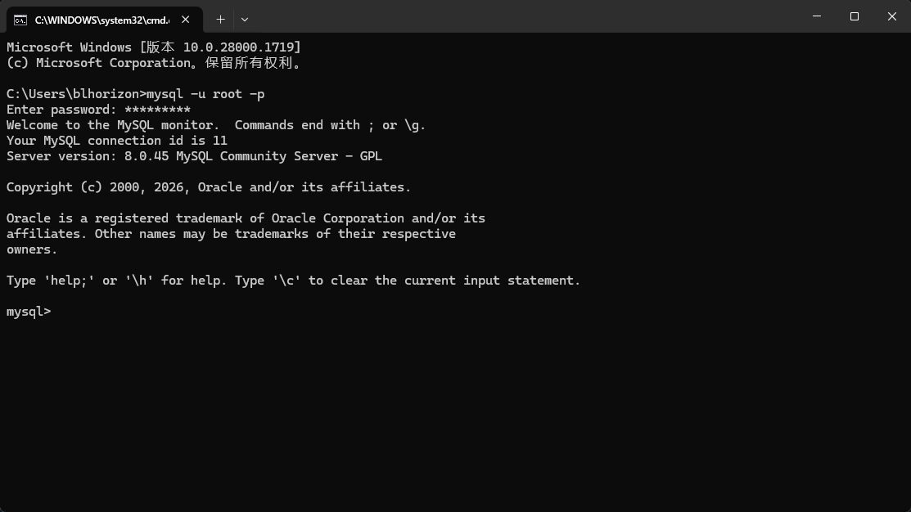

如果成功进入 MySQL 命令行界面，并显示 `Welcome to the MySQL monitor` 字样，说明 MySQL 8.0.45 安装成功。你可以开始使用 `CREATE DATABASE` 等命令创建数据库，进行`数据管理操作`了。

> 参考：[【2026最新】MySQL8下载安装全流程教程（附安装包+图文步骤）](https://developer.aliyun.com/article/1705141)

## Navicat17 安装

参考 [Navicat17安装教程（免费）,无需一键三连获取，评论区置顶免费获取](https://www.bilibili.com/video/BV1fSwvzXE1H/?spm_id_from=333.337.search-card.all.click&vd_source=8abceb502969e7de8c2eb9bc66a1d6e3)即可破解安装。