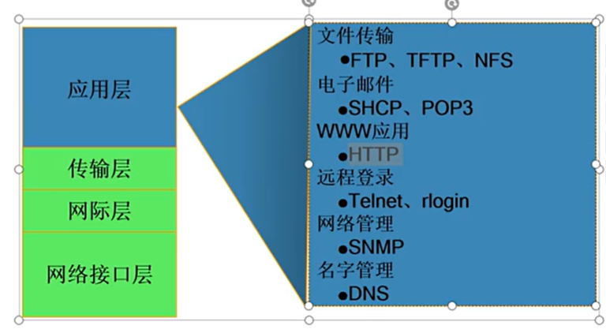
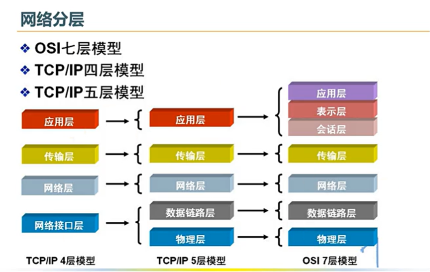
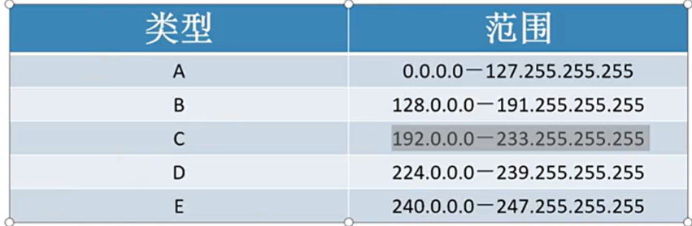

## Dos命令

DOS（Disk Operating System，磁盘操作系统）是早期个人电脑的主流命令行操作系统，如今 Windows 系统中的`命令提示符（CMD）` 完整继承了 MS-DOS 的核心命令体系，是 Windows 系统运维、批量操作、故障排查、自动化脚本的核心工具。

DOS 命令分为两类：
- 内部命令：随 CMD 启动`加载到内存`，可直接执行
- 外部命令：以`独立可执行文件`（.exe/.com）存放在系统目录中，需要对应文件存在才能执行

---

### 基础命令

| **命令**        | **核心功能**         | **语法与高频示例**                                                                                              |
|:-------------:|:----------------:|:--------------------------------------------------------------------------------------------------------:|
|   **cd/chdir**  |   切换工作目录           | 语法：`cd [/d] [路径]` 示例：`cd ..`  返回上一级目录 `cd \`  切换到当前磁盘根目录 `cd /d d:\test`  直接跨盘切换到 D 盘 test 文件夹（/d 参数实现盘符 + 目录一键切换）  |
|   **dir**       |   列出目录下的文件 / 文件夹   | 语法：`dir [路径] [参数]` 示例：`dir`  列出当前目录所有内容 `dir /a`  显示所有文件（含隐藏 / 系统文件） `dir *.txt /s`  递归查找当前盘所有 txt 文件 `dir /p`  分页显示内容 |
| **cls**       | 清空命令行窗口内容        | 直接输入`cls`回车，一键清屏                                                                                           |
| **exit**      | 关闭命令提示符窗口        | 直接输入`exit`回车，退出 CMD                                                                                        |
|  **help**      |  查看命令帮助文档         | 语法：`help [命令名] / [命令名] /?` 示例：`help cd`  查看 cd 命令完整用法 `ipconfig /?`  查看 ipconfig 的参数说明                           |
|   **echo**      |   输出文本 / 控制命令回显    | 语法：`echo [内容] [on/off]` 示例：`echo hello world`  输出指定文本 `echo off`  关闭后续命令的回显（批处理核心） `echo.`  输出空行                    |
| **ver**       | 查看系统版本           | 直接输入`ver`回车，显示当前 Windows 内核版本                                                                              |
| **date/time** | 查看 / 修改系统日期 / 时间 | 直接输入`date/time`可查看并修改对应值，无参数仅查看                                                                            |

---

### 目录 / 文件夹操作命令

| **命令**       | **核心功能** | **语法与高频示例**                                                                                                               |
|:------------:|:--------:|:-------------------------------------------------------------------------------------------------------------------------:|
|  **md/mkdir** |  创建文件夹    | 语法：`md [文件夹路径]` 示例：`md test`  当前目录创建 test 文件夹 `md d:\a\b\c`  一键递归创建多级目录                                                           |
|   **rd/rmdir** |   删除文件夹    | 语法：`rd [路径] [参数]` 核心参数：`/s` 递归删除文件夹及所有子内容 `/q` 安静模式，删除时不弹出确认提示 示例：`rd test /s /q`  无提示彻底删除 test 文件夹及所有内容 ⚠️ 高危警告：删除后无法从回收站恢复，务必确认路径无误 |

---

### 文件操作核心命令

| **命令**         | **核心功能**      | **语法与高频示例**                                                                                                                                   |
|:--------------:|:-------------:|:---------------------------------------------------------------------------------------------------------------------------------------------:|
|   **copy**       |   复制文件          | 语法：`copy [源文件] [目标路径]` 示例：`copy d:\1.txt e:\`  把 1.txt 复制到 E 盘根目录 `copy *.txt d:\backup`  批量复制当前目录所有 txt 文件 `copy 1.txt+2.txt 3.txt`  合并 1、2.txt 为 3.txt |
|   **xcopy**      |   增强型复制（支持目录递归） | 语法：`xcopy [源] [目标] [参数]` 核心参数：`/e` 复制所有子目录（含空目录） `/h` 复制隐藏 / 系统文件 `/y` 覆盖时不提示 确认示例：`xcopy d:\test e:\backup /e /h /y`  完整克隆 test 文件夹到 backup                |
|   **del/erase**  |   删除文件          | 语法：`del [文件路径] [参数]` 核心参数：`/s` 递归删除子目录中匹配的文件 `/q` 安静模式，无确认提示 示例：`del *.log`  删除当前目录所有 log 文件 `del d:\temp\*.* /s /q`  无提示清空 temp 目录所有文件                     |
|  **ren/rename** |  重命名文件 / 文件夹   | 语法：`ren [原名称] [新名称]` 示例：`ren 1.txt 2.txt`  单个文件重命名 `ren *.txt *.doc`  批量修改所有 txt 文件后缀为 doc                                                            |
|  **move**       |  移动文件 / 文件夹    | 语法：`move [源] [目标路径]` 示例：`move 1.txt d:\test`  把 1.txt 移动到 test 文件夹 `move test d:\new`  移动 test 文件夹并重命名为 new                                           |
|  **type**       |  查看文本文件内容      | 语法：`type [文件路径]` 示例：`type d:\1.txt`  查看 1.txt 内容`type 1.txt` `more`  分页查看长文本                                                                                        |
|   **attrib**     |   查看 / 修改文件属性   | 语法：`attrib [±属性] [文件路径]` 属性说明：`r`只读、`h`隐藏、`s`系统、`a`存档 示例：`attrib +h +s 1.txt`  把 1.txt 设为隐藏 + 系统文件 `attrib -h 1.txt`  取消文件的隐藏属性                                |

---

### 磁盘与系统管理命令

| **命令**         | **核心功能**       | **语法与高频示例**                                                                                                                                           |
|:--------------:|:--------------:|:-----------------------------------------------------------------------------------------------------------------------------------------------------:|
|    **shutdown**   |    系统关机 / 重启 / 注销 | 语法：`shutdown [参数]` 核心参数：`/s` 关机、`/r` 重启、`/l` 注销 `/t` 秒数 设置倒计时 `/a` 取消已设置的关机计划 示例：`shutdown /s /t 60`  60 秒后关机 `shutdown /r /t 0`  立即重启 `shutdown /a`  取消关机                    |
|   **format**     |   磁盘格式化          | 语法：`format [盘符:] [参数]` 核心参数：`/fs:ntfs` 指定文件系统为 NTFS `/q` 快速格式化 示例：`format d: /q /fs:ntfs`  快速格式化 D 盘为 NTFS ⚠️ 极高危命令！格式化会清空磁盘全部数据，严禁对系统盘操作                         |
|   **chkdsk**     |   磁盘检查与错误修复      | 语法：`chkdsk [盘符:] [参数]` 核心参数：`/f` 修复磁盘错误 `/r` 查找坏扇区并恢复可读数据 示例：`chkdsk d: /f`  检查 D 盘并修复文件系统错误                                                                     |
|   **diskpart**   |   磁盘分区管理         | 输入`diskpart`进入交互模式，核心子命令：`list disk` 列出所有磁盘 `list volume` 列出所有分区 `select disk 0` 选中磁盘 0 ⚠️ 专业分区工具，误操作会导致全盘数据丢失，非专业人员慎用                                           |
|  **tasklist**   |  查看系统运行进程       | 语法：`tasklist [参数]` 示例：`tasklist`  列出所有运行进程tasklist  `findstr "chrome"` 筛选 chrome 相关进程                                                                                                        |
|    **taskkill**   |    强制结束进程         | 语法：taskkill [参数] 核心参数：`/f` 强制结束 `/im` 进程名 指定进程映像名 `/pid` 进程ID 指定 PID 结束 示例：`taskkill /f /im chrome.exe`  强制结束所有 chrome 进程 `taskkill /f /pid` 1234  结束 PID 为 1234 的进程 |
| **systeminfo** | 查看系统完整信息       | 直接输入`systeminfo`回车，输出系统版本、硬件配置、补丁、网卡信息等完整系统数据                                                                                                           |
|  **sfc**        |  系统文件检查与修复      | 语法：`sfc /scannow` 核心功能：扫描并修复受损的 Windows 系统文件，需管理员权限运行                                                                                                    |

---

### 网络诊断与管理命令

| **命令**       | **核心功能**      | **语法与高频示例**                                                                                                                                                                 |
|:------------:|:-------------:|:---------------------------------------------------------------------------------------------------------------------------------------------------------------------------:|
|    **ipconfig** |    查看 / 管理网络配置   | 语法：`ipconfig [参数]` 核心参数：`/all` 查看完整网卡配置（MAC 地址、DNS、DHCP 等） `/flushdns` 刷新 DNS 解析缓存 `/release` 释放 IP 地址/renew 重新获取 IP 地址 示例：`ipconfig /all`  查看所有网卡详细信息 `ipconfig /flushdns`  清空本地 DNS 缓存     |
|   **ping**     |   测试网络连通性       | 语法：`ping [目标地址/域名] [参数]` 核心参数：`-t` 持续 ping 目标，按 Ctrl+C 停止 `-n` 次数 指定 ping 包数量 示例：`ping www.baidu.com`  测试到百度的网络连通性 `ping 192.168.1.1 -t`  持续 ping 网关地址                                    |
|  **tracert**  |  路由追踪          | 语法：`tracert [目标地址/域名]` 示例：`tracert www.baidu.com`  追踪到百度的网络节点，定位网络故障点                                                                                                            |
|  **netstat**  |  查看网络连接 / 端口占用 | 语法：`netstat [参数]` 核心参数：`-ano` 查看所有连接、监听端口及对应进程 PID 示例：`netstat -ano`  查看全量端口占用情况 `findstr "8080"` 查找 8080 端口的占用进程                                                                                       |
|    **net**      |    网络综合命令集       | 高频子命令：`net user`  查看系统所有用户账户 `net user 用户名 密码 /add`  新建本地用户 `net localgroup administrators` 用户名  `/add`  将用户加入管理员组 `net share`  查看系统所有共享文件夹 `net use Z: \\192.168.1.100\share`  将网络共享映射为 Z 盘 |

---

### 批处理进阶常用命令

批处理（.bat/.cmd）是 DOS 命令的`批量执行脚本`，以下是批处理核心命令：
1. `@`：行首添加，关闭当前行的命令回显，批处理开头常用`@echo off`
2. `pause`：暂停脚本执行，弹出「按任意键继续...」提示
3. `set`：定义 / 读取变量，示例：`set a=123` 定义变量，`echo %a%` 输出变量值
4. `if`：条件判断，示例：`if exist d:\1.txt (echo 存在) else (echo 不存在)`
5. `for`：循环命令，示例：`for %%i in (*.txt) do echo %%i` 遍历当前目录所有 txt 文件（CMD 直接执行用`%i`，批处理用`%%i`）
6. `goto`：跳转到指定标签，示例：`goto :start` 跳转到`:start`标签位置
7. `call`：调用另一个批处理脚本或子程序，示例：`call 2.bat`

---

### 常用特殊符号与高级语法

| **符号**   | **核心功能**               | **示例**                                     |
|:--------:|:----------------------:|:------------------------------------------:|
| **>**    | 输出重定向，覆盖写入文件           | `echo hello > 1.txt` 把 hello 写入 1.txt，覆盖原有内容 |
| **>>**   | 输出重定向，追加写入文件           | `echo hello >> 1.txt` 把 hello 追加到 1.txt 末尾   |
| **&&**   | 逻辑与，前一个命令执行成功，才执行后一个   | `md test && cd test` 创建 test 成功后，进入该目录       |
| ***/?**  | 通配符，*匹配任意字符，?匹配单个字符    | `del *.tmp` 删除所有 tmp 后缀文件                    |
| **""** | 路径包裹符，路径含空格时必须用英文双引号包裹 | `cd ""C:\Program Files""`                   |

---

### 常用快捷键

- `Ctrl+C`：强制终止正在执行的命令
- `Tab`：自动补全文件名 / 目录名
- `↑/↓`：快速调出历史执行命令
- `F7`：打开历史命令列表，可直接选择执行
- `Esc`：清空当前输入的命令行

---

### 注意事项

1. DOS 命令`不区分大小写`，cd 和 CD 执行效果完全一致
2. 涉及系统 / 磁盘管理的命令，`必须以管理员身份运行 CMD `才能正常执行
3. 高危命令（`rd /s/q`、`format、del /s/q`、`diskpart`）执行前务必反复确认路径，避免数据丢失
4. 路径中包含空格、特殊字符时，必须用`英文双引号`包裹完整路径

---

## 网络体系

计算机网络体系：计算机网络是用`通信设备和线路`将分散在不同地点的有独立功能的`多个计算机系统互相连接`起来，并`按照网络协议`进行数据通信，实现资源共享的计算机集合。

网络体系最基础、最通用的分类标准，按网络覆盖的物理距离、规模从小到大排序：
- 局域网（LAN）：范围在 `1km 以内，最大不超 10km`，其高带宽、低延迟、低误码率、组网灵活、由单一机构全权管理，是网络的基础单元。例如家庭 WiFi 网络、企业办公内网、学校机房、网吧网络；`无线局域网` WLAN是 LAN 的无线实现，核心技术 WiFi，是当前最主流的 LAN 形态

- 城域网（MAN）：范围在 `几十公里～上百公里`，其覆盖一个城市 / 都市圈，连接市内多个 LAN/CAN，作为城市级骨干网络，高带宽、统一规划，通常由运营商 / 政府主导建设。例如城市政务专网、运营商城市 IP 骨干网、智慧交通专网、广电有线电视网络

- 广域网（WAN）：范围在 `数百公里～数万公里`，其跨城市、跨省、跨国家 / 洲际，低带宽、高延迟（相对 LAN）、多运营商联合组网，采用复杂路由协议，是互联网的核心骨架。例如运营商国家级骨干网、跨地域企业总部 - 分公司专线、国际海缆网络；**互联网（Internet）是全球最大的开放式广域网**

协议：为进行数据交换而建立的规则、标准或约定。协议庞大且复杂但`协议不是绝对可靠`。

拓扑结构划分为`星型`、`总线型`、`环型`、`树型`、`网状`。

---

### 网络分层

计算机网络体系结构，核心是为`实现异构设备跨网络互联互通，而设计的分层式通信协议规范集合`。它将复杂的网络通信过程拆解为有明确功能边界的层级，定义了每层的通信规则、相邻层的服务接口，核心设计思想是`分层解耦`：下层为上层提供透明的服务，上层无需关心下层的具体实现细节，仅需调用下层接口。

业界有两大核心体系模型：
- **OSI 七层参考模型**：国际标准化组织制定的理论标准，是网络学习的核心框架
- **TCP/IP 模型**：互联网的工业事实标准，是当前全球网络通信的实际落地规范

分层是网络体系的灵魂，核心优势如下：
1. **独立性与解耦**：每层仅实现固定功能，技术升级仅影响本层，不干扰其他层级（如以太网从千兆升级到万兆，上层的 HTTP 协议无需任何修改）
2. **标准化与互通性**：各层功能、协议标准化，不同厂商的设备、不同架构的系统可实现跨网络互联互通
3. **易维护与排障**：可逐层定位故障，比如网络不通时，可从物理层（网线 / 信号）→链路层→网络层→传输层→应用层逐级排查，大幅降低问题定位难度
4. **可复用性**：通用功能可被多层复用，避免重复开发

---

### OSI 七层参考模型（理论标准）

OSI（Open System Interconnection，开放系统互连）七层模型是 ISO（国际标准化组织）1984 年发布的通用网络通信框架，是网络知识体系的核心参考，层级**从下到上**依次为 1-7 层，每层的核心功能、协议数据单元（PDU，本层传输的数据格式）、典型设备 / 协议如下：

| **层级**    | **层级名称** | **核心功能**                                                        | **协议数据单元 (PDU)**                  | **典型设备 / 核心协议**                                           |
|:---------:|:--------:|:---------------------------------------------------------------:|:---------------------------------:|:---------------------------------------------------------:|
| **第 1 层** | 物理层      | 负责在物理介质上传输`原始比特流`，定义硬件电气特性、接口标准、传输速率、信号编码方式，只关心 0 和 1 的传输，不关心数据含义 | 比特（Bit）                           | 设备：网线、光纤、集线器、中继器、网卡物理接口标准：RJ45、光纤接口、10BASE-T 等以太网物理标准     |
| **第 2 层** | 数据链路层    | 将物理层的比特流封装成`帧`，实现相邻节点（同一局域网内）的可靠传输；负责 MAC 地址寻址、差错校验、帧同步、流量控制      | 帧（Frame）                          | 设备：二层交换机、网卡、网桥协议：以太网协议、PPP、ARP/RARP、VLAN 协议               |
| **第 3 层** | 网络层      | 实现跨局域网的端到端通信，核心是`路由选择与寻址`；定义 IP 地址格式，通过路由协议生成路由表，将分组从源主机转发到目标主机   | 分组 / 包（Packet）                    | 设备：路由器、三层交换机协议：IP（IPv4/IPv6）、ARP、ICMP、IGMP、OSPF、BGP 等路由协议 |
| **第 4 层** | 传输层      | 负责两台主机`进程到进程`的端到端通信，为上层应用提供数据传输服务；实现端口寻址、流量控制、拥塞控制、差错恢复、传输可靠性保障   | 段（Segment，TCP）/ 数据报（Datagram，UDP） | 设备：四层防火墙、负载均衡器协议：TCP（传输控制协议，可靠）、UDP（用户数据报协议，不可靠）          |
| **第 5 层** | 会话层      | 负责建立、管理、终止两个应用进程之间的通信会话，提供会话同步、断点续传、全双工 / 半双工管理                 | 会话协议数据单元（SPDU）                    | 协议：RPC、SDP、NetBIOS，实际应用中极少单独实现                            |
| **第 6 层** | 表示层      | 负责处理通信双方的数据格式转换、加密解密、压缩解压缩，确保应用层能识别对方发送的数据                      | 表示协议数据单元（PPDU）                    | 功能实现：TLS/SSL 加密、JPEG/ASCII 格式转换、数据压缩，现已合并到 TCP/IP 应用层     |
| **第 7 层** | 应用层      | 直接为用户 / 应用程序提供网络服务，定义应用层的通信规则与业务逻辑，是用户与网络的接口                    | 报文（Message）                       | 协议：HTTP/HTTPS、DNS、FTP、SMTP/POP3/IMAP、SSH、WebSocket、RTSP   |

关键说明：OSI 模型是`理论参考框架`，其 5、6 层的功能在实际应用中，均被整合到了 TCP/IP 模型的应用层中，并未单独分层实现。

IP 是连接到网上的所有计算机网络实现相互通信的一套规则，只要遵守IP协议就可以与因特网互连互通。其具有`唯一性`。范围在 0~255。

网关：从一个网络跨到另外一个网络经过的关卡，比如局域网跨广域网。

DNS：`域名解析器`将域名解析为ip地址，这样才能访问对应网址的服务器。

---

### TCP/IP 体系模型（工业事实标准）

TCP/IP（传输控制协议 / 网际协议）模型，是伴随互联网诞生的落地标准，是当前全球所有网络通信的核心架构，它简化了 OSI 的分层设计，更贴合实际工程实现。

| **层级**    | **层级名称**   | **对应 OSI 层级**   | **核心功能**                                       | **核心协议**                                      |
|:---------:|:----------:|:---------------:|:----------------------------------------------:|:---------------------------------------------:|
| **第 1 层** | 网络接口层（链路层） | 物理层 + 数据链路层     | 负责比特流的物理传输、帧的封装与解封装、局域网内的 MAC 寻址，对接底层硬件介质      | 以太网协议、PPP、ARP、VLAN、驱动程序                       |
| **第 2 层** | 网际层（互联网层）  | 网络层             | 核心是 IP 寻址与路由转发，实现跨网络的端到端数据包传输，是整个 TCP/IP 体系的枢纽 | IPv4/IPv6、ARP、ICMP、IGMP、OSPF、BGP              |
| **第 3 层** | 传输层        | 传输层             | 负责进程到进程的通信，提供端到端的传输控制，为应用层提供可靠 / 不可靠的传输服务      | TCP、UDP                                       |
| **第 4 层** | 应用层        | 会话层 + 表示层 + 应用层 | 整合了 OSI 上三层的全部功能，直接为应用程序提供网络服务，定义业务层面的通信规则     | HTTP/HTTPS、DNS、FTP、SMTP、SSH、WebSocket、TLS/SSL |

为了更清晰地对应 OSI 模型、方便学习理解，业界教学中普遍`采用五层网络模型`，将 TCP/IP 的网络接口层拆分为`物理层 + 数据链路层`，其余层级不变，既保留了理论框架的完整性，又贴合实际工程实现，是目前最主流的教学体系。

| **对比维度**  | **OSI 七层模型**               | **TCP/IP 四层模型**                      |
|:---------:|:--------------------------:|:------------------------------------:|
| **定位**    | 理论参考标准，通用框架                | 互联网工业事实标准，落地实现                       |
| **分层设计**  | 分层精细，上三层（会话 / 表示 / 应用）拆分明确 | 分层简化，上三层合并为应用层，更贴合工程实践               |
| **协议耦合**  | 模型与协议解耦，不绑定特定协议            | 模型基于 TCP/IP 协议栈设计，与协议深度绑定            |
| **可靠性设计** | 从链路层到应用层均强调可靠传输            | 可靠性保障仅在传输层 TCP 协议实现，UDP 和 IP 均为不可靠传输 |
| **实际应用**  | 仅用于网络学习、故障排查的理论参考          | 全球互联网、局域网、所有网络设备均基于此模型运行             |

---

### 关于TCP和UDP

TCP（Transmission Control Protocol）是`面向连接、可靠交付、基于字节流`的传输层协议，核心设计目标是`保证数据传输的完整性和正确性`。
- **面向连接**：传输数据前`必须通过三次握手`建立端到端的全双工连接，传输结束后通过`四次挥手断开连接`，仅支持`单播通信`。
- **可靠传输**：通过序列号、`确认应答（ACK）`、超时重传、校验和机制，保证`数据无丢失、无重复、按序到达`。
- **流量与拥塞控制**：通过滑动窗口实现流量控制，避免发送方速率超过接收方处理能力；通过慢启动、拥塞避免、快重传、快恢复算法实现拥塞控制，避免网络过载。
- **面向字节流**：将数据视为无边界的字节流，应用层需自行处理数据边界与粘包问题。
- **首部开销**：固定 20 字节，可选字段最大可扩展至 60 字节。

对数据完整性、可靠性要求高，可容忍一定延迟的场景：`网页浏览（HTTP/HTTPS、HTTP/2）`、`文件传输（FTP、SFTP）`、`邮件收发（SMTP、POP3、IMAP）`、`远程登录（SSH、Telnet）`、`数据库访问`、`金融交易数据传输`等。

---

UDP（User Datagram Protocol）是`无连接、不可靠、面向数据报`的传输层协议，核心设计目标是极致的传输效率和低延迟。
- **无连接**：无需提前建立 / 断开连接，发送方直接封装报文发送，无握手、挥手环节，启动延迟极低。
- **不可靠交付**：协议层无确认应答、重传机制，不保证数据一定到达，也不保证按序交付，丢包、乱序的处理完全交给应用层。
- **无流量 / 拥塞控制**：不受网络拥塞影响，始终以固定速率发送数据，适合对实时性要求高于完整性的场景。
- **面向数据报**：有明确的报文边界，发送方一次发送一个完整报文，接收方一次接收完整报文，天然无粘包问题。
- **通信模式丰富**：支持单播、多播、广播，可实现一对多、多对多通信。
- **首部开销**：固定 8 字节，开销极低。

对实时性要求极高，可容忍少量丢包的场景：`实时音视频（直播、视频会议、VoIP 网络电话）`、`实时竞技网络游戏`、`DNS 域名解析`、`NTP 网络时间同步`、`物联网传感器数据上报`、`SNMP 网络管理`、`流媒体传输`、`HTTP/3（基于 QUIC 协议，底层为 UDP）`等。

UDP 的 “不可靠” 是`协议层不做可靠性保证，而非完全无法实现可靠传输`。应用层可基于 UDP 自行实现确认、重传、拥塞控制等机制，在保留低延迟优势的同时，实现定制化的可靠传输，典型代表就是 HTTP/3 使用的 QUIC 协议。