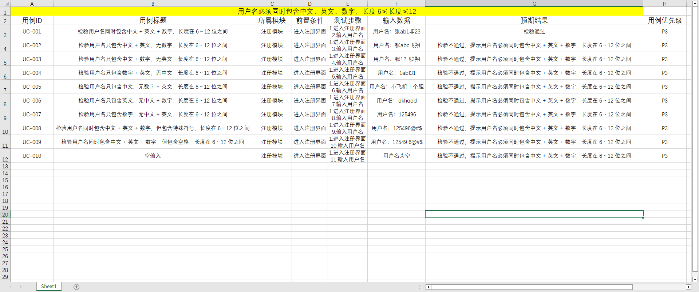

测试用例设计方法，是为了高效、`全面覆盖`测试场景、精准发现软件缺陷，基于需求规格、代码逻辑、业务场景制定的标准化设计思路。

## 等价类

等价类划分法是黑盒测试（功能测试）最基础、最核心的用例设计方法，**核心逻辑**是：将无法`穷举的输入数据`，按需求规则划分为若干个互不相交的「等价类」，从每个等价类中`选取少量具有代表性的数据`设计测试用例，用最少的用例覆盖最多的场景，解决穷举测试不可行的问题。

---

### 核心概念

等价类分为`有效等价类`和`无效等价类`两类，二者缺一不可，分别覆盖功能的`正常场景`和`异常容错场景`。
- 有效等价类：`符合需求`规格说明、合理的、有意义的输入数据集合，目的是为了程序是否正确实现了需求规定的功能
- 无效等价类：与有效等价类相反，其目的是为了验证程序的异常处理能力（容错性），是否能`对非法输入做正确拦截和提示`

---

### 核心规则

针对不同的输入规则，有标准化的划分方法，确保划分`无遗漏、无冗余`：
1. **输入规定了`取值范围` / 个数**：划分 1 个有效等价类，2 个无效等价类。
    
    例：需求要求输入 1-100 的整数，有效等价类：`1≤x≤100` 的整数；无效等价类：`x<1`、`x>100`。

2. **输入规定了「`必须遵守的规则`」**：划分 1 个有效等价类，N 个违反规则的无效等价类。

    例：用户名必须同时包含中文、英文与数字，有效等价类：`用户名必须同时包含：中文 + 英文 + 数字`；无效等价类：`缺少中文`、`缺少英文`、`缺少数字`、`只有中文`、` 只有英文`、`只有数字`、`包含特殊符号`、`空格`、`不可见字符 / 乱码`等。

3. **输入是枚举值 / 固定集合**：每个合法枚举值为 1 个有效等价类，所有非枚举值为 1 个无效等价类。

    例：需求要求性别只能选「男 / 女」，有效等价类：男、女；无效等价类：其他任意值。

4. **输入是布尔值**：划分 1 个有效等价类，1 个无效等价类。

    例：需求要求必须勾选用户协议，有效等价类：已勾选；无效等价类：未勾选。

5. **输入有多个规则叠加**：先为每个规则单独划分等价类，再`对有效等价类做组合，无效等价类单独拆分`。

---

### 标准步骤

1. **拆分输入条件**：基于需求规格，拆解所有可输入的项（如输入框、单选框、接口参数、表单字段等）。

2. **划分等价类并编号**：为每个输入条件，分别划分有效、无效等价类，给每个等价类分配唯一编号，便于后续追溯覆盖。

3. **设计有效等价类用例**：1 条用例尽可能覆盖**最多的未覆盖有效等价类**，直到所有有效等价类全部被覆盖。

4. **设计无效等价类用例**：严格遵循**单缺陷原则**，1 条用例仅覆盖 1 个未覆盖的无效等价类，直到所有无效等价类全部被覆盖。

    关键说明：单缺陷原则可避免`多个无效规则叠加`导致的「缺陷屏蔽」—— 若 1 条用例覆盖多个无效规则，程序可能只拦截了第一个错误，后续的缺陷就无法被测出。

---

### 实战案例

需求背景：**用户名必须同时包含中文、英文与数字，长度大于等于6且小于等于12**。

1. 有效等价类：同时包含：中文 + 英文 + 数字，长度在 6～12 位之间【没有包含其他的】
2. 无效等价类
    - 长度不符合：`长度 < 6（其他条件满足）`、`长度 > 12（其他条件满足）`
    - 缺少某一类字符（长度合法）：`只有 中文 + 英文，无数字`、`只有 中文 + 数字，无英文`、`只有 英文 + 数字，无中文`
    - 只有单一类型（长度合法）：`只有中文`、`只有英文`、`只有数字`
    - 包含非法内容（长度合法、三类都有）：`包含 特殊符号（!@#$%^&*_+- 等）`、`包含 空格`、`包含 换行 / 不可见字符`
    - 空值：`空输入`

根据等价类划分成测试用例：[文件](https://wwbri.lanzoub.com/iPqim3lxnr4h)

---

## 边界值

边界值分析法（Boundary Value Analysis，`BVA`）是黑盒测试最核心、性价比最高的测试方法之一，是`等价类划分法的重要补充`，核心逻辑是：软件绝大多数缺陷都出现在`输入 / 输出范围的边界临界点`，而非范围内部，因此专门针对边界值设计测试用例，能高效发现程序的逻辑错误。

---

### 核心概念

程序员在处理边界条件时极易出现`逻辑错误`（如>=与>混淆、循环终止条件错误、数组下标越界、数值溢出等），边界值法就是精准命中这类高频出错场景，通过测试边界的临界值，验证程序对边界的处理是否符合需求。

边界值设计的核心是精准识别 3 类点，这是用例设计的基础：
| **概念** | **定义**                       | **取值规则**                                   |
|:------:|:----------------------------:|:------------------------------------------:|
| **上点** | 边界上的点，无论区间是开 / 闭，上点固定为边界本身   | 闭区间[1,100]：上点为 1、100 开区间(1,100)：上点仍为 1、100 |
| **内点** | 边界范围内的任意一个有效值，用于校验正常业务场景     | 区间[1,100]内的 50，仅需 1 个即可                    |
| **离点** | 离上点最近、刚好超出边界的点，开闭区间决定离点的取值方向 | 闭区间[1,100]：离点为 0、101 开区间(1,100)：离点为 2、99   |

关键记忆点：**闭区间离点往外走，开区间离点往里走**。

---

### 设计方法

1. 基础边界值法（单缺陷假设）
    
    行业最常用的设计方法，基于`单缺陷假设`（故障大多由单个变量的临界值导致），每个输入变量独立覆盖边界，其他变量取正常值。
    - 取值规则：每个变量取 5 个值：`最小值`、`略高于最小值`、`正常值`、`略低于最大值`、`最大值`
    - 用例数量：n 个输入变量，生成 `4n+1` 个测试用例

2. 健壮性边界值法
    
    在基础边界值的基础上，增加对异常边界的测试，验证程序的容错能力和异常处理逻辑。
    - 取值规则：每个变量取 7 个值：`略低于最小值`、`最小值`、`略高于最小值`、`正常值`、`略低于最大值`、`最大值`、`略高于最大值`
    - 用例数量：n 个输入变量，生成 `6n+1` 个测试用例

3. 最坏情况边界值法

    基于多缺陷假设，测试多个变量边界值的组合场景，覆盖更全面，但用例数量会指数级增长，仅用于核心高风险模块。
    - 取值规则：所有变量的边界值进行全组合
    - 用例数量：n 个输入变量，基础版生成 `5^n` 个用例，健壮性版生成 `7^n` 个用例

---   

### 设计步骤

1. **明确边界条件**：从需求文档中提取所有`带范围`的输入 / 输出项，包括数值、长度、时间、数量、文件大小等。
2. **划分等价类**：先完成有效 / 无效等价类划分，锁定边界范围。
3. **确定上点、离点、内点**：根据`区间开闭`，精准确定 3 类点的取值。
4. **设计测试用例**：`优先覆盖所有上点，再覆盖离点，最后用内点做正常场景校验`；多变量场景优先用单缺陷假设，核心模块补充组合场景。
5. **补充输出域边界**：不仅测输入边界，还要构造输入，验证输出结果的边界是否符合需求（如输出金额上限、分页最大条数等）。

---

### 案例解析

1. `闭区间`数值输入

    输入一个整数，有效范围为 1~100（`闭区间`，包含 1 和 100），有效提示 “成功”，无效提示 “失败”。
    | **用例类型**   | **输入值** | **预期结果** |
    |:----------:|:-------:|:--------:|
    | **上点（有效）** | 1       | 成功       |
    | **上点（有效）** | 100     | 成功       |
    | **离点（无效）** | 0       | 失败       |
    | **离点（无效）** | 101     | 失败       |
    | **内点（有效）** | 50      | 成功       |

2. `开区间`数值输入

    输入一个整数，必须大于 1 且小于 100（`开区间`，不包含 1 和 100），有效提示 “成功”，无效提示 “失败”。
    | **用例类型**   | **输入值** | **预期结果** |
    |:----------:|:-------:|:--------:|
    | **上点（无效）** | 1       | 失败       |
    | **上点（无效）** | 100     | 失败       |
    | **离点（有效）** | 2       | 成功       |
    | **离点（有效）** | 99      | 成功       |
    | **内点（有效）** | 50      | 成功       |

3. `开闭区间`数值输入

    输入一个整数，必须大于 1 且小于 100（`开闭区间`，包含 1 且 不包含 100），有效提示 “成功”，无效提示 “失败”。
    | **要素类型**    | **取值** | **有效性** | **预期结果** |
    |:-----------:|:------:|:-------:|:--------:|
    | **上点（左闭）**  | 1      | 有效      | 成功     |
    | **上点（右开）**  | 100    | 无效      | 失败    |
    | **离点（左闭外）** | 0      | 无效      | 失败    |
    | **离点（右开内）** | 99     | 有效      | 成功     |
    | **内点**      | 50     | 有效      | 成功     |

边界值不止适用于整数，所有`带范围约束`的场景都适用，常见场景包括：
1. **数值类**：整数 / 小数的取值范围、精度限制（如金额保留 2 位小数）、数值类型上下限（如 int32 最大值 2147483647）
2. **长度类**：字符串、数组、集合的元素个数、文本输入框的最大 / 最小长度
3. **时间类**：活动起止时间、有效期、循环执行次数、超时时间
4. **空间 / 文件类**：上传文件大小限制、内存占用上限、磁盘空间阈值
5. **结构类**：数组下标（0 和最后一位下标）、分页的首页 / 末页、循环的 0 次 / 1 次 / 最大次数

---

### 经典案例

**需求**：输入边长A、B、C 3个值，判断是否能`构成三角形`，输出对应的信息。

1. 前置：输入合法性校验

    输入的 3 个边长 A、B、C，必须同时满足以下条件，否则判定为非法输入：
    - 均为`有效数值`（整数 / 浮点数，不接受空值、非数字字符、布尔值等）
    - 每个数值`严格大于 0`（边长为 0 / 负数无几何意义）

    非法输入固定输出：输入不合法，请输入3个大于 0 的有效数字

2. 三角形构成资格判定：

    满足合法输入后，必须符合**三角形充要条件：任意两边之和严格大于第三边**

    优化技巧：将三边从小到大排序为 `a ≤ b ≤ c`，`仅需判断 a + b > c 即可`（最大边 c 已确定，a+c>b、b+c>a必然成立）
    - 不满足条件输出：无法构成三角形，原因：任意两边之和必须严格大于第三边
    - 满足条件，进入三角形类型细分判定

3. 三角形类型细分（优先级从高到低）

    优先级说明：等边是特殊的等腰三角形，`业务中优先判定等边`，避免逻辑冲突
    - **等边三角形**：三边完全相等 `A == B == C`。输出示例：可构成三角形，类型为`【等边三角形】（特殊的等腰/锐角三角形`）
    - **等腰三角形**：恰好只有两边相等（排除等边），即 `(A==B && A≠C) || (A==C && A≠B) || (B==C && B≠A)`。输出示例：可构成三角形，类型为`【等腰三角形】`
    - **不等边普通三角形**：三边均不相等。输出示例：可构成三角形，类型为`【不等边普通三角形】`

    补充：按角分类（完善输出信息），基于排序后的 a ≤ b ≤ c，通过勾股定理延伸判定：
    - 直角三角形：`a² + b² == c²`，输出补充：同时为`【直角三角形】`
    - 锐角三角形：`a² + b² > c²`，输出补充：同时为`【锐角三角形】`
    - 钝角三角形：`a² + b² < c²`，输出补充：同时为`【钝角三角形】`

4. 根据等价类和边界值写出测试用例

    | 用例 ID | 输入 A  | 输入 B  | 输入 C  | 用例类型                    | 预期输出                            |
    |-------|-------|-------|-------|-------------------------|---------------------------------|
    | TC001 | 3     | 3     | 3     | 有效等价类 - 等边三角形           | 可构成三角形，类型为【等边三角形】，同时为【锐角三角形】    |
    | TC002 | 3     | 3     | 4     | 有效等价类 - 等腰锐角三角形         | 可构成三角形，类型为【等腰三角形】，同时为【锐角三角形】    |
    | TC003 | 3     | 3     | 5     | 有效等价类 - 等腰钝角三角形         | 可构成三角形，类型为【等腰三角形】，同时为【钝角三角形】    |
    | TC004 | 3     | 4     | 5     | 有效等价类 - 直角三角形           | 可构成三角形，类型为【不等边普通三角形】，同时为【直角三角形】 |
    | TC005 | 4     | 5     | 6     | 有效等价类 - 普通锐角三角形         | 可构成三角形，类型为【不等边普通三角形】，同时为【锐角三角形】 |
    | TC006 | 2     | 3     | 4     | 有效等价类 - 普通钝角三角形         | 可构成三角形，类型为【不等边普通三角形】，同时为【钝角三角形】 |
    | TC007 | 0     | 3     | 4     | 无效等价类 - 含 0 值           | 输入不合法，边长必须为大于 0 的正数             |
    | TC008 | -2    | 3     | 4     | 无效等价类 - 含负数             | 输入不合法，边长必须为大于 0 的正数             |
    | TC009 | 空     | 3     | 4     | 无效等价类 - 空值输入            | 输入不合法，请输入 3 个大于 0 的有效数字         |
    | TC010 | abc   | 3     | 4     | 无效等价类 - 非数字输入           | 输入不合法，请输入 3 个大于 0 的有效数字         |
    | TC011 | 1     | 2     | 3     | 边界值 - 两边之和等于第三边（临界无效）   | 无法构成三角形，原因：任意两边之和必须严格大于第三边      |
    | TC012 | 1     | 2     | 3.1   | 边界值 - 两边之和小于第三边（无效）     | 无法构成三角形，原因：任意两边之和必须严格大于第三边      |
    | TC013 | 1     | 2     | 2.9   | 边界值 - 两边之和刚好大于第三边（临界有效） | 可构成三角形，类型为【不等边普通三角形】，同时为【钝角三角形】 |
    | TC014 | 0.1   | 0.1   | 0.1   | 边界值 - 极小正数（有效）          | 可构成三角形，类型为【等边三角形】，同时为【锐角三角形】    |
    | TC015 | 99999 | 99999 | 99999 | 边界值 - 极大数值（有效）          | 可构成三角形，类型为【等边三角形】，同时为【锐角三角形】    |

    - **严格区分「大于」和「大于等于」**：三角形定义是`严格大于`，两边之和等于第三边是共线线段，不能构成三角形，这是边界值测试的核心易错点。
    - **浮点数精度处理**：代码中加入了 1e-10 的容差，避免因浮点运算误差导致直角三角形、边界值判断错误。
    - **判定优先级**：必须先判定等边，再判定等腰，否则等边三角形会被误判为等腰三角形。
    - **乱序输入兼容**：先对三边排序，无需用户按大小顺序输入，提升程序鲁棒性。

---

### 注意事项

1. **必须和等价类划分结合使用**：边界值是`等价类的补充，不能替代等价类`，二者结合才能实现完整的输入覆盖。
2. **严格区分开闭区间**：`离点的取值错误`是最常见的用例设计失误，闭区间离点向外，开区间离点向内。
3. **不要忽略`隐性边界`**：需求未明确写明，但技术层面存在的边界（如数据类型溢出、数据库字段长度限制、接口参数最大长度）必须补充测试。
4. **输入 + 输出边界双覆盖**：绝大多数测试人员只测输入边界，忽略输出边界，很多业务逻辑的缺陷仅能通过输出边界测试发现。
5. **优先单缺陷，谨慎全组合**：全组合边界用例数量会指数级增长，非核心模块无需使用，避免测试成本过高。

---

### 与等价类的区别

| **维度**     | **等价类划分法**                     | **边界值分析法**               |
|:----------:|:------------------------------:|:------------------------:|
| **测试核心**   | 覆盖有效 / 无效等价类的代表值，验证 “类” 的整体正确性 | 精准命中边界临界点，验证 “边界” 的处理正确性 |
| **用例设计**   | 从等价类中任选一个代表值即可                 | 必须覆盖上点、离点，取值有严格的规则       |
| **缺陷发现能力** | 覆盖范围广，但对边界类缺陷敏感度低              | 对边界逻辑缺陷的检出率极高，是等价类的强力补充  |

利用等价类、边界值：

自已所做的作业：[作业](https://wwbri.lanzoub.com/ieRNT3mc6n1i)。通过这次作业得知，要`站在用户的角度`上去思考多个测试点，同时关于手机号的验证，可以`手机位数、手机号段（13 ~ 19）`来验证。