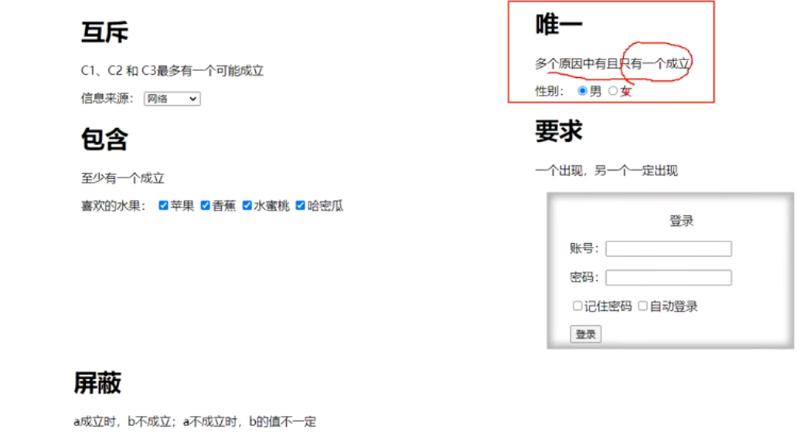
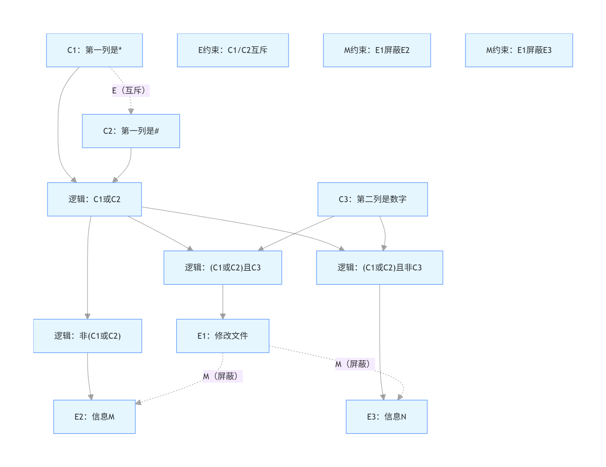
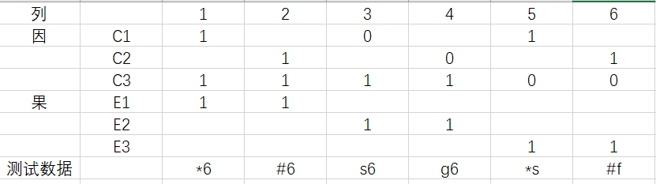
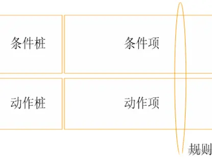

## 因果图

因果图法（Cause-Effect Graphing） 是一种经典的黑盒测试用例设计方法，核心是通过`图形化方式`梳理输入条件（因）与输出结果（果）之间的逻辑组合与约束关系，最终转化为判定表来生成测试用例，特别适合`多条件组合、业务逻辑复杂`的功能模块。

### 基本概念

- **因 (Cause)**：输入条件、操作、状态（如：输入内容、按钮点击、选项勾选）。
- **果 (Effect)**：输出结果、系统状态变化（如：提示信息、页面跳转、数据保存）。
- **核心价值**：解决等价类、边界值无法覆盖的`多条件组合`问题，确保`逻辑全覆盖`，发现隐藏缺陷。

---

### 基本逻辑关系

1. 恒等（Identity）

    - 因 = 1 → 果 = 1
    - 因 = 0 → 果 = 0

2. 非（Not）

    - 因 = 1 → 果 = 0
    - 因 = 0 → 果 = 1

3. 或（Or）

    - 多个因任意一个为 1 → 果 = 1
    - 全 0 → 果 = 0

4. 与（And）

    - 多个因全部为 1 → 果 = 1
    - 有一个 0 → 果 = 0

---

### 约束条件

约束只限制因之间或果之间，不画逻辑关系。

1. 互斥约束 E（Exclusive）

    - 多个因`最多只能`有一个为 1
    - 可以全 0，不能同时≥2 个 1

2. 包含约束 I（Inclusive）

    - 多个因`至少一个`为 1
    - 不能全 0

3. 唯一约束 O（Only）

    - 多个因`有且仅有`一个为 1
    - 不能全 0，也不能≥2 个 1

4. 要求约束 R（Requires）

    - `若因 A=1，则因 B 必须 = 1`
    - A=1，B=0 不合法

5. 屏蔽约束 M（Masking）

    - 只作用在结果之间
    - `若果 E1=1，则果 E2 必须 = 0`
    - E1、E2 不能同时为 1

---

### 设计步骤

1. 分析需求，`拆分因 / 果`

    - 提取所有输入条件（C1, C2, C3...）
    - 提取所有输出 / 结果（E1, E2, E3...）

2. 绘制因果图

    - 用逻辑符号（与 / 或 / 非）连接因 → 果
    - 标注约束（E/I/O/R/M），排除非法组合

3. 转换为判定表（决策表）

    - 行：因（输入）、果（输出）
    - 列：所有有效条件组合
    - 单元格：0/1 表示

4. 简化判定表（可选）

    - 合并相似列、剔除无效列

5. 生成测试用例

    - 每一列 → 一条用例（输入 + 预期输出）
---

### 案例

经典案例：自动售货机

需求：
    - 饮料单价 1.5 元
    - 投入 1.5 元 → 按按钮 → 出饮料
    - 投入 2 元 → 按按钮 → 出饮料 + 找零 0.5 元

1. 拆分因 / 果

因 (C)：
- C1：投入 1.5 元
- C2：投入 2 元
- C3：按 “可乐”
- C4：按 “雪碧”

果 (E)：
- E1：出可乐
- E2：出雪碧
- E3：找零 0.5 元
- E4：无任何出货 / 提示（金额不足 / 操作无效）

2. 约束
- E（互斥）：C1 与 C2 不能同时为 1
- E（互斥）：C3 与 C4 不能同时为 1
- 不投币、只按键：无效操作

3. 判定表

总原始组合 16 种，过滤非法后保留有效场景：
| 序号 | C1 (投 1.5) | C2 (投 2) | C3 (按可乐) | C4 (按雪碧) | E1 (出可乐) | E2 (出雪碧) | E3 (找 0.5) | E4 (无效) | 场景说明           |
|----|------------|----------|----------|----------|----------|----------|------------|---------|----------------|
| 1  | 0          | 0        | 0        | 0        | 0        | 0        | 0          | 1       | 不投币、不按键        |
| 2  | 0          | 0        | 1        | 0        | 0        | 0        | 0          | 1       | 只按可乐，不投币       |
| 3  | 0          | 0        | 0        | 1        | 0        | 0        | 0          | 1       | 只按雪碧，不投币       |
| 4  | 1          | 0        | 1        | 0        | 1        | 0        | 0          | 0       | 投 1.5 元 + 按可乐  |
| 5  | 1          | 0        | 0        | 1        | 0        | 1        | 0          | 0       | 投 1.5 元 + 按雪碧  |
| 6  | 0          | 1        | 1        | 0        | 1        | 0        | 1          | 0       | 投 2 元 + 按可乐，找零 |
| 7  | 0          | 1        | 0        | 1        | 0        | 1        | 1          | 0       | 投 2 元 + 按雪碧，找零 |
| 8  | 1          | 0        | 0        | 0        | 0        | 0        | 0          | 1       | 只投 1.5 元，不按键   |
| 9  | 0          | 1        | 0        | 0        | 0        | 0        | 0          | 1       | 只投 2 元，不按键     |

1 = 满足，0 = 不满足；已删掉 `C1=1 且 C2=1、C3=1 且 C4=1` 这类矛盾行，实际业务不可能出现。

4. 简化判定表（可选）

剔除无效场景，仅保留6条核心有效用例：
|用例编号|输入条件（投币+按键）|预期出可乐|预期出雪碧|预期找零0.5元|预期结果说明|
|---|---|---|---|---|---|
|TC-VM-001|投1.5元+按可乐|是|否|否|正常吐出可乐，无找零|
|TC-VM-002|投1.5元+按雪碧|否|是|否|正常吐出雪碧，无找零|
|TC-VM-003|投2元+按可乐|是|否|是|吐出可乐+找零0.5元|
|TC-VM-004|投2元+按雪碧|否|是|是|吐出雪碧+找零0.5元|
|TC-VM-005|只按键不投币（可乐/雪碧）|否|否|否|无任何动作，操作无效|
|TC-VM-006|只投币不按键（1.5元/2元）|否|否|否|待机无动作，操作无效|

---

#### 其他案例

- **E/I/O/R**：管**输入条件之间**
- **M**：管**输出结果之间**
- **因果图 = 逻辑关系 + 约束 → 判定表 → 测试用例**

1. 找出因和果

某个软件规格说明书中规定：第一列字符必须是*或#，第二列字符必须是一个数字，在此情况下进行文件的修改，但如果第一列字符不正确，则给出信息M；如果第二列字符不正确，则给出N

因：
- C1：第一列字符为*
- C2：第一列字符为#
- C3：第二列字符为数字

果：
- E1：修改文件
- E2：给出信息M
- E3：给出信息N

2. 理清它们之间的关系

3. 根据对应的关系画出因果图

4. 根据因果图转成判定表/决策表

5. 根据决策表变成测试用例

---

## 判定表

判定表（Decision Table），也叫决策表，是黑盒测试用例设计中逻辑最严谨、覆盖最完备的结构化方法，核心是将`多输入条件的所有组合、对应的业务规则与输出动作，以表格形式完整呈现`，从根本上避免逻辑分支遗漏，尤其擅长处理`多条件联动、多规则约束`的复杂业务场景，是功能测试中处理逻辑判断类需求的核心方法之一。

| 组成部分                 | 定义说明                                                            |
|----------------------|-----------------------------------------------------------------|
| 条件桩（Condition Stub）  | 列出所有影响系统输出的独立输入条件 / 判断因子，建议按业务优先级排序，每个条件桩仅对应一个布尔判断（是 / 否、真 / 假） |
| 动作桩（Action Stub）     | 列出条件组合触发后，系统所有可能执行的操作、输出结果或业务处理动作                               |
| 条件项（Condition Entry） | 针对条件桩，列出所有可能的取值组合（常用 Y/N、1/0 表示，也支持多枚举值），确保无重复、无遗漏              |
| 动作项（Action Entry）    | 对应每一组条件项组合，明确该规则下需要触发的动作桩结果（常用√标记执行动作）                          |
| 规则（Rule）             | 一组条件项 + 对应的动作项，构成一条完整的业务规则，`一条规则对应至少一条测试用例`，是判定表的核心执行单元           |

---

### 数学基础与规则计算

判定表的完备性，核心来自对条件组合的全量枚举：
- 若 n 个条件均为布尔型（2 个取值：是 / 否），则总规则数 = 2ⁿ
- 若条件有多个枚举值（如会员等级分普通 / 银卡 / 金卡），则总规则数 = 每个条件的取值数的乘积（m₁×m₂×…×mₙ）

示例：3 个布尔型条件，总规则数 = 2³=8 条，可覆盖所有条件组合。  

--- 

### 设计步骤（附实战案例）

1. 分析需求，确定条件桩与动作桩

    **业务需求**：
    - 登录需校验 3 项内容：用户名、密码、图形验证码
    - 仅当用户名正确、密码正确、验证码匹配时，登录成功
    - 用户名错误，直接提示「用户名不存在」，无需校验后续项
    - 用户名正确、密码错误，提示「密码错误」
    - 用户名和密码正确、验证码错误，提示「验证码错误」

拆解业务规则，拆分独立的输入条件和所有可能的输出动作，`严禁一个条件桩包含多个判断`，避免逻辑遗漏。
- 条件桩：C1. 用户名正确；C2. 密码正确；C3. 验证码匹配（均为布尔型：Y/N）
- 动作桩：A1. 登录成功；A2. 提示用户名不存在；A3. 提示密码错误；A4. 提示验证码错误

2. 计算规则总数，确定表格规模

根据条件桩的数量和每个条件的取值数，计算理论最大规则数，搭建表格框架。
- 3 个布尔条件，总规则数 = 2³= 8 条

3. 填充全量条件项组合

按`二进制枚举`的方式，逐列填充所有条件的取值组合，确保无遗漏、无重复。

4. 匹配业务规则，填充动作项

对照需求文档，为每一组条件项组合，明确对应的动作结果，完成初始判定表。
| 条件桩 / 动作桩    | 规则 1 | 规则 2 | 规则 3 | 规则 4 | 规则 5 | 规则 6 | 规则 7 | 规则 8 |
|--------------|------|------|------|------|------|------|------|------|
| C1. 用户名正确    | Y    | Y    | Y    | Y    | N    | N    | N    | N    |
| C2. 密码正确     | Y    | Y    | N    | N    | Y    | Y    | N    | N    |
| C3. 验证码匹配    | Y    | N    | Y    | N    | Y    | N    | Y    | N    |
| A1. 登录成功     | √    |      |      |      |      |      |      |      |
| A2. 提示用户名不存在 |      |      |      |      | √    | √    | √    | √    |
| A3. 提示密码错误   |      |      | √    | √    |      |      |      |      |
| A4. 提示验证码错误  |      | √    |      |      |      |      |      |      |

5. 简化合并等价规则

合并核心原则：多条规则中，只有一个条件取值不同，其余条件完全一致，且触发的动作完全相同，可合并为一条规则，该不同条件用 `-` 标记为「无关项 / 不影响结果」。
- 严禁为减少规则数强行合并动作不同、或条件存在业务关联的规则，避免覆盖遗漏。

- 规则 5-8：仅 C1=N，其余条件无论取值如何，动作均为 A2，可合并。
- 规则 3-4：C1=Y、C2=N，C3 取值不影响动作，可合并。

最终简化表：
| 条件桩 / 动作桩    | 规则 1 | 规则 2 | 规则 3 | 规则 4 |
|--------------|------|------|------|------|
| C1. 用户名正确    | Y    | Y    | Y    | N    |
| C2. 密码正确     | Y    | Y    | N    | -    |
| C3. 验证码匹配    | Y    | N    | -    | -    |
| A1. 登录成功     | √    |      |      |      |
| A2. 提示用户名不存在 |      |      |      | √    |
| A3. 提示密码错误   |      |      | √    |      |
| A4. 提示验证码错误  |      | √    |      |      |

6. 基于规则生成测试用例

将简化后的每一条规则，转换为一条可执行的测试用例，明确测试输入、执行步骤与预期结果。
| 用例编号 | 测试输入             | 预期结果       |
|------|------------------|------------|
| TC01 | 正确用户名、正确密码、匹配验证码 | 登录成功       |
| TC02 | 正确用户名、正确密码、错误验证码 | 提示「验证码错误」  |
| TC03 | 正确用户名、错误密码、任意验证码 | 提示「密码错误」   |
| TC04 | 错误用户名、任意密码、任意验证码 | 提示「用户名不存在」 |

---

### 场景

**适用场景**：
- 多条件联动、多分支逻辑判断的业务（如登录、权限校验、表单校验、营销规则、金融风控）
- 业务规则有明确的「条件 - 结果」对应关系，需求对逻辑分支有清晰定义
- 需要确保测试覆盖无遗漏，避免边界逻辑漏洞的核心功能
- 跨角色需求 / 用例评审，需要可视化呈现所有业务规则，对齐认知

**不适用场景**：
- 条件桩数量过多（如超过 10 个布尔条件，规则数超 1024 条），出现规则爆炸，维护成本极高
- 业务逻辑以循环、时序流程、状态流转为主，而非条件判断分支
- 输入条件的取值无法明确枚举，边界模糊的场景
- 条件之间无逻辑关联、相互独立的简单场景

---

### 优缺点

**优点**：
- **逻辑严谨，覆盖完备**：枚举所有条件组合，从根本上避免遗漏业务规则和测试分支，是黑盒方法中逻辑完整性最强的方法之一
- **可视化强，便于对齐**：表格形式清晰呈现所有「条件 - 动作」规则，便于测试人员梳理需求，也能快速发现需求中的逻辑漏洞
- **可维护性强**：需求变更时，只需调整对应条件桩、动作桩和规则，无需重构整体用例框架
- **用例设计高效**：一条规则对应一条用例，避免重复设计，且能精准定位缺陷对应的业务规则

**缺点**：
- **规则数指数级增长**：条件数量增加时，规则数呈指数级爆炸，维护成本急剧上升
- **需求梳理要求高**：若条件桩、动作桩拆分错误，会导致整个判定表失效，需要测试人员对业务规则有深度理解
- **场景适配有限**：无法很好地处理循环、顺序执行、状态流转类的业务场景，需配合状态迁移图等方法使用

---

### 使用技巧与避坑

1. **条件桩拆分原则**：每个条件桩仅对应一个布尔判断，避免一个条件桩包含多个判断（如不要把「用户名和密码正确」做成一个条件桩），否则会出现逻辑遗漏
2. **合并规则的边界**：合并仅适用于不影响动作结果的无关项，严禁强行合并动作不同的规则，避免覆盖遗漏
3. **多取值条件处理**：若一个条件有多个枚举值（如会员等级），按实际取值数计算规则数，不要强行转为布尔值，避免逻辑失真
4. **大规模条件优化**：当条件数过多时，可配合**正交试验法**减少规则数，或按业务模块拆分多个子判定表，分别处理
5. **与其他方法配合**：等价类划分确定条件的取值范围，边界值确定临界输入，判定表覆盖组合场景，三者配合使用可实现最高效的测试覆盖

---

## 错误推断法

错误推断法是黑盒测试中典型的`经验驱动型`测试用例设计方法，核心是基于`测试人员的行业经验`、项目历史缺陷数据、业务认知与直觉，预判软件中可能存在的错误、缺陷、异常场景与边界风险，针对性设计测试用例，直击高风险模块，而`非依赖标准化的逻辑拆分规则`。

它无法替代等价类划分、边界值分析等标准化测试方法，核心定位是补充测试手段，用于覆盖规范方法难以触达的隐性缺陷。

---

### 推断依据

错误推断法不是无依据的随机测试，所有用例设计均需`基于可沉淀的经验依据`，核心来源如下：
1. **项目历史缺陷库**：过往版本、同类型功能反复出现的高频 bug（如表单重复提交、接口超时无兜底、大数据量分页崩溃），是最高优先级的推断依据。
2. **行业通用易错场景**：全行业软件的共性缺陷点，包括空值 / Null / 特殊字符输入、数值边界溢出、权限越权操作、并发场景数据不一致、弱网 / 断网异常、浏览器 / 设备兼容性问题、敏感信息泄露等。
3. **业务核心风险点**：产品核心流程的高风险分支，如支付退款、库存扣减、用户账号注销、数据备份与恢复、合规校验等场景。
4. **研发团队特性**：开发人员的编码习惯（如部分开发易忽略异常处理、边界校验）、重构 / 迭代频繁的模块、历史债务重的老系统、第三方依赖接口等。
5. **合规与安全通用漏洞**：如 SQL 注入、XSS 跨站脚本、CSRF 跨站请求伪造、未授权访问等常见安全风险。

---

### 实施步骤

1. **沉淀与维护错误知识库**：搭建团队级缺陷台账，分类归档历史 bug、行业通用错误、业务风险点，形成可复用的错误推断清单。
2. **拆解模块与风险预判**：针对待测功能模块，结合错误知识库，梳理该模块可能出现的所有错误类型、触发场景与诱因。
3. **针对性设计测试用例**：为每一个预判的错误点设计专属用例，明确前置条件、操作步骤、输入数据、预期结果，重点覆盖异常分支与极端场景。
4. **执行测试与闭环迭代**：执行用例验证缺陷，同时将本次新发现的 bug 补充至错误知识库，持续优化推断清单，形成经验闭环。

---

### 典型示例

针对用户登录模块，通过错误推断法可快速设计以下高优先级测试用例：
1. 账号 / 密码输入空值、超长字符串、特殊字符、SQL 注入语句，校验是否有合规拦截与异常兜底
2. 连续多次输错密码，校验账号锁定机制是否生效，是否存在锁定绕过漏洞
3. 弱网 / 断网环境下提交登录请求，网络恢复后是否出现重复提交、多 token 生成问题
4. 登录成功后点击浏览器回退按钮，是否可重复登录、是否能未授权访问受限页面
5. 第三方登录授权失败 / 取消授权时，是否出现页面白屏、流程卡死无兜底的问题
6. 记住密码功能在无痕模式、多浏览器切换场景下，是否存在账号信息泄露风险

---

### 优缺点

| 维度 | 核心说明                                                                                                                                     |
|----|------------------------------------------------------------------------------------------------------------------------------------------|
| **优点** | 1.高效直击高风险点，项目周期紧张时，可快速发现核心严重缺陷 2.灵活性强，可覆盖等价类、边界值等规范方法无法触达的隐性场景 3.落地成本低，无需复杂的逻辑建模与用例拆分，可快速产出测试用例 4.补充性极强，与标准化方法搭配使用，可大幅提升测试覆盖率与缺陷检出率 |
| **缺点** | 1.效果高度依赖测试人员的经验、业务理解与技术能力，新人难以落地，效果不稳定 2.无标准化执行流程，用例覆盖度不可控，易出现主观漏测 3.测试过程与成果难以量化，无法精准评估风险覆盖程度 4.不可作为核心测试方法，仅能作为补充手段，无法替代规范的用例设计方法   |

---

### 注意事项

1. **严禁单独使用**：`高风险核心模块`（支付、交易、用户数据等），必须以等价类划分、边界值分析、场景法等标准化方法为核心，错误推断法仅用于补充测试。
2. 降低个人依赖：必须搭建团队共享的缺陷知识库与错误推断清单，将个人经验转化为组织资产，避免人员流动导致测试能力断层。
3. 持续迭代优化：每次版本迭代、上线复盘后，必须将新发现的缺陷补充至知识库，持续更新高频风险点，提升推断精准度。
4. 区分随机测试：错误推断法是目标明确的针对性测试，而非无目的的随机点击、随意测试，所有用例必须有明确的风险预判依据。

---

## 正交实验法

正交实验法（又称正交试验设计法）是一种基于统计学正交表的**黑盒测试用例设计方法**，其核心价值在于解决多因素多水平场景下的“用例组合爆炸”问题——从海量输入组合中，筛选出少量具有高度代表性的测试点，以最少的测试用例实现最大化的场景覆盖，同时保证测试结果的可分析性和可靠性，是平衡测试效率与测试质量的核心方法之一。

掌握正交实验法，需先明确四个核心概念，这是后续用例设计的基础：

1. **因素（Factor/因子）**：对被测功能、系统输出结果产生直接影响的输入条件、参数、配置项或操作变量。简单来说，就是测试中需要控制的“变量”。例如：登录功能中的用户名、密码、验证码；兼容性测试中的浏览器类型、操作系统版本、屏幕分辨率。

2. **水平（Level/水平数）**：每个因素的可取值、可选状态或范围。水平的选取需结合等价类划分法、边界值分析法，优先覆盖有效、无效、边界等关键场景，避免无意义的重复取值。例如：用户名的水平可设置为「正确用户名、错误用户名、空值」3个水平；浏览器的水平可设置为「Chrome、Edge、Firefox」3个水平。

3. **正交表**：正交实验法的核心工具，是基于数学正交性原理预制的标准化表格，通用格式为  $L_n(m^k)$ ，各字母含义如下：
       

    -  $L$ ：正交表的固定标识；

    -  $n$ ：正交表的行数，即最终生成的测试用例数量；

    -  $m$ ：每个因素的水平数（要求各因素水平数一致，混合水平需选用专用正交表）；

    -  $k$ ：正交表的列数，即该表格最多可容纳的因素数量。

4. **核心正交特性**：正交表的价值源于“均匀分散、整齐可比”两大特性，也是其区别于普通随机抽样的关键：
        

    - 均匀分散：每个因素的每个水平，在所有测试用例中出现的次数完全相等，确保用例在整个组合空间中均匀分布，代表性极强，避免局部场景覆盖不足；

    - 整齐可比：任意两列的水平组合出现次数完全相等，可通过测试结果精准定位“哪个因素、哪个水平”对功能结果影响最大，便于缺陷定位和根因分析。

### 场景

**正交实验法是多因素组合场景的最优解，尤其适合以下情况：**

- 多输入参数、多条件联动的功能测试（如复杂表单提交、接口多参数校验、系统配置项联动测试）；

- 全量组合数量过大，无法实现穷举测试的场景（例如4因素3水平，全量组合有81个，正交法仅需9个用例即可覆盖核心场景）；

- 兼容性测试（浏览器、操作系统、分辨率、设备型号等多维度组合场景）；

- 性能测试的参数调优、接口压力测试的多变量组合场景；

- 回归测试的用例精简，在有限时间内完成核心场景覆盖，提升回归效率。

**正交实验法并非万能，以下场景不建议使用：**

- 单因素单水平的简单功能校验（如单一按钮点击、单个输入框校验），无需复杂组合；

- 因素间存在强互斥、强依赖关系，且无法通过人工调整规避无效组合的场景（如“支付方式=现金”与“支付渠道=线上支付”无法同时出现，会导致大量无效用例）；

- 连续型变量无法离散化的场景（如温度、压力等连续值，无法拆分为明确的水平，需先进行离散化处理）。

### 设计步骤

正交实验法的用例设计流程固定，核心分为6步，结合实战案例可快速掌握：

1. **明确测试目标，提取核心因素**：分析需求规格说明书，梳理所有影响被测功能输出的输入条件/参数，优先筛选对功能影响大、风险高的核心因素，剔除弱影响、无关因素（避免因素过多导致用例数冗余）。

2. **确定每个因素的水平**：为每个核心因素设定有业务代表性的水平，结合等价类、边界值法，覆盖有效、无效、边界场景；尽量让各因素的水平数保持一致，简化正交表的选择（水平数不一致可选用混合水平正交表）。

3. **选择适配的正交表**：选表核心原则：① 正交表的列数 $k$ ≥实际因素数；② 正交表的水平数 $m$ =实际因素的水平数；③ 在满足前两个条件的正交表中，选择行数 $n$ 最小的表（用例数最少，效率最高）。

4. **因素水平映射到正交表**：将确定的因素一一对应到正交表的列，每个因素的水平按顺序替换正交表中的数字（如因素A的3个水平，替换正交表中“1、2、3”三个数字）。

5. **生成基础测试用例**：正交表的每一行，对应一个可执行的测试用例，补充用例的前置条件、操作步骤、预期结果，形成完整的基础用例集。

6. **补充优化用例**：正交表生成的是核心覆盖用例，无法覆盖所有极端场景、全异常组合，需人工补充强业务相关、极端边界、全异常的特殊用例，降低漏测风险。

### 实战案例（电商订单查询功能）

被测功能：电商后台订单查询功能，用户可通过“订单状态”“时间范围”“排序方式”三个条件组合查询订单，需设计高效的测试用例覆盖核心场景。

#### 步骤1-2：确定因素与水平

经需求分析，提取3个核心因素，每个因素设置3个有代表性的水平，具体如下：

|因素编号|因素名称|水平1|水平2|水平3|
|---|---|---|---|---|
|A|订单状态|待付款|待发货|已完成|
|B|时间范围|近7天|近30天|自定义|
|C|排序方式|按时间降序|按金额升序|按订单号升序|
说明：全量组合数为3×3×3=27个，使用正交法可精简至9个用例，大幅提升测试效率。

#### 步骤3：选择正交表

3因素3水平，满足条件的最小正交表为  $L_9(3^4)$ （9行、3水平、最多4列），多余的1列直接弃用，不影响测试覆盖。

#### 步骤4-5：映射并生成基础测试用例

将3个因素（A、B、C）对应到 $L_9(3^4)$ 的前3列，水平替换正交表中的数字，生成9条基础测试用例：

|用例编号|订单状态(A)|时间范围(B)|排序方式(C)|预期结果|
|---|---|---|---|---|
|1|待付款(1)|近7天(1)|按时间降序(1)|查询出近7天待付款订单，按时间降序排列|
|2|待付款(1)|近30天(2)|按金额升序(2)|查询出近30天待付款订单，按金额升序排列|
|3|待付款(1)|自定义(3)|按订单号升序(3)|查询出自定义时间内待付款订单，按订单号升序排列|
|4|待发货(2)|近7天(1)|按金额升序(2)|查询出近7天待发货订单，按金额升序排列|
|5|待发货(2)|近30天(2)|按订单号升序(3)|查询出近30天待发货订单，按订单号升序排列|
|6|待发货(2)|自定义(3)|按时间降序(1)|查询出自定义时间内待发货订单，按时间降序排列|
|7|已完成(3)|近7天(1)|按订单号升序(3)|查询出近7天已完成订单，按订单号升序排列|
|8|已完成(3)|近30天(2)|按时间降序(1)|查询出近30天已完成订单，按时间降序排列|
|9|已完成(3)|自定义(3)|按金额升序(2)|查询出自定义时间内已完成订单，按金额升序排列|

#### 步骤6：补充优化用例

结合电商订单查询的业务场景，补充3条关键异常/边界用例，完善覆盖：

- 用例10：订单状态=已取消，时间范围=近7天，排序方式=按时间降序 → 验证已取消订单的查询逻辑是否正常；

- 用例11：订单状态=待付款，时间范围=自定义（起止时间相同），排序方式=按时间降序 → 验证边界时间查询的准确性；

- 用例12：订单状态=空，时间范围=空，排序方式=空 → 验证必填项空值校验的提示信息是否正确。

### 常用正交表参考

实际测试中，无需手动绘制正交表，可直接选用预制的标准化正交表，以下是常用正交表分类及参数：

#### 单一水平正交表（各因素水平数相同）

|正交表|水平数|最大因素数|用例数|全量组合数参考（以最大因素数为例）|
|---|---|---|---|---|
| $L_4(2^3)$ |2|3|4|2³=8|
| $L_8(2^7)$ |2|7|8|2⁷=128|
| $L_9(3^4)$ |3|4|9|3⁴=81|
| $L_{16}(4^5)$ |4|5|16|4⁵=1024|
| $L_{27}(3^{13})$ |3|13|27|3¹³=1594323|

#### 混合水平正交表（各因素水平数不同）

适用于各因素水平数不一致的场景，无需强行统一水平数，常用类型如下：

-  $L_8(4^1×2^4)$ ：1个4水平因素 + 4个2水平因素，共8条用例；

-  $L_{18}(2^1×3^7)$ ：1个2水平因素 + 7个3水平因素，共18条用例；

-  $L_{16}(4^1×2^{12})$ ：1个4水平因素 + 12个2水平因素，共16条用例。

### 优缺点分析

#### （一）优点

- **效率极高**：相比全量穷举，可将测试用例数量减少50%-90%，大幅降低测试人力、时间成本，尤其适合多因素组合场景；

- **覆盖度高**：依托“均匀分散”特性，每个因素的每个水平都能被完整覆盖，且能有效覆盖80%以上缺陷所在的“因素两两交互”场景，漏测风险低；

- **结果可分析**：借助“整齐可比”特性，可量化分析不同因素、不同水平对功能结果的影响程度，快速定位缺陷根因，辅助开发人员修复问题；

- **标准化可复用**：设计流程固定，可通过工具自动化生成用例，适合自动化测试脚本批量构建，测试过程与结果可追溯。

#### （二）缺点

- **依赖测试经验**：因素与水平的选取直接决定测试效果，若遗漏核心因素、水平取值无代表性，会导致测试失效；

- **场景适配有限**：仅支持离散型因素，连续型变量需先离散化；对因素间强互斥、强依赖的场景，无法直接适配，需人工大量调整；

- **无法覆盖全量极端场景**：正交法生成的是代表性用例，无法覆盖所有极端组合、全异常组合，必须人工补充关键用例；

- **混合水平复杂度高**：当各因素水平数差异较大时，正交表选择与适配难度提升，用例精简效果会下降。

### 使用关键注意事项

- 因素筛选优先级：优先选择对功能影响大、风险高的核心因素，剔除无影响、弱影响的次要因素，控制因素数量（建议不超过5个，否则用例数会显著增加）；

- 水平选取原则：每个水平必须有业务代表性，覆盖有效等价类、无效等价类、边界值，避免重复、无意义的取值（如用户名“正确”与“合法”属于重复水平，需合并）；

- 互斥/依赖因素处理：若因素间存在互斥、依赖关系，需人工删除正交表中的无效用例，补充符合业务逻辑的有效组合，避免无效测试；

- 不可替代基础方法：正交法是组合场景的优化方法，不能替代等价类、边界值、错误推测法，需结合多种用例设计方法使用，才能保障测试完整性；

- 工具辅助提效：复杂场景（多因素、混合水平）可借助正交表生成工具（如正交设计助手、SPSS、Minitab）自动生成正交表，避免人工制表出错，提升设计效率。