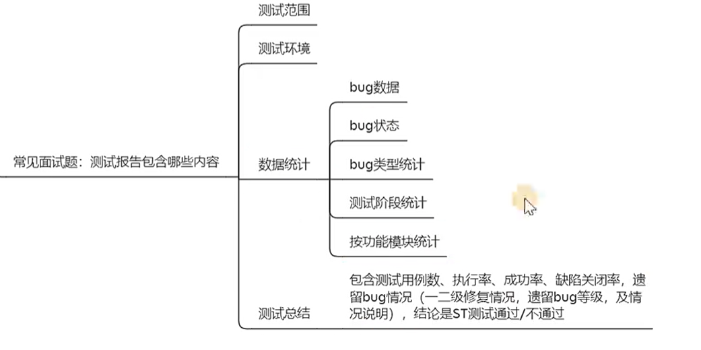
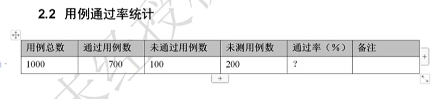
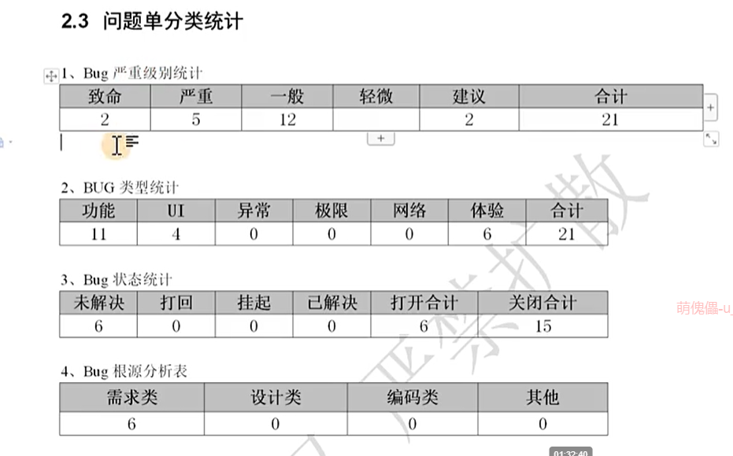

## 测试计划

测试计划一般由测试负责人来主导，输出测试全流程的`纲领性核心文档`，明确测试`全流程的目标、范围、策略、资源、进度、风险与规则`，保障测试活动可控、可追溯、可落地。

测试计划一般包含几个内容，大致可以称为 `"5W+1H"`，其包含的内容：`测试目的（why）`、`测试范围（what）`、`测试进度安排（when）`、`测试环境（where）`、`测试方法+测试工具（how）`，`风险评估(需求变更 / 人员变动)`。

一个项目大约 `60% ~ 70%` 的时间都在进行开发，留给测试的有 `30% ~ 40%` 的时间。

一般测试计划会在一天内完成；需求分析和测试用例编写所需时间大致成 `3:4`；测试执行会分多轮，但与编写测试用例所需时间大约成 `1:1`；测试报告则在1天到半天左右时间；这些时间是大致上所需时间分配，具体以测试计划排期为主。

在进行测试执行前，会对项目主流程进行一次冒烟测试，通过且已搭建好测试环境后，才正式开始执行测试用例。而在缺陷遗留率达到预定质量目标时会结束测试。

## 测试报告

一份评估软件质量的测试文档。一般指定某个测试人员去其他测试人员那里收集测试数据，编写该项目`仅此一份`的测试报告。

每个公司都会有自已的测试报告模板，根据其所需照写即可。而一般测试报告会包含：`测试范围`、`测试环境`、`遗留的bug有哪些`、`测试用例覆盖率有多少`、`bug的统计与分析`、`风险有哪些`、`版本测试评估`、`发布的建议`。

关于测试报告一些重要地方：

通过率是`已通过的用例数跟已执行的用例数相除`可得，而执行率则是`已执行用例数跟总用例数相除`可得。

通过缺陷管理工具提供的报表进行 Bug 数据统计：

Bug 最好在测试执行第一轮就发现，而不是等第二轮或者之后，这关乎到测试人员是否厉害。