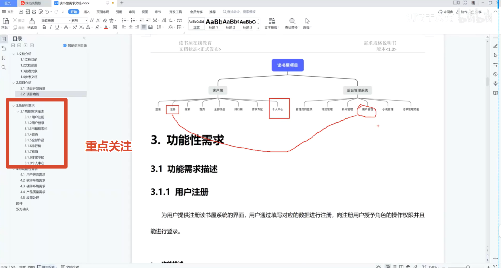

在进行一个Web项目，有几步需要走：
1. 根据`需求文档`进行需求评审会议
2. 编写相应的测试计划
3. 编写测试用例或需求分析（Xmind）
4. 执行测试用例，发现缺陷（Bug），解决后进行回归测试
5. 编写项目测试报告

---

会议前，会议人员通过群消息通告参与并收到相应的需求文档，测试人员最好先大致了解下该需求文档，记录自已不清楚的需求点，并着重在会议时听产品讲，或者等到对应模块时提出对应的疑问或建议，前提要你**对该问题理解清楚**。

产品会将会议中所提的疑问或建议进行整合补全，最后再发放到各个项目组中，得到需求文档（`prd`）。

参与视频：视频觉得讲的不是很好，就一个简单的需求文档分析就用了一个小时左右时间，而且之前介绍禅道视频时看到是2022年，标题却写着2026年...同时所给的资料没卵用，都是视频加一些文档模板，笔记需求文档这些都没有。

<iframe width="100%" height="468" src="//player.bilibili.com/player.html?isOutside=true&aid=115836492716590&bvid=BV1U9iEBREWt&cid=35182415261&p=50" scrolling="no" border="0" frameborder="no" framespacing="0" allowfullscreen="true"></iframe>