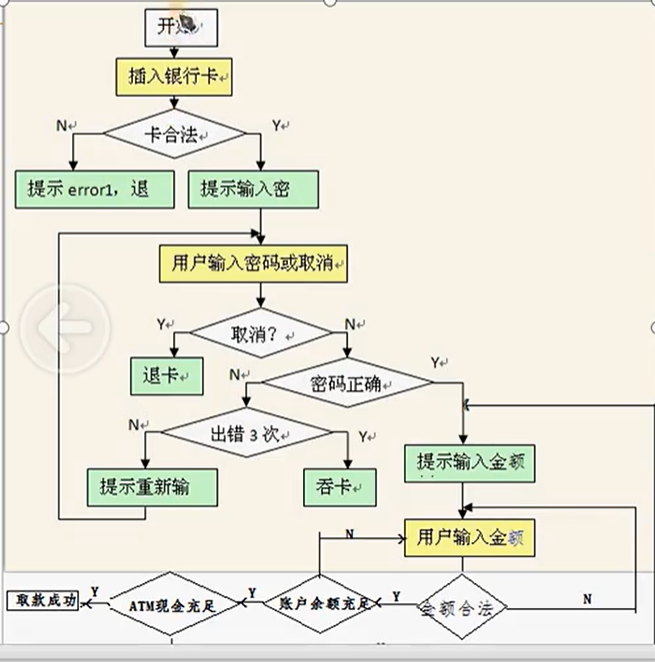
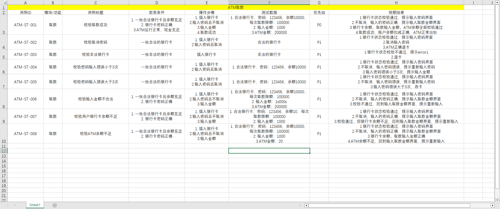

场景法（也叫用例场景法、业务场景分析法），是`基于用户真实业务流程`，通过模拟用户端到端的操作行为，覆盖`完整业务路径`的黑盒测试方法。

核心思想是用 “流”（`流程路径`）描述用户与系统的交互，以业务场景为单位设计测试用例，是系统测试、集成测试、验收测试中最核心的测试方法之一，尤其适用于业务流程复杂的软件系统。

---

## 基础概念

1. 基本流（主流程 / 阳光流 / 有效流）

    - 指用户`操作最顺利`、`无任何异常和分支`，`完整走完业务核心目标的最短路径`。它是业务最核心、最高频的流程，也是测试优先级最高的场景，`所有分支流都基于基本流延伸`。
    - 例：电商下单的基本流：登录成功→商品加购成功→提交订单成功→支付成功→订单完成。

2. 备选流（正常分支流）

    - 从基本流的某个节点分支出来，属于`用户合法、合规`的`正常操作分支`，最终可回到基本流，或终止流程。
    - 例：提交订单前修改商品数量、下单后未支付前取消订单、申请售后退款等。

3. 异常流（错误流 / 无效流）

    - 从基本流 / 备选流的节点分支出来，因`用户非法操作、系统异常、外部依赖故障`导致的`错误路径`，用于验证系统的容错能力和异常处理机制。
    - 例：登录密码错误锁定账号、支付时余额不足、下单时商品库存为 0、支付过程网络中断等。

---

## 应用场景

- 业务流程复杂、多环节联动的系统（电商、金融、银行、OA 审批、出行等）。
- 端到端的系统测试、集成测试、用户验收测试（UAT）。
- 核心业务流程的回归测试，保障版本迭代不破坏主流程。
- 自动化测试用例设计，是 UI 自动化、接口自动化流程用例的核心设计思路。

对于`单元测试`、单个功能控件的细节测试（如`输入框的格式校验`）、`无明确业务流程`、纯工具类的单点功能测试均不适合场景法。

---

## 设计步骤

1. 梳理业务需求，绘制业务流程图

    深度对齐产品需求与业务规则，明确业务的参与角色、功能节点、流转规则、上下游依赖，用流程图 / 泳道图`完整呈现全链路业务，避免遗漏关键节点`。

2. 确定核心基本流

    提取业务中`最核心、无任何异常`的主流程，明确`每个节点的操作和预期结果`，作为所有场景的主干。

3. 全量识别备选流与异常流

    基于基本流的每个节点，梳理所有`合法的分支操作`（备选流）、所有`可能的错误操作与系统异常`（异常流），明确每个分支的触发条件、流转规则和系统预期处理逻辑。

4. 组合流，生成独立业务场景

    将基本流与备选流、异常流进行组合，生成`互不重复、覆盖全路径`的独立场景。

    - 优先级规则：纯基本流场景（P0）> 高频备选流场景（P1）> 核心异常流场景（P1）> 低频分支 / 异常场景（P2/P3）。
    - 避坑原则：`避免无限制组合`导致的 “路径爆炸”，复杂业务优先保障高优先级场景全覆盖，低频场景可按需裁剪。

5. 为每个场景设计测试用例

    每个场景对应 1 个或多个测试用例，完整填写用例核心要素：用例 ID、用例名称、优先级、前置条件、测试数据、操作步骤、预期结果。

## 实战案例

关于 ATM 取款的场景：

### 选取基本流（主流程 / 阳光流，P0 最高优先级）

用户`无异常操作`、`系统无故障`，`完整完成取款`的**核心路径**，也是业务最高频、最核心的流程：
1. 用户发起取款，插入银行卡
2. 系统校验银行卡合法，校验通过
3. 系统弹出密码输入提示
4. 用户输入正确密码，不选择取消操作
5. 系统校验密码正确，校验通过
6. 系统弹出取款金额输入提示
7. 用户输入合法的取款金额
8. 系统校验金额合规，校验通过
9. 系统校验用户账户余额充足，校验通过
10. 系统校验 ATM 机内现金充足，校验通过
11. 系统出钞，取款成功，流程结束

插入银行卡 → 卡合法 → 提示输入密码 → 用户输入密码（不执行取消操作） → 密码正确 → 提示输入金额 → 用户输入取款金额 → 金额合法 → 账户余额充足 → ATM 现金充足 → 取款成功

也可以通过路径的方式来描述基本流，但在复杂的业务逻辑中，选择这个感觉会很乱，用序号的方式来将整个核心路径给写出来清晰明了。

### 备选流（用户正常操作分支）

只有一条 `用户主动取消取款` 为用户正常操作分支下的备选流：插入银行卡 → 卡合法 → 提示输入密码 → 用户选择取消 → 退卡，流程结束。

### 异常流（错误 / 故障场景）

覆盖流程图中`所有校验不通过`、`系统异常`的分支：
1. 银行卡合法性校验不通过（挂失 / 过期 / 非法卡）

    路径：插入银行卡 → 卡不合法 → 提示 error1，退卡，流程结束

2. 密码输入错误，累计错误次数＜3 次

    路径：插入银行卡 → 卡合法 → 输入错误密码（不取消） → 密码校验失败 → 错误次数＜3 次 → 提示重新输入 → 回到密码输入环节

3. 密码连续错误 3 次，触发吞卡

    路径：插入银行卡 → 卡合法 → 连续 3 次输入错误密码 → 密码校验失败 → 错误次数达 3 次 → 系统吞卡，流程结束

4. 取款金额不合法（非 100 倍数 / 超单笔限额 / 低于最低取款额）

    路径：插入银行卡 → 卡合法 → 提示输入密码 → 用户输入密码（不执行取消操作） → 密码正确 → 提示输入金额 → 用户输入取款金额 → 金额不合法 → 回到金额输入环节，提示重新输入

5. 取款金额合法，但用户账户余额不足

    路径：插入银行卡 → 卡合法 → 提示输入密码 → 用户输入密码（不执行取消操作） → 密码正确 → 提示输入金额 → 用户输入取款金额 → 金额合法 → 余额不足 → 回到金额输入环节，提示重新输入 → 回到金额输入环节，提示重新输入

6. 金额合法、余额充足，但 ATM 机内现金不足

    路径：插入银行卡 → 卡合法 → 提示输入密码 → 用户输入密码（不执行取消操作） → 密码正确 → 提示输入金额 → 用户输入取款金额 → 金额合法 → 账户余额充足 → ATM 余额不充足 → 回到金额输入环节，提示重新输入

### 我的路径写法

```txt
基本流：插入合法银行卡 -> 输入正确密码 -> 输入合法金额 -> 账号余额充足，ATM现金充足 -> 取款成功
备选流：插入合法银行卡 -> 取消输入密码 -> 退卡
		插入合法银行卡 -> 输入密码错误 -> 重新输入密码
		插入合法银行卡 -> 输入正确密码 -> 输入金额非法 -> 重新输入金额
		插入合法银行卡 -> 输入正确密码 -> 输入金额合法 -> 账户余额不充足 -> 重新输入金额
		插入合法银行卡 -> 输入正确密码 -> 输入金额合法 -> 账户余额充足 -> ATM现金余额不充足 -> 重新输入金额
异常流：插入非法银行卡 -> 提示error1，退卡
		插入合法银行卡 -> 输入密码出错3次 -> 吞卡
```

可以看出，备选流和异常流理解错误；并非一定要按照` → `来表示路径，也可以通过`序号`来解释。

### 用例设计



所写文件：[场景法](https://wwbri.lanzoub.com/i9iQW3m3fhgh)
