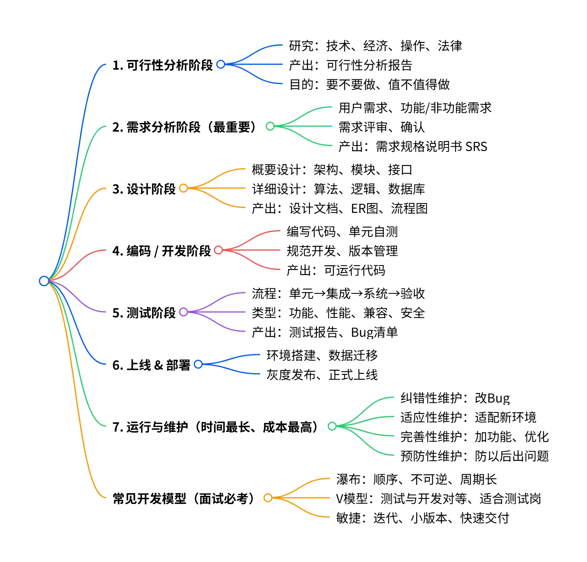
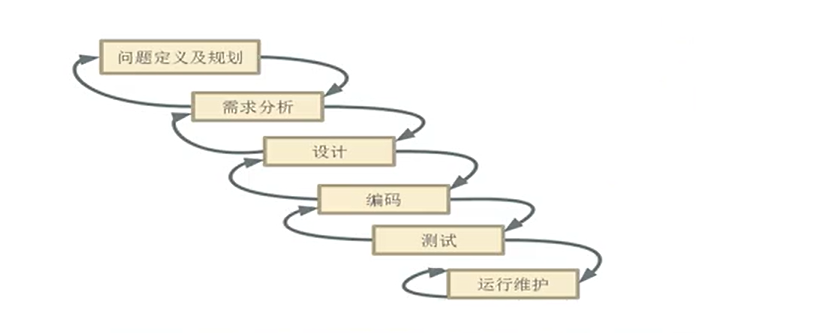
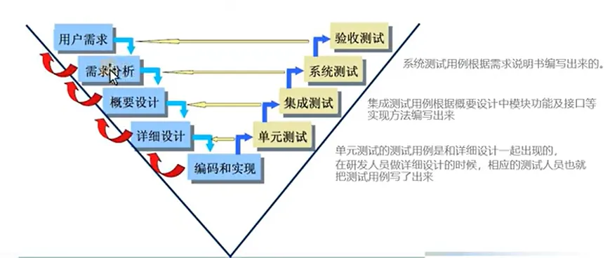
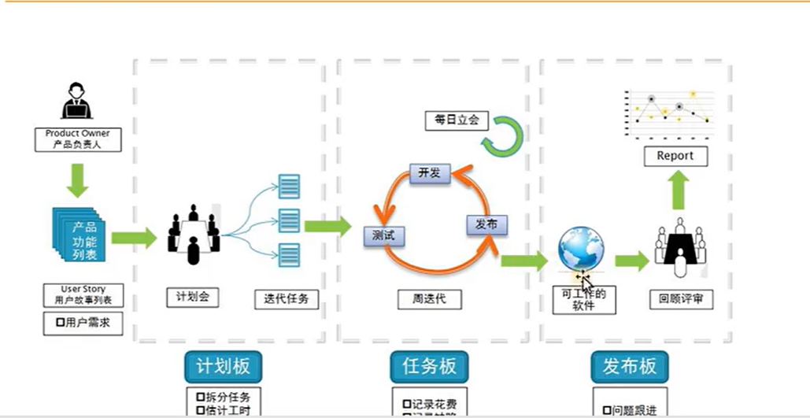

## 什么是软件生命周期

软件生命周期（Software Development Life Cycle，简称 `SDLC`），是软件从`初始概念构思`到`最终退役下线`的全流程、标准化管理框架，是软件工程的核心基石。

其核心目标是通过标准化的阶段管控，保证软件质量、管控研发成本、降低项目风险、对齐业务需求，最终实现软件的全生命周期价值最大化。

---

### 通用核心全阶段

1. **规划与可行性分析阶段（立项阶段）**：回答「`这个软件要不要做`」，完成项目的立项决策，从源头规避无效投入。
2. **需求分析与定义阶段**：精准定义「`软件要做成什么样，解决什么问题`」，是项目成败的核心关键环节，需求偏差是软件项目失败的首要原因。
3. **设计阶段**：明确「`软件怎么实现`」，将需求转化为可落地的`需求规格说明书`，是衔接需求与开发的核心桥梁。
   
    通常分为两个层级：
    - 概要设计（高层设计）：整体架构设计（如分层架构、微服务架构、云原生架构）、核心模块划分、对外接口定义、技术栈选型、数据库概要设计、部署架构设计
    - 详细设计：模块级的业务逻辑、算法、数据结构、接口细节、数据库表结构设计、UI/UX 交互详细设计、安全合规方案细化

4. **编码实现（开发）阶段**：将设计方案转化为`可运行的软件代码`，`完成功能`的落地实现。
5. **测试与质量保障阶段**：验证「`软件是否符合需求，是否存在缺陷`」，在上线前完成质量管控，杜绝核心风险流入生产环境。
6. **部署与上线阶段**：将验证通过的软件交付到生产环境，**正式对用户开放使用**，完成从研发到运营的交接。
7. **运行与维护阶段**：保障软件长期稳定、安全、高效运行，持续迭代优化，是软件生命周期中`耗时最长、成本占比最高`的阶段（通常占全生命周期成本的 60%-80%）。
8. **退役与下线阶段**：完成软件生命周期的`闭环`，当软件不再满足业务需求、被新系统替代，或无维护价值时，安全合规地完成下线。

---

### 主流开发模型

1. **瀑布模型**：经典`线性顺序`模型，唯有前一阶段完成并通过评审，才能进入下个阶段，每个阶段都有相应的文档以及所需的交付物。
    
    - 这种模型适合`需求高度明确、稳定，合规与管控要求极高的项目`，如军工、金融核心系统、政府项目、基础设施类软件。
    - **优势**：`流程清晰`、管控简单、文档体系完整、权责明确。
    - **劣势**：无法应对需求变化，`后期维护成本极高`，用户仅能在项目末期看到可运行的产品，风险集中在后期释放。
    

2. **V模型**：是`瀑布模型的核心改进变种`，由`开发和测试同时进行`的方式来缩短开发周期，从而提高开发效率。

    - 这种模型适合`需求高度明确、稳定，安全合规要求极高，不允许频繁变更的项目`，如军工、金融核心系统、政府项目、基础设施类软件。
    - 跟瀑布模型相比，`测试不再闲置`，与开发并行完成该项目，降低线上缺陷率，保障交付质量。
    - 对测试团队要求极高，需要能`在无代码`的情况下，基于需求与设计文档完成测试用例设计。
    - 测试开发并行发展，一旦需求变更或不清晰完整，就要`重新走全流程`，成本极高且效率低下，无法快速响应业务变化。
    

3. **敏捷开发模型**：一套以`用户需求为核心、迭代增量为基础、拥抱变化为核心能力`的软件开发理念与方法论体系。

    - 这种模型适合互联网产品、需求变化快、需要快速试错的创新型项目。
    - 版本会进行
    - **优势**：响应`需求变化速度快`，交付效率高，用户全程参与，产品贴合业务需求。
    - **劣势**：对`团队协作能力、自驱力要求高`，文档体系相对薄弱，范围管控难度大。
    