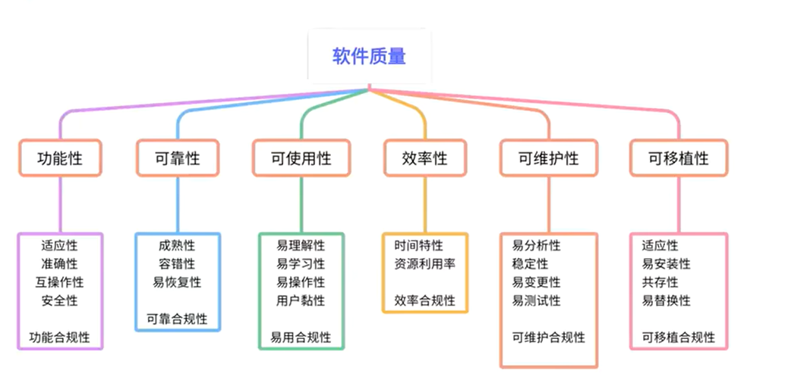

## 黑灰白盒

**黑盒测试**：不关注软件内部代码、架构、逻辑，只看**输入输出是否符合需求**，把软件当成一个看不见内部的“黑盒子”，站在用户视角测试功能。

**白盒测试**：深入软件**内部代码逻辑、程序结构、算法流程**，像打开盒子一样检查代码细节，针对性排查代码漏洞、逻辑缺陷。

**灰盒测试**：结合 黑盒+白盒 的优势，既关注外部功能表现，也适度了解内部接口、模块逻辑，兼顾功能验证与内部排查。

|测试类型|核心依据|测试人员|适用场景|常用方法|优缺点|
|---|---|---|---|---|---|
|**黑盒测试**|需求规格说明书、用户文档|专职测试工程师、产品、用户|功能测试、系统测试、验收测试、回归测试|等价类划分、边界值分析、场景法、错误推测法、因果图|✅ 贴合用户需求，易上手，无需代码基础 ❌ 无法覆盖内部逻辑，易遗漏代码级bug|
|**白盒测试**|源代码、程序结构、算法逻辑|开发工程师、资深测试工程师|单元测试、模块内部逻辑验证|语句覆盖、判定覆盖、条件覆盖、路径覆盖、代码审查|✅ 精准定位代码缺陷，覆盖逻辑盲区 ❌ 耗时耗力，需掌握代码，忽略整体功能体验|
|**灰盒测试**|需求文档+部分内部接口/模块逻辑|测试工程师、开发测试联动|集成测试、接口测试、兼容性测试|接口测试、断点调试、日志分析、混合功能测试|✅ 兼顾功能与内部接口，效率高 ❌ 无法做到全量代码覆盖，对测试人员有一定技术要求|
---

## 测试策略
测试策略 = 告诉别人：
1. 测哪些功能？（范围）
2. 用什么方法测？（黑盒 / 白盒 / 自动化）
3. 重点测哪里？（核心功能、风险高的）
4. 不测哪里？（忽略不重要的）
5. 环境怎么搭？
6. 什么时候算测完？（准入、准出标准）

一句话：**策略就是：怎么测、测什么、重点在哪、标准是什么**。

例如需要测试一个登录界面，那么测试策略可以按如下这样写：
- 主要做**功能测试**
- 重点测**账号密码错误、为空、验证码**
- 做**兼容性测试**（不同浏览器 / 手机）
- 做**安全测试**（防暴力破解）
- 不做性能压力测试
- bug 修复完必须回归
- 无致命、严重 bug 才能上线

## 软件质量特性
**软件质量六大特性**（基于 ISO/IEC 9126 / GB/T 16260 标准）包括：**功能性**、**可靠性**、**易用性**、**效率**、**可维护性**、**可移植性**。

### **一、功能性**
- 适合性：功能是否贴合用户需求，能不能解决实际问题
- 准确性：计算、输出、数据是否正确、精确、无错误
- 互操作性：能和其他系统、硬件、软件正常配合、数据互通
- 安全性：保护信息、数据、权限，防止未授权访问、泄露、破坏
- 依从性：符合相关标准、规范、法律法规、行业约定
### **二、可靠性**
- 成熟性：软件在正常使用下不容易出故障、崩溃、报错
- 容错性：出现异常、误操作、数据错误时，软件不崩溃、不卡死、不影响整体
- 易恢复性：故障发生后，能快速恢复正常、数据不丢、重启可用
### **三、易用性**
- 易理解性：用户看得懂、知道怎么用
- 易学性：容易学会、上手快
- 易操作性：操作简单、方便控制
### **四、效率**
- 时间特性：响应快、处理快。3，5，8原则-在请求一个数据的时候，响应速度最好能够控制在3s以内，其次5s，8s响应时间太久，就容易让用户流失
- 资源特性：CPU / 内存 / 流量占用低
### **五、可维护性**
- 易分析性：好查问题、好定位
- 易改变性：易修改、易扩展
- 稳定性：改完不乱、不出新错
- 易测试性：方便测试验证
### **六、可移植性**
- 适应性：能适配不同环境
- 易安装性：安装简单方便
- 共存性：和其他软件一起用不冲突
- 易替换性：方便替换、版本升级不麻烦

## 面试题
**给你XXX功能，你要怎么去进行测试？** 通过软件的六大特性来解答
### 功能测试
- 能否正常装水、装液体
- 能否正常喝水、倒水
- 有无漏水
- 杯盖能否盖紧、打开
- 把手是否方便握持
### 性能测试
- 装热水是否烫手
- 装冰水外壁是否结露
- 装满水后承重是否正常
- 倒入沸水，杯子是否变形、异味
### 界面 / 外观测试
- 外观无划痕、无瑕疵
- 尺寸、颜色、logo符合要求
- 杯口、杯身光滑无毛刺
### 易用性测试
- 单手能否轻松拿起
- 倒水是否顺畅不洒
- 老人 / 小孩是否容易使用
### 可靠性 / 稳定性测试
- 反复装水倒水，是否依然不漏水
- 长期使用是否开裂、老化
- 轻微磕碰后是否破损
### 兼容性测试
- 能否装水、茶、咖啡、饮料等不同液体
- 能否在常温、高温、低温环境使用
- 能否放入洗碗机、消毒柜
### 安全性测试
- 材质是否无毒、无有害物质
- 杯口是否锋利、划嘴
- 装热水是否炸裂风险
- 是否防滑、防倾倒
### 可维护性 / 可移植性
- 是否容易清洗
- 是否方便收纳、携带

面试万能一句话总结（直接背）：**从功能、性能、界面、易用、兼容、可靠、安全、可维护八个维度，设计正常、异常、边界、压力场景进行测试**。