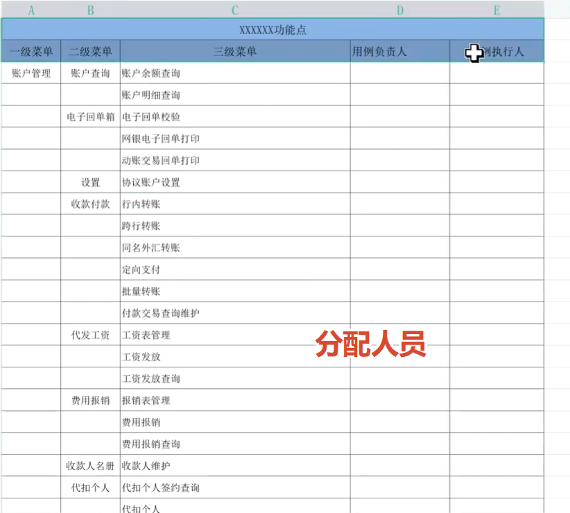
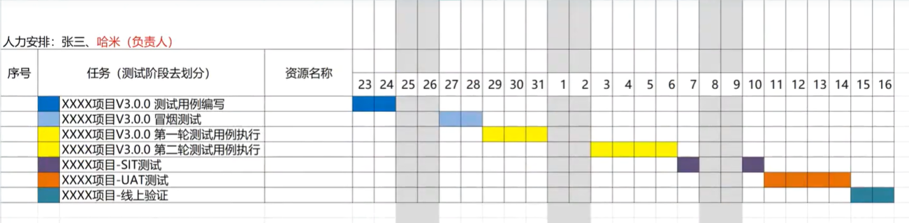

需求文档评审完后，开发、测试会编写自已的计划。其中测试人员会通过测试计划根据排期分配对应的任务，其中分配任务的时候是要依赖开发计划的，毕竟没有开发所写的功能你是不能测试到的。

当测试完结后，需要从起始到终点测试中所写的文档以交付物的方式进行上交。

有所关联的功能一般会安排一人去完成，并且要注意的是，你所写的测试用例`不一定`会由你去执行，可能会交叉测试。

测试人员会根据功能点编写测试用例或 Xmind需求分析，一般都是`二选一`，不会让两个都做，毕竟时间没这么多。

核心点在于 `UI测试`、`功能测试`和`兼容性测试`，其余诸如接口、性能和安全等看项目组安排。

根据功能点分配对应的测试人员：

根据测试阶段进行排期：

这次这个视频相比之前就好了很多，但是这个哈米老师打字怎么这么慢，有时好像不认得字那样要打很久：

<iframe width="100%" height="468" src="//player.bilibili.com/player.html?isOutside=true&aid=115836492716590&bvid=BV1U9iEBREWt&cid=35182415549&p=51" scrolling="no" border="0" frameborder="no" framespacing="0" allowfullscreen="true"></iframe>