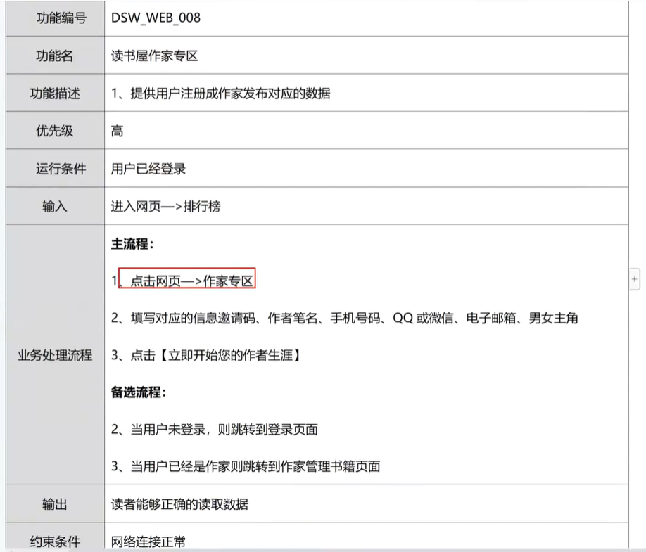
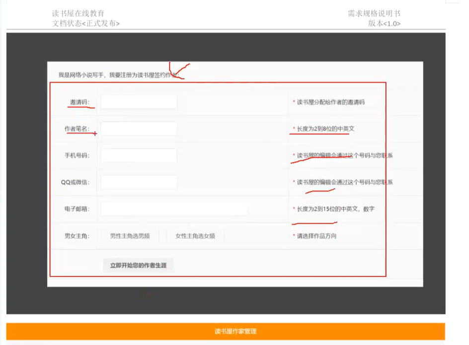
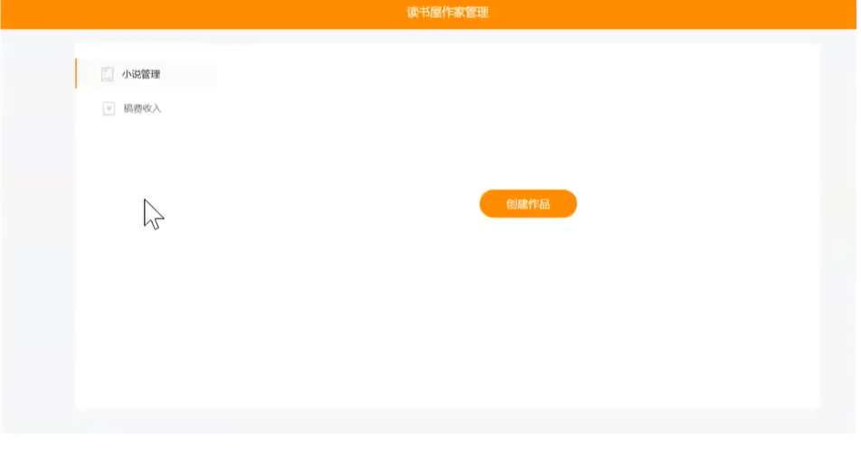

一个项目前端后端都各自有自已所属的页面的，区别在于所使用的人不同，前端页面一般是给用户看的，而后端页面则是给内部人员看的。

一般来说，需求文档是没有后端页面相关的功能需求的，但是在与你需要测试的功能相关联系到数据时就需要进行测试。

后端页面由于是给自已人看的，所以在时间紧迫前提下可以不需要详细测试。

---

由于所给的资料并没有`读书屋`的需求文档，所以不能将所有功能进行测试，只能编写视频中的**作家专区**功能需求。

普通用户需得到`邀请码`才能注册成为作家，并发表相应的小说数据。

作家专区的功能需求：

作家注册界面：

书籍管理界面：

编写的需求分析（Xmind）：[读书屋作家专区.xmind](https://wwbri.lanzoub.com/i4civ3ljrihg)

当联系到后端时，需要考虑`是否有数据`、`分页`和`是否正确显示对应的数据字段`等。

这节视频我觉得还是可以的，并没有想之前那样毛病频出：

<iframe width="100%" height="468" src="//player.bilibili.com/player.html?isOutside=true&aid=115836492716590&bvid=BV1U9iEBREWt&cid=35182415824&p=52" scrolling="no" border="0" frameborder="no" framespacing="0" allowfullscreen="true"></iframe>