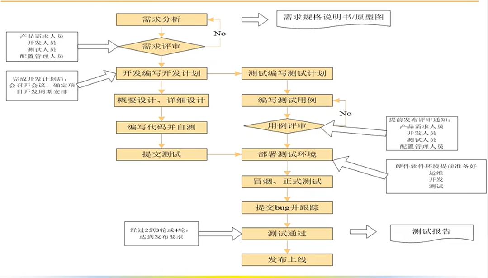
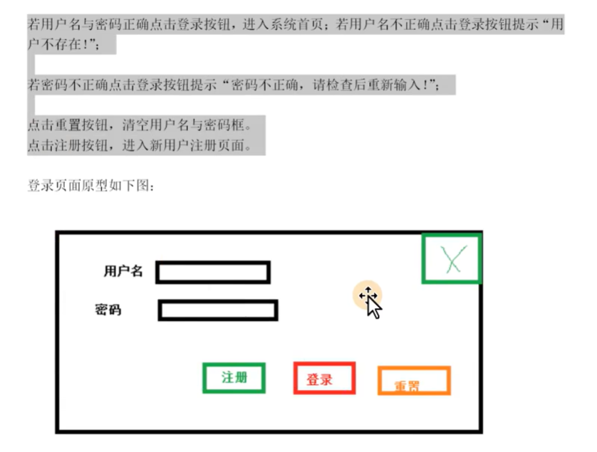
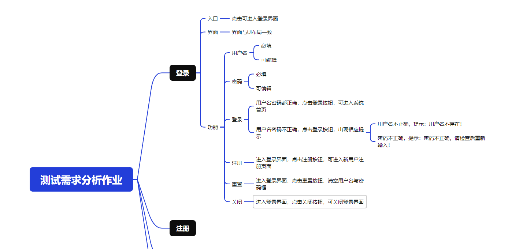
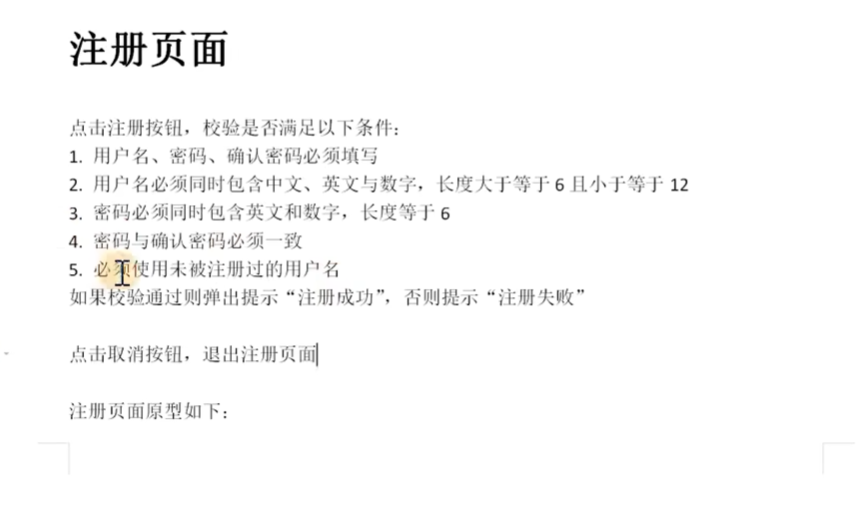
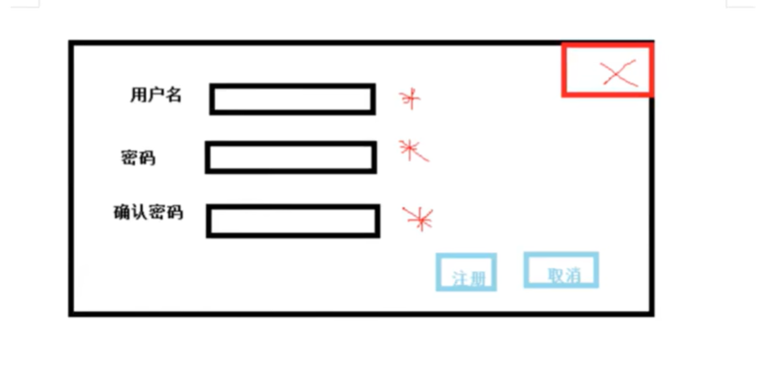
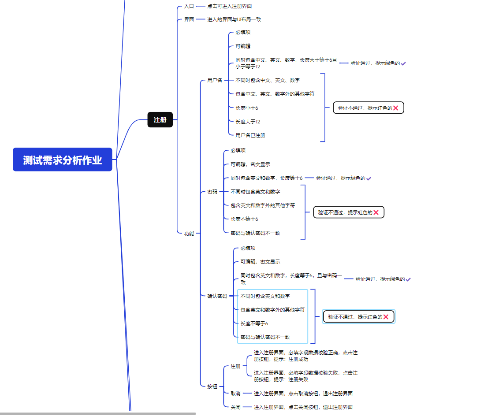

## 软件测试工作流程

软件测试工作流程包含 `测试需求分析阶段` -> `测试计划阶段` -> `测试设计阶段` -> `测试执行阶段` -> `测试评估阶段`。

---

## 需求分析阶段

根据`需求规格说明书（SRS）`/`原型图`中的功能需求提取`测试点（明确需求 + 隐性需求）`，明确需要测试什么。

为什么要测试需求：
1. 软件测试需求是设计测试用例的`依据`。
2. 有助于保障测试的`质量与进度`。 
3. 测试需求是衡量测试覆盖率的重要指标，保证`测试点`能达到 100%。

测试需求的特征：
1. 所指定的测试需求项是`可核实`的，即它是能观察到、可评测的结果。
2. 应指明`前置条件`，即满足时的条件或不满足时的出错条件。
3. `不涉及`具体的测试数据，它是测试设计环节才接触的。

简单实战：

1. 简陋的登录界面：
    

    通过 Xmind 编写需求分析得出：
    

2. 比较复杂的注册界面：
    
    

    通过 Xmind 编写需求分析得出：
    

对于`字段约束`，例如`同时包含中文、英文`这样，没有必要写`纯中文、纯英文`这样的需求项，直接`不同时包含中文、英文`即可。

编写测试用例前需要进行测试需求分析，而不是需求分析和测试用例`二选一`。