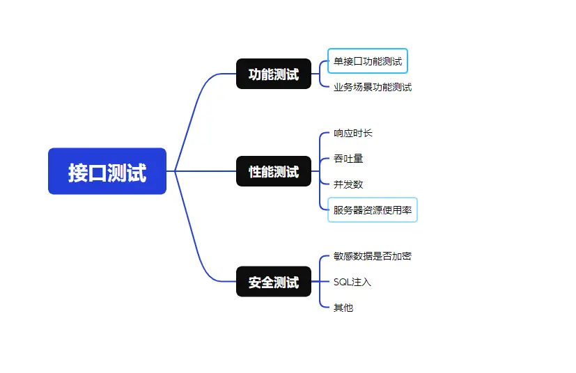

## 接口的作用和组成

接口，是不同模块或系统间预先约定的标准化`交互规范`与通信契约。调用方`无需关注其内部的实现逻辑与底层细节`，只需明确接口的核心能力、调用规则与返回约定，即可完成对接调用。

接口的作用：

1. **解耦隔离，屏蔽实现细节**：接口将能力实现与业务调用完全解耦，严格隔离底层实现逻辑与核心细节。`只要接口的交互规范与契约保持不变`，底层实现的迭代、优化、重构均不会影响上游业务，无需对业务调用侧代码做任何修改，大幅降低系统耦合度与维护成本。

2. **能力复用，提升研发效率**：标准化的接口可实现`一次开发、多场景复用`，能够被多个业务模块、终端、系统无差别调用，避免同一段业务逻辑的重复开发，大幅缩减研发周期，提升全项目的协作与开发效率。

3. **安全管控，筑牢访问防线**：接口作为系统对外暴露的核心访问入口，可在接口层统一实现`鉴权认证`、权限管控、参数校验、流量限流等安全能力，精准拦截非法请求，有效规避恶意操作、核心数据泄露等安全风险，是系统安全防护的第一道核心防线。

---

## 接口测试的目的和应用

接口测试是软件质量保障体系的核心环节，聚集于`服务端接口`的规范、业务逻辑正确性、数据流转准确性、系统安全性与性能稳定性，是前后端分离的测试手段。

接口测试的核心目的：

1. 以接口文档约定的规范为唯一依据，通过模拟客户端向服务端发送请求，校验接口返回的实际结果与预期结果是否完全一致，确保接口完全符合设计要求，`实现既定业务功能`。

2. 接口测试可在项目研发早期介入，无需等待前端页面开发完成，在后端接口开发完成、前后端联调阶段即可开展测试，能`提前暴露缺陷，大幅降低问题修复成本`。

3. 可直接绕过前端无法覆盖大量异常场景、边界场景与底层逻辑场景，精准定位问题根因，`明确区分前端渲染问题与后端服务逻辑问题`，大幅提升问题排查效率。

4. 可专项验证接口的鉴权认证，`保障系统的接口安全`，并通过接口进行性能测试，`保障系统长期稳定运行`。

5. 接口变更频率远低于前端 UI 页面，基于接口开发的`自动化测试脚本`，具备执行速度快、稳定性高、维护成本低的核心优势，是自动化测试体系的首选方案，还同时`适配敏捷迭代`。

---

## 接口测试的流程设计

接口测试的流程设计与软件测试基础的功能测试类似，通过开发所提供的`接口文档`提取测试点来设计测试用例，在按「`冒烟测试 → 核心接口功能测试 → 主业务场景测试`」执行，同步提交缺陷与快速回归，最后输出测试报告。

不同公司的 [接口文档](https://wwbri.lanzoub.com/ir02k3nl2f3i) 模板、承载格式各有差异，但一份规范的接口文档，通常包含以下核心信息：

- 基础信息：请求路径、请求方法

- 请求参数：请求头、请求体（请求数据）

- 返回数据：操作成功的状态码、自定义的错误码

---

## 接口测试的测试用例设计

单接口功能测试用例设计，底层逻辑与基础软件测试用例设计完全一致，核心均为围绕需求规范验证单个功能点的正确性；核心差异为`接口测试需针对请求参数`开展校验。

业务场景化的功能测试，核心要锚定用户的真实使用场景来设计，同时要把握一个核心原则：`用最少的测试用例，覆盖最多的业务场景`，既保证测试覆盖度，又能提升测试效率。

因接口测试参数的出现，用例模板也有所不同：
