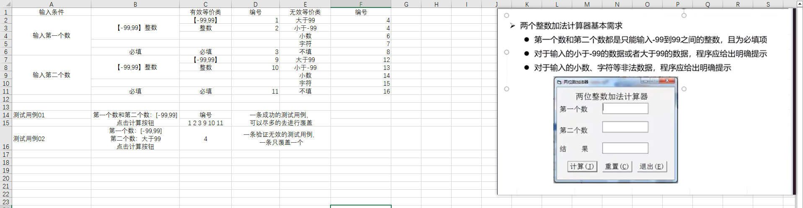
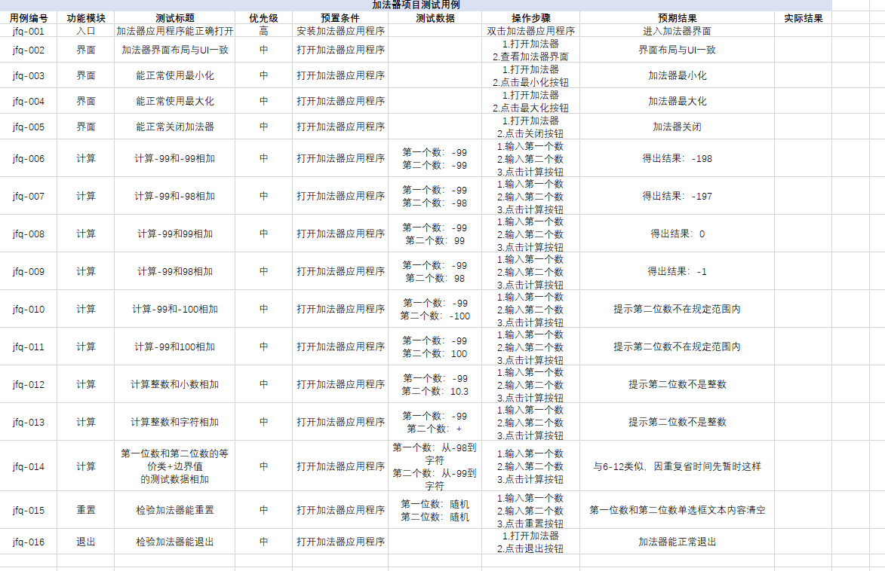

边界值和等价类是针对**单个文本框**的。

## 边界值

**大于 7（x > 7）** 的边界值分析

先确定**边界点**，对于条件：**x > 7**，其边界值：**7**

边界值需要取三个点：
- **上点**（刚刚等于）：边界上的值 **→ 7**
- **内点**（刚刚大于）：有效区域内靠近边界的值 **→ 8**
- **离点**（刚刚小于）：无效区域内靠近边界的值 **→ 6**

## 等价类

- **有效等价类**：满足需求、合法、符合规则、应该被系统正常处理的数据集合，例如 **x > 7**
- **无效等价类**：不满足需求、不合法、不该通过的数据集合。例如 **x ≤ 7**

等价类原则（无需死记，常用自然会记住）：
1. 如果**输入条件规定了取值范围**或**值**的个数，则可以确定**一个有效等价类**和**两个无效等价类**。例如7
2. 在规定了输入数据必须遵守的规则的情况下，可确立**一个有效等价类**（符合规则）和**若干个无效等价类**（从不同角度违反规则）。例如正整数
3. 在输入条件是一个布尔量 **（真假/1、0）** 的情况下，可确定一个有效等价类和一个无效等价类。例如真假
4. 在规定了**输入数据的一组值**（假定n个），并且程序要对每一个输入值分别处理的情况下，可确立**n个有效等价类**和**一个无效等价类（没有无效等价类）**。例如密保问题下拉列表
5. 如果我们确知，已划分的某个等价类的各元素，在程序中的处理方式是不同的，则应将此等价类进一步划分成更小的等价类。比如成绩的划分

通过等价类编写测试用例的注意点：
- **一条成功的测试用例，可以尽多的去进行覆盖**
- **一条验证无效的测试用例，一条只覆盖一个** -> **有针对性的去验证这种异常情况给到的提示**

例如如下案例：

## 黑盒测试

**黑盒测试**：也称功能测试，测试中把被测的软件当成一个黑盒子，**不关心盒子的内部结构是什么**，只关心软件的**输入数据**与**输出结果**。

从理论上讲，黑盒测试只有**采用穷举输入**测试，把所有可能的输入**都作为测试情况考虑**，才能查出所有的错误。实际上测试情况是无穷多的，完全测试是不可能的。

如何解决？

必须将**黑盒测试行为加以分类**

- **节约测试实施的时间和资源**
- 避免**盲目测试**、提高测试**效率**
- **使测试的实施重点突出**、目的更**明确**

## 测试用例

**测试用例**（TestCase）：是为项目需求而编制的一组测试输入、执行条件以及预期结果，以便测试某个程序是否满足客户需求。

可以这样简单总结：**为了测试某个功能，提前写好的一套：输入、操作步骤、预期结果**。

为什么要写测试用例？
- 有依据：测试不是凭感觉，按用例测，**不漏测、不瞎测**。
- 可重复：别人也能按同样步骤测出一样结果，**方便交接**。
- 好衡量：执行多少用例、通过多少，**进度和质量一目了然**。
- 防遗漏：把边界、异常、等价类都写进去，**覆盖全面**。
- 便于回归：改完代码再跑一遍用例，**保证没引入新 bug**。

可以这样简单总结：**写测试用例，就是为了测得到位、测得规范、测得可复现、不出错**。

测试用例组成要素：
- 用例编号：产品名-测试阶段-测试项-xxx功能模块的首字母加数字
- 功能模块：对应一个功能模块（细分功能）
- **测试标题**：直接对测试点进行细化得出，输入内容+结果，同一功能模块标题不能重复
- 重要级别（优先级别）：高、中、低
- 预置条件：需要满足一些前提条件，否则用例无法执行
- **测试数据**：需要加工的输入信息，根据具体情况来设计（跟步骤结合起来一定要具有指导性意义）
- **操作步骤**：明确给出每个步骤的描述、执行人员可以根据该步骤完成执行工作
- **预期结果**：根据预期输出对比实际结果，来判断被测对象是否符合需求。（预期结果唯一，不能出现“是否或者”）

以上面加法器为例写出测试用例：

关于两个数计算这块，本认为预期结果相同，但了解后发现，只要**用例编号不同**、**输入数据不同**、**操作 / 条件不同**这三个其中一个满足，就可以认为两者是不同的测试用例了。

这也就说明**输入不同，就算标题一样，也要分开写**。