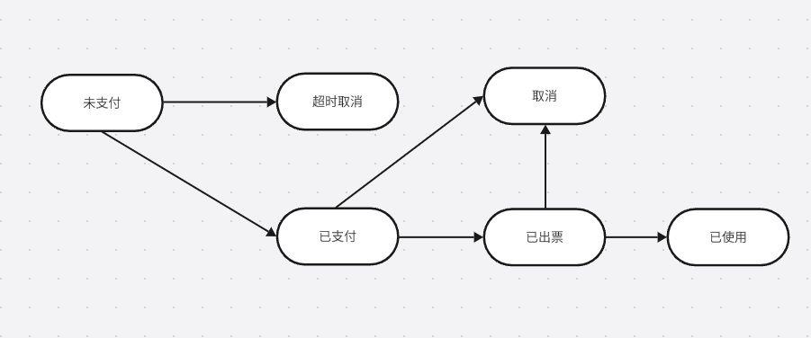
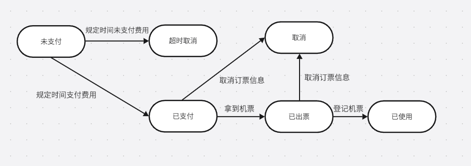
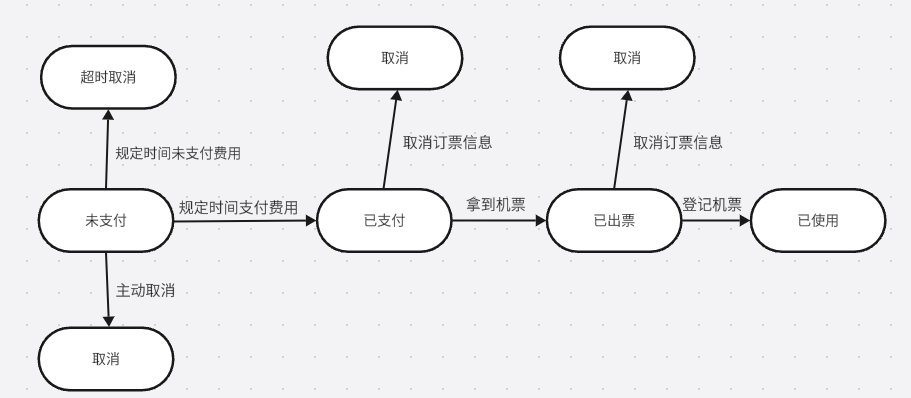
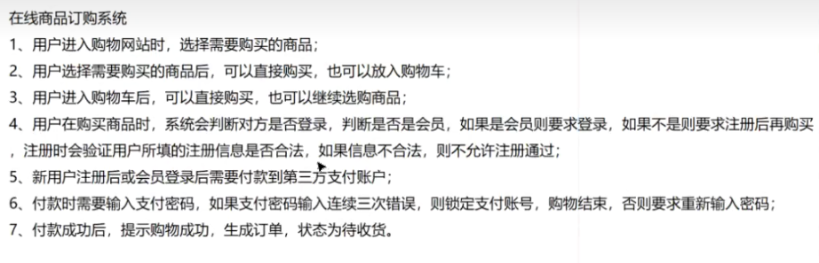
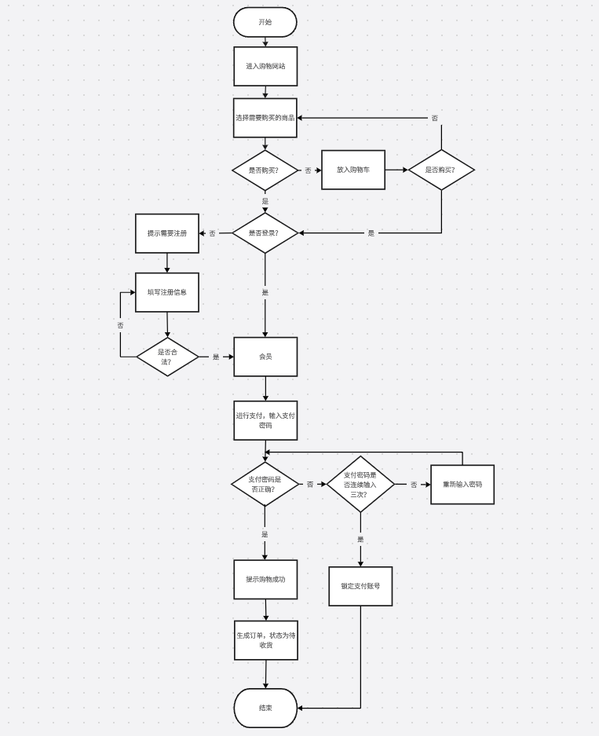

## 状态图

### 一、状态图核心定义

状态图是描述**单个对象**在其生命周期内的**状态变化过程**，重点体现：
- 对象有哪些状态；
- 状态之间如何转换；
- 触发转换的事件 / 条件、转换时执行的动作。

### 二、状态迁移图分析步骤

1. 提取需求中的所有状态

- 向航空公司预定机票：将机票下单成功，但是未支付；此时机票信息处于“未支付”状态
- 在规定时间内顾客未支付费用，机票则会变成“超时取消”状态
- 在规定时间内顾客支付了支票费用，机票信息就变为“已支付”状态
- 旅行当天到达机场，拿到机票后，机票信息就会变为“已出票”状态
- 登记检票后，机票信息就变为“已使用”状态
- 在登上飞机之前任何时间可以取消自己的订票信息，如果已经支付了机票的费用，则还可以得到退款，取消后，订票信息处于“取消”状态

从上诉案例提取状态：**未支付、超时取消、已支付、已出票、已使用、取消**

2. 通过箭头标示可以转换的状态

3. 给这些转换添加触发事件

4. 把状态迁移图变成状态转换树

相比于存在**闭环**的状态图，状态树会**从头到尾延续下去**，也会**有对应的分支**存在

5. 根据状态转换树，设计测试用例（路径覆盖（最常用）、事件覆盖、状态覆盖）

路径覆盖（最常用）：**选择路径**
- case1：未支付 -> 超时取消
- case2：未支付 -> 取消
- case3：未支付 -> 已支付 -> 取消
- case4：未支付 -> 已支付 -> 已出票 -> 取消
- case5：未支付 -> 已支付 -> 已出票 -> 已使用（**会被冒烟测试作为主流程**）

事件覆盖（最常用）：**选择事件**
- case1：未支付 -> 超时取消
- case2：未支付 -> 取消
- case3：未支付 -> 已支付 -> 取消
- case4：未支付 -> 已支付 -> 已出票 -> 已使用（**会被冒烟测试作为主流程**）

状态覆盖（最常用）：**选择状态**
- case1：未支付 -> 超时取消
- case2：未支付 -> 已支付 -> 取消
- case3：未支付 -> 已支付 -> 已出票 -> 已使用（**会被冒烟测试作为主流程**）

### 三、冒烟测试

冒烟测试是**软件新版本发布 / 提测后，先执行的一轮 “快速基础测试”**，目的是验证系统核心功能是否能正常运行（“能不能跑起来”），如果核心功能通不过，直接打回开发，无需进行后续详细测试（比如之前的判定表细化测试）

核心价值：
- **节省时间**：提前发现致命问题，避免测试人员在 “根本跑不起来” 的版本上浪费时间
- **快速反馈**：开发能第一时间修复核心缺陷，缩短迭代周期
- **聚焦核心**：只关注 “能不能用”，不关注 “用得好不好”（比如界面美观、边界值等）

冒烟测试设计原则：
- **只测核心功能**：覆盖系统 “最基本、最关键” 的流程，不纠结细节
- **用例极少且高效**：一般 5-20 条用例，10-30 分钟能执行完
- **结果只有 “过 / 不过”**：核心功能都通 = 通过，任意核心功能不通 = 不通过

冒烟测试执行时机 & 流程：

执行时机：**开发提测新版本 → 测试人员先执行冒烟用例**

执行流程：
- 步骤 1：执行冒烟用例；
- 步骤 2：若全部通过 → 进入详细测试（比如用判定表设计的 4 条规则测试）；
- 步骤 3：若任意一条失败 → 标注 “冒烟不通过”，打回开发修复，修复后重新执行冒烟测试。

## 场景法

**场景法**是软件测试中最常用的**黑盒测试用例设计方法**，核心是**模拟用户真实操作流程**，覆盖业务的正常、异常与分支路径，确保系统流程正确。

### 一、核心概念

场景法的核心是区分基本流与备选流（异常流）：
- **基本流（快乐路径）**：用户最常用、无任何错误、直接完成目标的标准流程（优先级最高）

例：登录 → 搜索 → 加购 → 结算 → 支付成功

- **备选流 / 异常流**：因输入错误、条件不满足、操作异常等产生的分支路径

例：密码错误、余额不足、库存不足、支付取消、网络异常等

### 二、适用场景
- 业务流程复杂、多步骤、多分支（如电商下单、银行转账、审批流程）
- 需验证**端到端流程与异常处理能力**
- 不适合：仅需验证单个输入框 / 控件的场景（优先用等价类、边界值）

### 三、设计步骤（实战流程）
1. **梳理业务流程**：画出流程图，明确起点、终点、关键步骤与判断节点

生成流程图：

2. **识别基本流**：确定最顺畅的主路径

进入网站 → 选择商品 → 立即购买 / 加入购物车 → 去结算 → 判断是否登录 → 已登录（会员）→ 进入第三方支付 → 输入支付密码（正确）→ 付款成功 → 生成订单（待收货）→ 购物结束

3. **枚举备选流 / 异常流**：在每个判断点，列出所有可能的分支与错误情况

- 选商品 → 加入购物车 → 继续选购 → 再结算（回流）

- 结算时 未登录 + 是会员 → 提示登录 → 登录成功→支付

结算时 未登录 + 不是会员（新用户） → 需要注册
- 注册信息不合法 → 注册失败 → 不能下单，流程结束
- 注册信息合法 → 注册成功 → 进入支付

支付输入密码
- 第 1/2 次错误 → 重新输入
- 连续 3 次错误 → 锁定账户 → 购物结束

4. **生成场景**：每条路径对应一个场景（基本流 + 多条备选流组合）
5. **设计测试用例**：为每个场景明确**前置条件、操作步骤、预期结果、测试数据**
6. **复审与精简**：去重、确保覆盖核心路径

### 四、优势与局限
优势
- 贴近用户真实使用，易发现流程集成缺陷
- 覆盖全面，尤其适合复杂业务
- 用例逻辑清晰，便于评审与维护

局限
- 难以覆盖所有极端边界（需结合等价类、边界值）
- 流程复杂时，用例数量可能较多

### 五、与其他方法配合
- **场景法 + 等价类 / 边界值**：在输入节点补充边界与等价类数据。
- **场景法 + 状态迁移法**：验证流程中系统状态的正确转换。
- **场景法 + 错误推测法**：补充经验性异常场景。