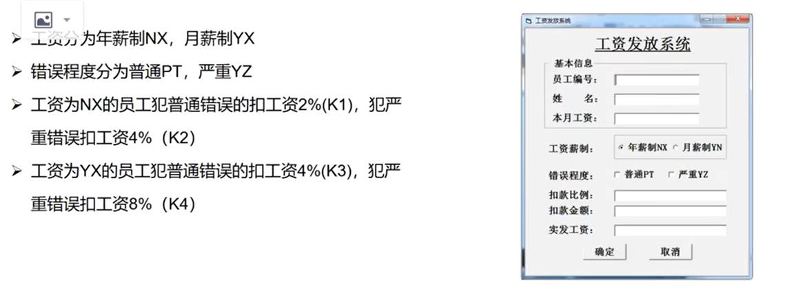
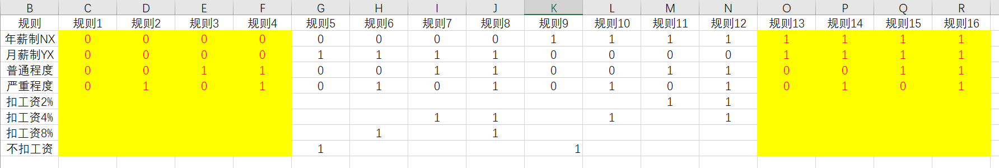
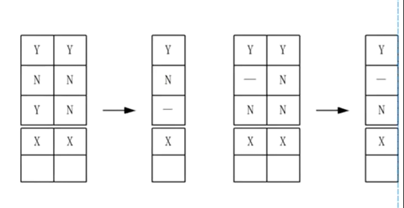

在**多个输入条件的组合得到不同的结果**时，可以使用因果图、决策表的方法来编写测试用例。

## 因果图

### 一、基本概念

因果图：从需求中找出**因**（输入条件）和**果**（输出或程序状态的改变），通过分析输入条件之间的关系（组合关系、约束关系等）及输入和输出之间的关系绘制出因果图，再转化成判定表，从而设计出测试用例的方法。

该方法主要适用于各种输入条件之间存在某种相互制约关系或输出结果依赖于各种输入条件的组合时的情况。

- **因（Cause）**：`输入条件`、前提（一般用 Ci 表示）
- **果（Effect）**：`输出结果`、系统反应（一般用 Ei 表示）
- 作用：把复杂需求逻辑画成图，再转**决策表/判定表**，生成最少且覆盖全面的测试用例

### 二、四种基本逻辑关系

1. 恒等（Identity）

- 因 = 1 → 果 = 1
- 因 = 0 → 果 = 0

2. 非（Not）**~**

- 因 = 1 → 果 = 0
- 因 = 0 → 果 = 1

3. 或（Or）**V**

- 多个因任意一个为 1 → 果 = 1
- 全 0 → 果 = 0

4. 与（And）**^**

- 多个因全部为 1 → 果 = 1
- 有一个 0 → 果 = 0

### 三、五种约束条件（重点）

约束只限制因之间或果之间，不画逻辑关系。

1. 互斥约束 E（Exclusive）

- 多个因最多只能有一个为 1
- 可以全 0，不能同时≥2 个 1

2. 包含约束 I（Inclusive）

- 多个因至少一个为 1
- 不能全 0

3. 唯一约束 O（Only）

- 多个因有且仅有一个为 1
- 不能全 0，也不能≥2 个 1

4. 要求约束 R（Requires）

- 若因 A=1，则因 B 必须 = 1
- A=1，B=0 不合法

5. 屏蔽约束 M（Masking）

- 只作用在结果之间
- 若果 E1=1，则果 E2 必须 = 0
- E1、E2 不能同时为 1

### 四、案例

- **E/I/O/R**：管**输入条件之间**
- **M**：管**输出结果之间**
- **因果图 = 逻辑关系 + 约束 → 判定表 → 测试用例**

1. 找出因和果

某个软件规格说明书中规定：第一列字符必须是*或#，第二列字符必须是一个数字，在此情况下进行文件的修改，但如果第一列字符不正确，则给出信息M；如果第二列字符不正确，则给出N

因：
- C1：第一列字符为*
- C2：第一列字符为#
- C3：第二列字符为数字

果：
- E1：修改文件
- E2：给出信息M
- E3：给出信息N

2. 理清它们之间的关系

3. 根据对应的关系画出因果图

4. 根据因果图转成判定表/决策表

5. 根据决策表变成测试用例

## 判定表

1. 找到因果，其中**因 = 条件桩**，**果 = 动作桩**，每一个所获得的数据都称为**规则**

根据上图所示：
- 条件桩：**年薪制NX、月薪制YX、普通程度、严重程度**
- 动作桩：**扣工资2%、扣工资4%、扣工资8%、不扣工资**

2. 通过通用公式 **2的n次方** 可以确定判定表中规则的个数，其中 **n 表示条件桩的个数**

- 根据上述条件桩的个数，可以得知规则的个数为**16个**

3.得到对应的判定表/决策表

4.化简判定表/决策表

- 上诉黄色背景则是不符合真实所化掉的

5.编写对应的测试用例

对于多条件，条件多取值的决策表，对应的规则北较大时，可以对其进行简化

决策表的简化主要包括方面：

- 多个条件桩所获得的动作桩相同时，可以进行省略
- 不影响最终动作桩，可以进行合并，用 **-** 代替，表示动作与该条件的取值无关
