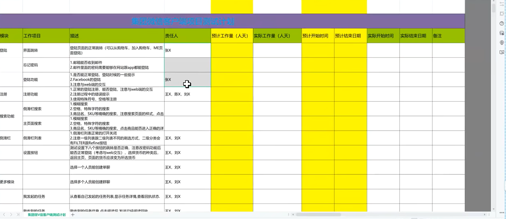
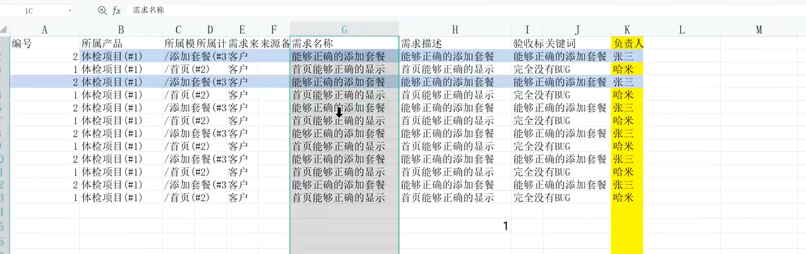
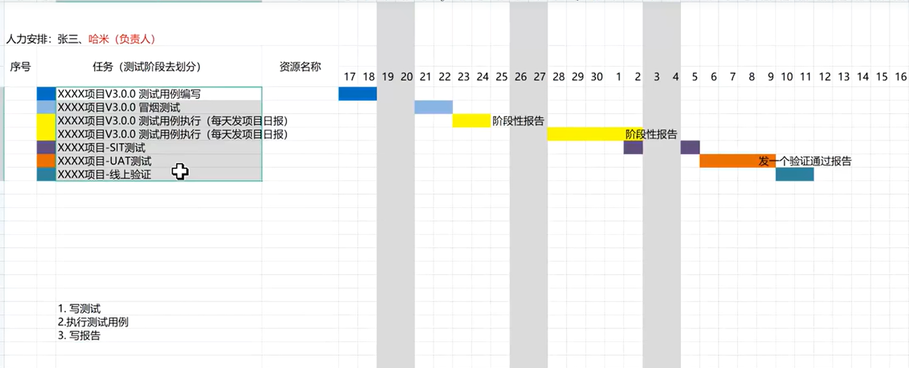

## 一、阶段目标

明确**测什么、怎么测、谁来测、何时测、风险与标准**，输出可执行、可评审的**测试计划**，指导后续所有测试工作。

**测试计划当中包含的内容**？(具体去写)
- 产品概述、测试目标、测试范围、测试策略、资源配置、测试周期、风险分析

测试计划的体现：
- EXCEL（目前市场上使用比较多的）

- WORD（一般是需要客户硬性要求才会去进行编写）

> **SIT：系统集成测试（把各个模块、接口、服务拼在一起，测它们能不能正常联动、数据能不能正常流转）** **UAT：用户验收测试（最终用户 / 产品方 来验证：软件是不是真的能用、符合业务要求）**

## 二、主要输入

- 需求规格说明书 / 用户故事
- 产品原型、设计文档
- 项目计划、排期
- 历史版本缺陷数据、测试经验

### 用户故事是什么

**用户故事 = 从用户角度写的一句话需求**，用来代替又长又难懂的需求文档。

1. 标准格式（必背）

作为 【**角色**】，我想要 【**功能 / 动作**】，以便 【**价值 / 目的**】。

例子：
- 作为用户，我想要修改密码，以便账号更安全。
- 作为管理员，我想要查看用户列表，以便管理账号。

2. 跟「测试计划」有什么关系？

- 测试计划：**整体怎么测、测多久、谁来测、风险是什么**
- 用户故事：**具体要测的一个个小需求**

简单说：
**测试计划定大局，用户故事定每个要测的功能点。**

3. 用户故事的特点（好记）
- 小：一次迭代能做完
- 清晰：谁、要什么、为什么
- 可测试：能写出测试用例
- 讲价值，不只讲功能

## 三、核心工作内容
### 1、需求分析与范围确认
- 梳理测试范围、功能点
- 识别不明确 / 冲突需求
### 2、测试策略制定
- 确定测试类型：功能、性能、接口、兼容、安全、自动化等
- 选择测试方法、测试环境、工具
### 3、资源与进度规划
- 人员分工、职责
- 测试里程碑、时间排期
### 4、风险识别与应对
- 需求变更、时间不足、环境问题、人员变动等
### 5、准入 / 准出标准定义
- 测试启动条件
- 测试通过 / 上线标准
### 6、输出测试计划文档

## 四、阶段输出
- **测试计划**（范围、策略、资源、进度、风险、通过标准）
- 测试范围清单
- 初步风险清单

## 五、完成标志
- 测试计划**评审通过**
- 测试范围、策略、排期达成一致