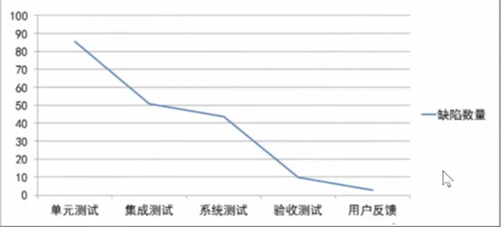
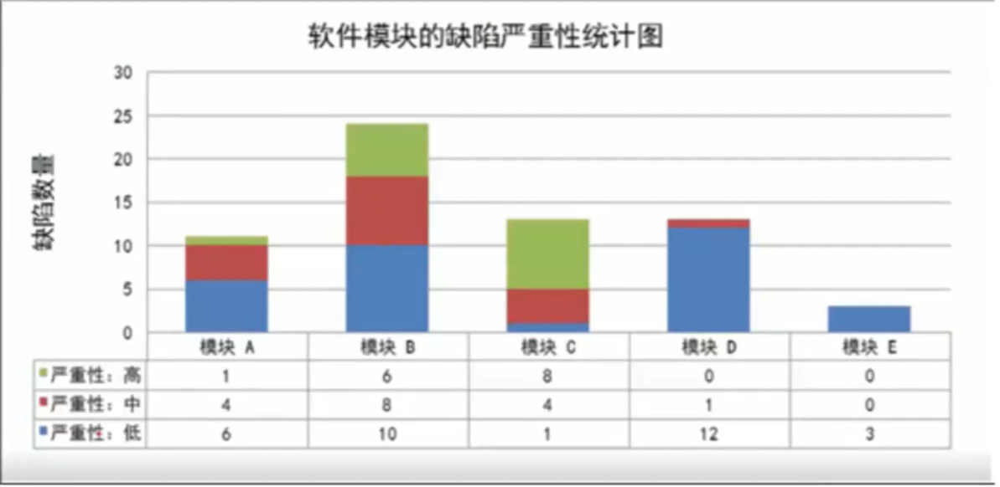
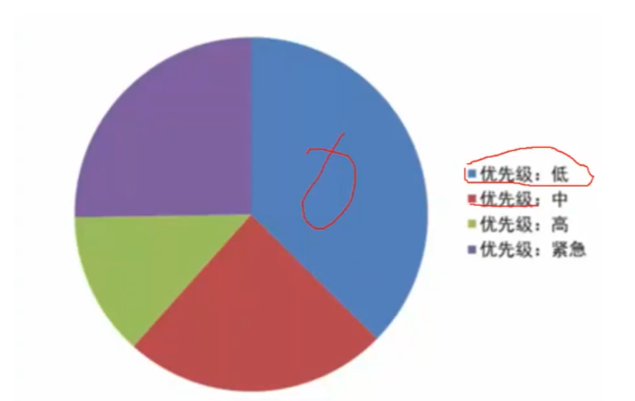
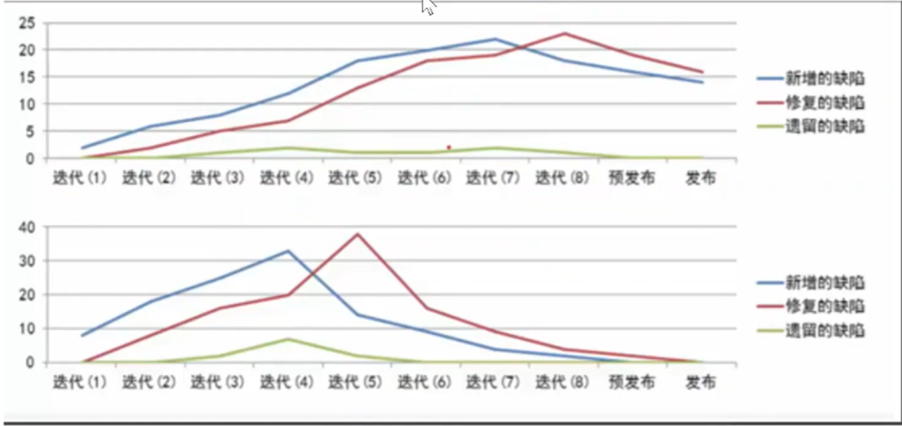
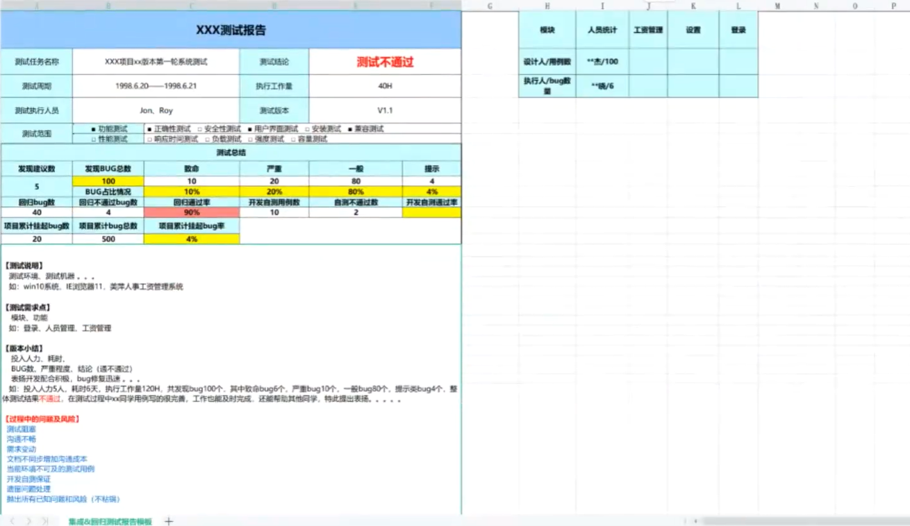

## 一、什么是测试报告

测试结束后，**总结测试过程、测试结果、Bug 情况、版本是否上线的正式文档，给项目、开发、产品看**。

项目因**项目的产品需要结束测试**、**收到开发等方面的因素制约而阻塞**、**软件质量严重不达标**、**按照规定完成了全部的测试工作**、**特别规定的测试结束标准**等会结束该测试。
> **用例跑完、高危 Bug 修好、指标达标、报告出炉、结论确定 = 测试结束**

【面试题】测试人员在内部将**所有测试用例全部执行完毕、所有严重、高危 Bug 全部修复并回归通过、达到预定的测试指标、通过率达标、没有遗留高危、中危 Bug、能出具正式的测试报告，给出上线结论**时就已完成全部的测试工作了。

## 二、结束的标准
集成测试结束准则：
- 整个系统集成`完成`，自能够正常工作，`业务流转正常`，达到**集成测试完成标准**
- 集成测试**用例全部执行完毕**，需求覆盖率达到`100%`
- 所提交的缺陷中，`1、2、3`级缺陷**100%修改并验证通过**，其它缺陷修改并验证通过在90%，且**有明确的说明信息**
- 集成测试报告通过评审

系统测试结束准则：
- 功能**满足业务需求**规格说明书要求
- 测试**用例全部执行完毕**，需求覆盖率达到`100%`
- 最后一个版本中，发现的缺陷不超过`已提交缺陷的5％`
- 测试发现缺陷**全部关闭**，或**具有明确处理意见**
- 功能测试报告通过评审

UAT测试结束准则(用户验收测试)：
- UAT测试**用例执行完毕**
- 客户确认**系统通过**，提交**UAT测试报告**
- 客户提交UAT测试报告通过评审

性能测试结束准则：
- 根据性能测试计划执行所有测试场景，测试出系统基本性能参数，并分析系统性能瓶颈系统调优后，达到**需求定义的性能指标**
- 提交系统性能测试报告
- 性能测试分析报告通过正式评审

## 三、测试报告包含什么

其核心内容是两个：
- 一个是测试结果的汇总报告，是针对所测软件本身，是给所测软件一个客观真实的评价
- 一个是测试过程的汇总总结，是针对测试过程改进，回顾测试流程中存在的不足，加以总结改进

主要包括如下内容：引言、测试用例、测试环境、测试方法、测试时间安排，**缺陷汇总分析，测试过程改进和附录**等

`测试过程改进`：对整个测试活动进行一个总结，有哪些得失，测试方法和流程需要哪些改进，测试过程中暴露出哪些问题，有哪些好的地方值得发扬等等。该项很重要，绝不可少。

`附录`：一般附上缺陷列表以及执行过的测试用例地址等。（收集东西）

### 缺陷汇总分析

- 缺陷总结：一般按照严重程度，功能模块进行划分。提供折线图、柱状图等，直观一点。该项很重要，绝不可少
- 缺陷分析：通过上面的总结，对bug进行分析。这项是测试报告的核心所在，一般有缺陷功能模块分析，缺陷类型分析和缺陷发现阶段分析
- 遗留问题：目前软件残存的已知问题。有些是解决不掉的问题。**该项很重要，绝不可少**
- 测试结论：基于以上分析，给被测软件一个全面客观真实的结论，功能如何，性能如何，稳定性，安全性等等给出一个评价。该项最重要，绝不可少

缺陷的阶段分布：`按照测试的不同阶段统计发现的缺陷数量`

缺陷的模块分布：`按照软件的模块分别统计每个模块中发现的缺陷数量`

缺陷的优先级分布：`按照软件的优先级分别统计发现的缺陷数量`

缺陷的状态变化趋势：`分析开发过程中新增缺陷、修复缺陷和遗留缺陷的变化规律`

上述报表在缺陷管理系统中可以自动生成。

## 四、测试报告样子

一般来说，多数公司一般都会给对应的模板，常使用 Excel 方式发送对应的 Email 中。当然也有通过 Word 的方式来写测试报告。

