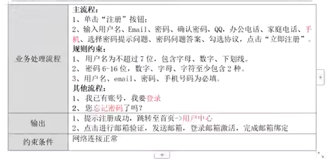
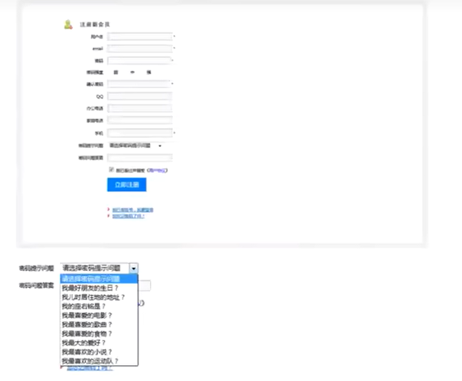

产品所写的文档就是我们要的需求，需求包括**功能性需求**、**非功能性需求**、**限制条件**。
- 功能性需求：**必须要完成的事情**
- 非功能需求：比如**性能相关**的，例如：淘宝平台每年 双11 时 60万单/秒并发量，需要100%完成
- 限制条件：**国家一些标准**、**包含客户的要求（用户需要什么时候去上线）**

为什么要做需求分析？
- 提供测试思路
- 在测试前就能了解需求

所需要的 **Xmind软件** 通过看 B站 该视频：[【2026最新】XMind安装及激活教程，傻瓜式安装，即装即用【附安装包免费领取】](https://www.bilibili.com/video/BV1cqFTz3EmS/?spm_id_from=333.337.search-card.all.click&vd_source=8abceb502969e7de8c2eb9bc66a1d6e3)

线上xmind软件：[boardmix](https://boardmix.cn/)、[Process](https://www.processon.com/diagrams)

作业：利用 Xmind 来编写功能的测试点

自已所写的作业：[SHOP.xmind](https://wwbri.lanzoub.com/i8DGq3kyxp5g)。缺点：对于范围没有用边界值来测定

写需求分析需要考虑的点：
- 入口
- 界面布局
- 功能 -> 正常功能、异常功能给予提示
- 所有字段都必须得到校验

**保证测试点的覆盖率到100%**